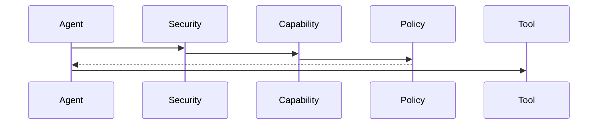
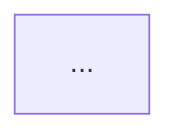

如果研究 **OpenFang**，研究方法应该比 OpenHands 更偏向 **Agent OS / Agent Kernel / Security / Runtime**。原因是 OpenFang 官方定位本身就是 **Agent Operating System**，而且当前代码已经是 Rust workspace，包含 14 个 crates；官方架构文档明确涉及 Kernel、Runtime、Memory、Capability Security、OFP、Channels、Skills、MCP/A2A 等。([GitHub][1])

因此，我建议你的 AI Coder Goal 不要只是“深度分析 OpenFang”，而是让它完成：

> **OpenFang Source Code Reverse Engineering → Agent OS Kernel Model → Security Model → Runtime Model → Bianbu Agent OS Mapping**


````text
# GOAL
OpenFang 深度源码研究、Agent OS Kernel 逆向分析与 Bianbu Agent OS 架构映射

Repository:
https://github.com/RightNow-AI/openfang

Official Documentation:
https://www.openfang.sh/docs

Project Name:
OpenFang

最终目标：

生成：

《OpenFang Deep Dive & Agent OS Technical Wiki v1.0》

以及：

《OpenFang → Bianbu Agent OS Architecture Mapping v1.0》

============================================================
0. ROLE
============================================================

你不是普通代码阅读 Agent。

你现在是一名：

- Principal Systems Architect
- Rust Systems Engineer
- Agent Runtime Engineer
- Agent OS Architect
- Security Architect
- Distributed Systems Engineer
- AI Infrastructure Engineer
- OS Kernel Architect
- Open Source Researcher

必须从：

源码
+
架构
+
Runtime
+
Security
+
Memory
+
Scheduling
+
Capability
+
Tool
+
Skill
+
Agent
+
Workflow
+
IPC
+
Network
+
Persistence

多个层面理解 OpenFang。


============================================================
1. CORE RESEARCH QUESTION
============================================================

整个研究围绕一个核心问题：

OpenFang 到底是不是一个真正意义上的 Agent Operating System？

不能因为 README 说：

"Agent Operating System"

就直接接受这个结论。

必须从源码证明：

OpenFang 是否真的实现了：

Agent Process
Agent Lifecycle
Agent Scheduling
Agent Memory
Agent Persistence
Agent Capability
Agent Security
Agent Sandbox
Agent Communication
Agent Networking
Agent Tool Runtime
Agent Skill Runtime
Agent Workflow
Agent Observability
Agent Governance


最终回答：

OpenFang 是：

A. Agent Framework

B. Agent Runtime

C. Agent Platform

D. Agent OS

E. Agent Control Plane

还是：

A+B+C+D+E 的组合？

必须给出架构定义。


============================================================
2. RESEARCH PRINCIPLE
============================================================

第一原则：

SOURCE CODE > DOCUMENTATION > README > MARKETING


如果：

README 说 A

Documentation 说 B

源码实际上是 C

必须写：

Document Claim:
A

Implementation Reality:
C

Conclusion:
...


绝对不允许把营销描述直接当作架构事实。


============================================================
3. REPOSITORY RECONNAISSANCE
============================================================

首先完整扫描 Repository。


分析：

Cargo.toml
Cargo.lock
crates/
docs/
tests/
examples/
scripts/
.github/
Dockerfile
configuration
CI/CD


输出：

# 3.1 Repository Structure


例如：

openfang/
├── crates/
│   ├── openfang-types
│   ├── openfang-kernel
│   ├── openfang-runtime
│   ├── openfang-memory
│   ├── openfang-api
│   ├── openfang-wire
│   ├── openfang-cli
│   └── ...
├── tests/
├── docs/
└── ...


必须根据实际源码生成。


============================================================
4. CRATE ARCHITECTURE
============================================================

对每一个 crate 进行逆向分析。


输出：

| Crate | Responsibility | Depends On | Used By | Runtime Role |
|---|---|---|---|---|


对每个 crate 分析：

Purpose
Public API
Core Structs
Core Traits
Dependencies
State
Concurrency
Persistence
Network
Security
Testing


重点：

openfang-types
openfang-kernel
openfang-runtime
openfang-memory
openfang-api
openfang-wire
openfang-cli


以及所有其他 crate。


============================================================
5. DEPENDENCY GRAPH
============================================================

生成：

```mermaid
graph TD
    ...
````

必须展示：

crate → crate

并分析：

* dependency direction
* cyclic dependency
* layering
* kernel boundary
* API boundary
* runtime boundary

回答：

OpenFang 是否真正采用 Layered Architecture？

============================================================
6. KERNEL DEEP DIVE
===================

这是本项目最重要的研究内容。

重点逆向：

OpenFang Kernel。

回答：

Kernel 到底是什么？

它负责：

* boot
* initialization
* agent registry
* lifecycle
* scheduler
* configuration
* memory
* security
* runtime
* channels
* workflow
* persistence

还是只是一个：

Application Orchestrator？

必须找到：

Kernel struct

KernelConfig

Kernel initialization

Kernel boot sequence

Kernel shutdown

Kernel state

输出：

# OpenFang Kernel Model

============================================================
7. KERNEL BOOT SEQUENCE
=======================

完整追踪：

openfang start

发生什么？

从 CLI：

openfang start

开始追踪：

CLI
↓
Daemon
↓
Kernel
↓
Config
↓
Database
↓
Memory
↓
Agent Registry
↓
Runtime
↓
API
↓
Channels
↓
Scheduler

每一步必须给：

File
Struct
Function
Call

生成：

```mermaid
sequenceDiagram
    CLI->>Daemon:
    Daemon->>Kernel:
    Kernel->>Memory:
    Kernel->>Runtime:
    Kernel->>API:
    Kernel->>Scheduler:
```

============================================================
8. AGENT AS PROCESS
===================

这是 Agent OS 最关键的问题。

传统 OS：

Process
PID
Address Space
File Descriptor
Credentials
Signal
IPC
Scheduler

OpenFang：

Agent
AgentId
State
Memory
Capabilities
Tools
Channels
Tasks

必须建立：

# Agent Process Model

回答：

OpenFang Agent 是否等价于：

Process？

分析：

Agent Identity
AgentId
Agent State
Agent Lifecycle
Agent Memory
Agent Capability
Agent Runtime
Agent Communication

输出映射：

| Traditional OS | OpenFang         |
| -------------- | ---------------- |
| Process        | Agent            |
| PID            | AgentId          |
| Process State  | Agent State      |
| File           | Memory/Workspace |
| Permission     | Capability       |
| IPC            | Agent Message    |
| Socket         | OFP              |
| Scheduler      | ?                |
| Process Image  | Agent Manifest   |
| Signal         | Event/Control    |
| Audit          | Audit Trail      |

============================================================
9. AGENT LIFECYCLE
==================

完整研究：

Create
Spawn
Start
Running
Suspend
Resume
Stop
Kill
Restart
Recover
Delete

生成：


必须找到真实源码实现。

============================================================
10. AGENT MANIFEST
==================

深入研究：

AgentManifest。

分析：

* identity
* metadata
* model
* prompt
* tools
* capabilities
* memory
* channels
* schedule
* workflow
* security
* signing

回答：

AgentManifest 是否相当于：

Process Descriptor
+
Application Manifest
+
Security Policy
+
Capability Declaration

如果不是：

明确指出差异。

============================================================
11. CAPABILITY SYSTEM
=====================

这是 OpenFang 最重要的安全设计之一。

深入分析：

Capability enum
Capability parser
Capability checker
Capability enforcement

研究：

ToolInvoke
ToolAll
MemoryRead
MemoryWrite
NetConnect
AgentSpawn
AgentMessage

以及源码中实际存在的全部 capability。

输出：

# Capability Security Model

============================================================
12. CAPABILITY ENFORCEMENT FLOW
===============================

不要只列 capability。

必须追踪：

Agent
↓
Action
↓
Capability Check
↓
Policy
↓
Tool
↓
Execution

生成：



必须指出：

权限检查发生在哪一层？

Kernel？

Runtime？

Tool？

Sandbox？

API？

============================================================
13. SECURITY ARCHITECTURE
=========================

深入研究 OpenFang 的全部安全机制。

特别关注官方声称的：

16-layer security

不要直接接受。

必须从源码建立：

Security Matrix。

格式：

| Layer | Mechanism | Code | Enforcement Point | Threat |
| ----- | --------- | ---- | ----------------- | ------ |

研究：

* Capability
* sandbox
* WASM
* subprocess isolation
* env_clear
* network control
* audit
* Merkle chain
* signing
* secret handling
* authentication
* RBAC
* rate limiting
* input validation
* supply chain
* prompt injection
* SSRF
* path traversal

============================================================
14. WASM SANDBOX
================

重点研究：

WASM sandbox。

回答：

为什么使用 WASM？

Sandbox boundary 在哪里？

Host function 是什么？

Agent 能访问什么？

Agent 不能访问什么？

Memory limit？

CPU limit？

Network？

Filesystem？

Syscall？

绘制：

```mermaid
graph TB

Agent
↓
Tool
↓
WASM Sandbox
↓
Host Interface
↓
OS
```

必须定位源码。

============================================================
15. DUAL-METERED SANDBOX
========================

如果源码存在：

dual-metered sandbox

必须深入分析：

CPU metering
Memory metering
Fuel
Resource quota

回答：

它和：

cgroup
rlimit
seccomp
namespace

有什么区别？

============================================================
16. MEMORY SUBSTRATE
====================

深入分析：

openfang-memory。

研究：

SQLite schema

structured KV

semantic search

embeddings

knowledge graph

session

task board

usage events

canonical sessions

输出：

# Memory OS Architecture

============================================================
17. MEMORY LAYERS
=================

判断 OpenFang 是否具有：

Working Memory
Session Memory
Episodic Memory
Semantic Memory
Knowledge Graph
Long-Term Memory

建立：

```text
Agent
 ↓
Working Memory
 ↓
Session
 ↓
Episodic
 ↓
Semantic
 ↓
Knowledge Graph
```

必须根据源码验证。

============================================================
18. KNOWLEDGE GRAPH
===================

深入研究：

Entity
Relation
Graph traversal
Embedding
Retrieval

回答：

Knowledge Graph 如何构建？

什么时候写入？

什么时候查询？

谁触发？

Agent 自动写入还是 Tool 写入？

============================================================
19. MEMORY PERSISTENCE
======================

研究：

SQLite

Schema Version:

V1
V2
V3
V4
V5
...

分析：

Migration
Transaction
Concurrency
Locking
Recovery

回答：

OpenFang Agent Crash 后：

Memory 是否恢复？

Task 是否恢复？

Session 是否恢复？

============================================================
20. AGENT RUNTIME
=================

深入研究：

openfang-runtime。

重点：

AgentRouter
BridgeManager
ChannelRateLimiter
ChannelOverrides

以及所有 runtime 核心对象。

回答：

Runtime 和 Kernel 的边界是什么？

============================================================
21. AGENT LOOP
==============

完整还原：

User Message
↓
Agent Router
↓
Agent
↓
LLM
↓
Tool Call
↓
Capability
↓
Tool
↓
Observation
↓
Memory
↓
LLM
↓
...

必须深入到：

Rust struct
trait
function

生成真实：

Sequence Diagram。

============================================================
22. LLM DRIVER
==============

研究：

LLM abstraction。

分析：

Provider
Model
Driver
Routing
Fallback
Retry
Streaming
Token usage
Cost

回答：

为什么 OpenFang 能支持多个 LLM provider？

抽象接口是什么？

============================================================
23. MODEL CATALOG
=================

研究：

Model Catalog。

分析：

Model
Provider
Tier
Cost
Capability
Context Window

回答：

模型选择是：

Static？

Dynamic？

Policy-driven？

Cost-aware？

Performance-aware？

============================================================
24. HANDS
=========

这是 OpenFang 的核心产品抽象。

深入研究：

Hands。

回答：

Hand 到底是什么？

是：

Agent？

Skill？

Workflow？

Autonomous Service？

Cron Job？

Application Package？

分析：

Hand Manifest
Hand Lifecycle
Hand Schedule
Hand Memory
Hand Tool
Hand Trigger

建立：

# Hand Runtime Model

============================================================
25. HAND VS AGENT
=================

必须明确区分：

Agent

vs

Hand

vs

Skill

vs

Workflow

vs

Task

输出：

| Concept | Lifecycle | State | Memory | Trigger | Execution |
| ------- | --------- | ----- | ------ | ------- | --------- |

============================================================
26. SCHEDULER
=============

深入研究：

schedule

trigger

cron

event

回答：

OpenFang Agent 是否真正支持：

24/7 Autonomous Execution？

Scheduler 是：

Kernel subsystem？

Runtime subsystem？

External service？

必须找到源码。

============================================================
27. WORKFLOW ENGINE
===================

深入分析：

Workflow。

研究：

* steps
* dependencies
* branching
* retries
* parallel
* agent delegation
* triggers
* state

回答：

Workflow 和：

LangGraph

有什么本质区别？

============================================================
28. MULTI-AGENT
===============

研究：

AgentSpawn
AgentMessage
Workflow
A2A
OFP

建立：

# Multi-Agent Architecture

回答：

Agent A

如何：

spawn

Agent B？

如何：

communicate？

share memory？

share capability？

delegate task？

terminate child？

============================================================
29. OFP
=======

深入研究：

OpenFang Protocol。

分析：

PeerNode
PeerRegistry
TCP
JSON framing
HMAC-SHA256
nonce
authentication

回答：

OFP 是：

IPC？

RPC？

P2P Agent Protocol？

Distributed Agent Bus？

============================================================
30. A2A
=======

研究：

Agent-to-Agent Protocol。

比较：

OFP

vs

A2A

回答：

为什么同时需要两个协议？

============================================================
31. MCP
=======

深入分析：

MCP。

研究：

MCP server

tool discovery

tool schema

tool invocation

security

capability

比较：

Native Tool

MCP Tool

A2A

OFP

============================================================
32. SKILL SYSTEM
================

深入分析：

Skill。

研究：

SKILL.md

Skill installation

Skill registry

Skill marketplace

Skill loading

Skill execution

回答：

Skill 是：

Plugin？

Package？

Capability？

Prompt？

Tool Collection？

============================================================
33. CHANNEL SYSTEM
==================

研究：

40+ channel integrations。

分析：

Telegram
Slack
Discord
WhatsApp
Web
CLI
...

回答：

Channel 和 Agent 的关系是什么？

模型：

Channel
↓
Router
↓
Agent
↓
Conversation

还是：

Channel
↓
Conversation
↓
Agent

必须以源码为准。

============================================================
34. API ARCHITECTURE
====================

深入分析：

openfang-api。

研究：

REST

WebSocket

SSE

OpenAI compatible API

Auth

RBAC

建立完整：

API Matrix。

============================================================
35. OPENAI COMPATIBILITY
========================

研究：

/v1/chat/completions

/v1/models

回答：

OpenFang 能否作为：

OpenAI-compatible Agent Server？

为什么？

============================================================
36. CLI ARCHITECTURE
====================

分析：

openfang CLI。

重点：

daemon mode

in-process mode

TUI

HTTP

回答：

为什么同时存在：

Daemon

和

In-process Kernel？

这对 Agent OS 有什么意义？

============================================================
37. DAEMON MODEL
================

研究：

openfang start

daemon.json

health check

HTTP communication

回答：

Daemon 是否相当于：

Agent OS system daemon？

如果是：

类似 Linux：

systemd

吗？

============================================================
38. STORAGE ARCHITECTURE
========================

完整分析：

SQLite
filesystem
config
logs
audit
memory
workspace

建立：

Storage Model。

============================================================
39. AUDIT ARCHITECTURE
======================

重点研究：

Audit trail。

如果存在：

Merkle audit

必须回答：

为什么使用 Merkle？

如何防篡改？

如何验证？

Root Hash 如何生成？

Event 如何加入？

攻击者修改历史记录会发生什么？

============================================================
40. OBSERVABILITY
=================

研究：

Logs

Metrics

Usage

Tracing

Events

Audit

回答：

是否可以完整重放：

Agent execution？

如果不能：

提出：

Agent Replay Architecture。

============================================================
41. RESOURCE MANAGEMENT
=======================

Agent OS 必须管理：

CPU
Memory
Storage
Network
LLM tokens
Concurrency

研究 OpenFang 是否具备：

quota

rate limit

metering

scheduling

建立：

# Agent Resource Management

============================================================
42. AGENT SCHEDULING
====================

研究：

Agent Scheduling

比较：

OS Scheduler

vs

Agent Scheduler

回答：

OpenFang 是否存在：

Priority
Fairness
Quota
Preemption
Deadline
Retry

============================================================
43. AGENT IDENTITY
==================

研究：

AgentId

Manifest

Signing

Authentication

Capabilities

回答：

Agent Identity 是：

Name？

UUID？

Cryptographic Identity？

============================================================
44. SUPPLY CHAIN SECURITY
=========================

研究：

Agent Manifest Signing

Ed25519

Skill packages

MCP

Plugins

Dependencies

回答：

恶意 Agent Package 如何防御？

============================================================
45. AGENT PACKAGE
=================

研究：

Agent Bundle / Manifest / Hand / Skill

回答：

OpenFang 是否形成了：

Agent Package Format？

如果存在：

定义：

```text
Agent Package
├── Manifest
├── Prompt
├── Skills
├── Tools
├── Policy
├── Memory
├── Model
└── Signature
```

必须和源码对应。

============================================================
46. CONFIGURATION
=================

研究：

config.toml

environment variables

KernelConfig

分析：

Configuration hierarchy

Default

Environment

File

CLI

Runtime

============================================================
47. DESKTOP
===========

研究：

Tauri 2.0

回答：

Desktop App 在整个 Agent OS 中是什么角色？

UI

vs

Control Plane

============================================================
48. DEPLOYMENT
==============

分析：

Single Binary

Daemon

Docker

Desktop

Server

Cloud

回答：

为什么 OpenFang 强调：

single binary

从：

Distribution

Deployment

Security

Performance

Portability

分析。

============================================================
49. RUST ARCHITECTURE
=====================

深入研究：

为什么 OpenFang 使用 Rust？

分析：

Memory Safety
Concurrency
Async
Tokio
WASM
Single Binary
Cross Compilation
Resource Control

比较：

Rust OpenFang

vs

Python OpenHands

vs

TypeScript OpenClaw

============================================================
50. CONCURRENCY MODEL
=====================

研究：

Tokio

async/await

Arc

Mutex

DashMap

channels

tasks

回答：

一个 Agent 对应：

一个 Tokio Task？

一个 thread？

一个 state machine？

一个 runtime object？

必须通过源码回答。

============================================================
51. FAILURE / RECOVERY
======================

研究：

Agent crash

Kernel crash

LLM failure

Tool failure

Network failure

Database failure

Sandbox failure

回答：

如何：

Retry？

Recover？

Resume？

Checkpoint？

Restore？

============================================================
52. DISTRIBUTED AGENT
=====================

研究：

OFP

A2A

PeerNode

PeerRegistry

设计：

Multi-node OpenFang Architecture。

分析：

Node

Agent

AgentId

Peer

Network

Security

============================================================
53. MULTI-TENANCY
=================

研究：

RBAC

User

Agent

Workspace

Memory

Capability

回答：

OpenFang 是否真正支持：

Multi-tenant Agent OS？

如果不足：

设计：

Tenant Isolation。

============================================================
54. THREAT MODEL
================

至少分析：

Prompt Injection
Tool Injection
Malicious Skill
Malicious MCP
Malicious Agent
Credential Theft
Data Exfiltration
SSRF
Command Injection
Sandbox Escape
Path Traversal
Supply Chain
Privilege Escalation
Agent Hijacking
Memory Poisoning
Knowledge Graph Poisoning
A2A Abuse
OFP Spoofing
Replay Attack
Denial of Service

输出：

| Threat | Asset | Attack | Impact | Existing Defense | Gap |
| ------ | ----- | ------ | ------ | ---------------- | --- |

============================================================
55. SECURITY GAP ANALYSIS
=========================

不要只总结：

"OpenFang 很安全"

必须寻找：

Security Boundary

Trust Boundary

TCB

Attack Surface

Confused Deputy

Capability Leakage

Prompt Injection

Cross-Agent Permission

输出：

# Security Gap Analysis

============================================================
56. AGENT OS LAYER MODEL
========================

建立：

```text
L0 Hardware
L1 Linux / Kernel
L2 Agent OS Kernel
L3 Agent Runtime
L4 Agent
L5 Skills / Tools
L6 Applications
L7 User
```

然后把 OpenFang 映射进去。

============================================================
57. AGENT OS PRIMITIVES
=======================

提炼 OpenFang 的 Agent OS primitives：

Agent
Task
Capability
Memory
Tool
Skill
Workflow
Channel
Event
Schedule
Sandbox
Audit
Identity
Policy
Peer
Protocol

对每个 primitive 输出：

Definition
Lifecycle
API
Storage
Security
Runtime

============================================================
58. TRADITIONAL OS MAPPING
==========================

建立：

Traditional OS

vs

OpenFang

| OS Primitive | OpenFang Primitive | Similarity | Difference |
| ------------ | ------------------ | ---------- | ---------- |
| Process      | Agent              |            |            |
| Thread       | Task               |            |            |
| Scheduler    | Trigger/Scheduler  |            |            |
| Filesystem   | Workspace/Memory   |            |            |
| IPC          | OFP                |            |            |
| Socket       | Channel/OFP        |            |            |
| Permission   | Capability         |            |            |
| Credential   | Agent Identity     |            |            |
| Audit        | Merkle Audit       |            |            |
| Package      | Agent/Skill        |            |            |

============================================================
59. OPENFANG VS OPENHANDS
=========================

必须进行源码级架构比较。

比较：

Kernel

Agent

Runtime

State

Memory

Tool

Skill

Sandbox

Security

Scheduler

Workflow

MCP

A2A

Agent-to-Agent

Persistence

Deployment

Language

============================================================
60. OPENFANG VS OPENCLAW
========================

重点比较：

Agent Runtime

Agent Profile

Memory

Skill

Plugin

Channel

Security

Sandbox

Multi-Agent

Scheduling

Gateway

Deployment

============================================================
61. OPENFANG VS HERMES
======================

比较：

Agent Loop

Memory

Skill

Self-improvement

Runtime

Security

Long-running Agent

============================================================
62. OPENFANG VS ZEROCLAW
========================

重点：

Rust

Embedded

Low-resource

Single binary

Memory

Runtime

Security

Hardware

回答：

OpenFang 和 ZeroClaw 的 Agent OS 思路有什么不同？

============================================================
63. OPENFANG VS LANGGRAPH
=========================

重点：

State Machine

Graph

Runtime

Persistence

Agent

Tool

Scheduling

Memory

Security

最终回答：

OpenFang 是：

Graph Orchestrator？

还是：

OS Runtime？

============================================================
64. OPENFANG VS CLAUDE CODE / CODEX
===================================

比较：

Agent Runtime

Sandbox

Tool

Model

Memory

Task

Permission

Deployment

============================================================
65. AGENT OS SCORECARD
======================

建立：

| Capability    | OpenFang | OpenHands | OpenClaw | LangGraph | Bianbu |
| ------------- | -------- | --------- | -------- | --------- | ------ |
| Agent Kernel  |          |           |          |           |        |
| Scheduler     |          |           |          |           |        |
| Memory OS     |          |           |          |           |        |
| Capability    |          |           |          |           |        |
| Sandbox       |          |           |          |           |        |
| IPC           |          |           |          |           |        |
| Agent Network |          |           |          |           |        |
| Security      |          |           |          |           |        |
| Observability |          |           |          |           |        |
| Persistence   |          |           |          |           |        |
| Device        |          |           |          |           |        |

============================================================
66. BIANBU AGENT OS MAPPING
===========================

这是本研究最重要的输出之一。

将：

OpenFang

映射到：

Bianbu Agent OS。

参考架构：

```text
Bianbu Agent OS
│
├── agentd
├── taskd
├── memoryd
├── contextd
├── skilld
├── toold
├── securityd
├── capabilityd
├── sandboxd
├── scheduler
├── aihald
├── knowledge
├── eventd
├── observabilityd
├── deviced
└── storaged
```

逐项映射：

OpenFang
→
Bianbu

例如：

OpenFang Kernel
→ agentd/kernel

OpenFang Agent
→ agentd

OpenFang Capability
→ capabilityd/securityd

OpenFang Memory
→ memoryd

OpenFang Runtime
→ runtime

OpenFang Skill
→ skilld

OpenFang WASM Sandbox
→ sandboxd

OpenFang OFP
→ agent IPC/network

OpenFang Scheduler
→ scheduler

但必须：

根据源码确认。

不能机械映射。

============================================================
67. WHAT BIANBU SHOULD COPY
===========================

输出：

A. MUST ADOPT

B. SHOULD ADOPT

C. SHOULD MODIFY

D. SHOULD NOT ADOPT

例如：

Capability Security

WASM Sandbox

Agent Manifest

Memory Schema

Audit

OFP

Scheduler

逐个评价。

============================================================
68. OPENFANG LIMITATIONS
========================

主动寻找：

Architecture Debt

Security Gap

Scalability Issue

Memory Issue

Distributed Issue

Embedded Issue

RISC-V Issue

Offline Issue

AI Runtime Issue

Model Dependency

Rust Ecosystem Risk

必须写：

# What OpenFang Gets Wrong

至少 20 条。

============================================================
69. RISC-V ANALYSIS
===================

重点分析：

OpenFang 是否能运行在：

RISC-V 64

Bianbu Linux

Spacemit K1

Spacemit K3

检查：

Rust target

Dependencies

WASM runtime

SQLite

Tokio

Tauri

Native dependencies

Cross compilation

SIMD

CPU features

最终输出：

# OpenFang on RISC-V

============================================================
70. EDGE AGENT OS
=================

分析：

如果运行在：

4GB RAM

8GB RAM

低功耗 CPU

Local LLM

OpenFang 是否可行？

重点：

Memory footprint

Binary size

SQLite

WASM

Concurrency

LLM inference

============================================================
71. OFFLINE MODE
================

设计：

Offline OpenFang。

要求：

Local LLM

Local Embedding

Local Memory

Local Knowledge Graph

Local Skill

Local MCP

No Cloud

分析哪些模块需要修改。

============================================================
72. AGENT OS KERNEL REDESIGN
============================

假设重新设计 OpenFang Kernel。

提出：

OpenFang Kernel 2.0

包括：

Agent Scheduler

Capability Manager

Memory Manager

Context Manager

Tool Runtime

Skill Runtime

Sandbox Manager

Policy Engine

Audit Engine

Checkpoint Manager

IPC

绘制：



============================================================
73. BIANBU AGENT OS SECURITY
============================

基于 OpenFang Security：

重新设计：

Bianbu Agent OS Security Architecture。

包括：

Capability Token

Policy DSL

Sandbox

Seccomp

Namespace

BPF

WASM

Audit

Taint Tracking

Secret Vault

Credential Isolation

重点回答：

OpenFang 的 capability model 如何升级为：

Bianbu Capability Token？

============================================================
74. AGENT MANIFEST 2.0
======================

基于 OpenFang Agent Manifest：

设计：

Bianbu Agent Manifest v2。

至少包含：

identity
runtime
model
memory
tools
skills
capabilities
network
filesystem
schedule
policy
sandbox
resources
audit
signature

============================================================
75. AGENT PACKAGE
=================

研究 OpenFang Agent/Skill 包机制。

最终设计：

Bianbu Agent Bundle。

格式：

```text
.agent/
├── manifest.yaml
├── agent.yaml
├── prompts/
├── skills/
├── tools/
├── workflows/
├── policies/
├── memory/
├── models/
└── signature.json
```

必须说明：

哪些来自 OpenFang？

哪些来自其他 Agent？

哪些是 Bianbu 新设计？

============================================================
76. ARCHITECTURE LESSONS
========================

提炼至少：

30 条

OpenFang Agent OS Lessons。

每条：

Lesson
Evidence
Why Important
Bianbu Recommendation

============================================================
77. ARCHITECTURE DECISION RECORD
================================

至少生成：

20 ADR。

格式：

ADR-001

Title:

Problem:

Decision:

Reason:

Trade-off:

Evidence:

Bianbu Impact:

============================================================
78. REAL EXECUTION TRACE
========================

构造一个真实任务：

"让 Agent 每天自动分析 GitHub Repository，并把结果发送到 Telegram"

完整追踪：

Schedule
↓
Agent
↓
Capability
↓
LLM
↓
Tool
↓
Network
↓
GitHub
↓
Memory
↓
Knowledge Graph
↓
Telegram
↓
Audit

每一步：

Component
File
Function
Data
Security
Persistence

============================================================
79. FAILURE TRACE
=================

模拟：

1. LLM timeout
2. Tool failure
3. Network failure
4. Agent crash
5. SQLite failure
6. Sandbox violation
7. Capability denial

分析：

OpenFang 如何处理？

如果没有：

设计应该如何处理？

============================================================
80. FINAL ARCHITECTURE
======================

最终建立：

# OpenFang Agent OS Architecture Model

必须形成：

```text
                User / Channel
                      │
                      ▼
                API / Router
                      │
                      ▼
                Agent Kernel
       ┌──────────────┼──────────────┐
       ▼              ▼              ▼
   Scheduler       Agent         Capability
       │              │              │
       │              ▼              │
       │           Runtime            │
       │              │              │
       ├──────────────┼──────────────┤
       ▼              ▼              ▼
    Memory          Tools         Sandbox
       │              │              │
       └──────────────┼──────────────┘
                      ▼
                  LLM Driver
                      │
                      ▼
               External Systems
```

必须根据源码修正。

============================================================
81. FINAL BIANBU ARCHITECTURE
=============================

最终输出：

# Bianbu Agent OS Inspired by OpenFang

但：

不要复制 OpenFang。

应该吸收：

OpenFang
+
OpenHands
+
OpenClaw
+
Hermes
+
LangGraph
+
Linux

形成：

Bianbu Agent OS。

============================================================
82. REQUIRED DIAGRAMS
=====================

至少：

1. Repository Architecture
2. Crate Dependency
3. Kernel Architecture
4. Kernel Boot
5. Agent Lifecycle
6. Agent Runtime
7. Agent Loop
8. Capability Security
9. WASM Sandbox
10. Memory Architecture
11. Knowledge Graph
12. Scheduler
13. Workflow
14. Multi-Agent
15. OFP
16. A2A
17. MCP
18. Skill System
19. Channel Architecture
20. API Architecture
21. CLI Architecture
22. Audit Architecture
23. Deployment
24. Security Threat Model
25. Traditional OS Mapping
26. Agent OS Mapping
27. OpenFang → Bianbu Mapping
28. Bianbu Agent OS Next Architecture

全部使用 Mermaid。

============================================================
83. REQUIRED SOURCE TABLES
==========================

必须生成：

Core Crates

Core Structs

Core Traits

Core Functions

Core Events

Core APIs

Core Capabilities

Core Database Tables

Core Configuration

Core Security Controls

============================================================
84. DATABASE ANALYSIS
=====================

必须读取：

实际 SQLite schema。

输出：

ER Diagram。

分析：

Table
Column
Index
Foreign Key
Migration
Transaction
Concurrency

============================================================
85. API ANALYSIS
================

完整分析：

REST
WS
SSE
OpenAI API
OFP
A2A
MCP

输出：

API Matrix。

============================================================
86. TEST ANALYSIS
=================

研究：

Unit Tests

Integration Tests

E2E

Security Tests

Benchmark

Agent Evaluation

分析：

测试是否覆盖：

Kernel

Runtime

Security

Memory

Sandbox

Agent

============================================================
87. BENCHMARK
=============

研究官方 benchmark。

如果不存在：

设计 benchmark。

至少：

Startup
Memory
CPU
Agent latency
Tool latency
LLM latency
Concurrent agents
Memory query
Sandbox startup
Scheduler throughput

============================================================
88. CODE QUALITY
================

分析：

Rust idioms

unsafe

unwrap

panic

error handling

async

locking

deadlock risk

dependency risk

============================================================
89. TCB ANALYSIS
================

定义：

Trusted Computing Base。

计算：

哪些代码必须信任？

例如：

Kernel
Capability
Sandbox
WASM Runtime
API Auth
Memory
Audit

输出：

# OpenFang TCB

============================================================
90. ATTACK SURFACE
==================

建立：

Agent OS Attack Surface。

包括：

CLI

API

WebSocket

SSE

MCP

A2A

OFP

Skill

Hand

Manifest

Workspace

Network

Memory

LLM

============================================================
91. FINAL WIKI
==============

最终生成：

docs/openfang-deep-dive-wiki-v1.0.md

目录：

01 Executive Summary
02 Project Positioning
03 Evolution
04 Repository
05 Crate Architecture
06 Kernel
07 Boot Sequence
08 Agent Model
09 Agent Lifecycle
10 Agent Manifest
11 Capability
12 Security
13 Sandbox
14 Memory
15 Knowledge Graph
16 Runtime
17 Agent Loop
18 LLM Driver
19 Hands
20 Scheduler
21 Workflow
22 Multi-Agent
23 OFP
24 A2A
25 MCP
26 Skills
27 Channels
28 API
29 CLI
30 Daemon
31 Storage
32 Audit
33 Observability
34 Resource Management
35 Failure Recovery
36 Deployment
37 Rust Architecture
38 Distributed Agent
39 Multi-Tenancy
40 Threat Model
41 Security Gap
42 OS Mapping
43 Agent OS Primitives
44 OpenFang vs OpenHands
45 OpenFang vs OpenClaw
46 OpenFang vs Hermes
47 OpenFang vs ZeroClaw
48 OpenFang vs LangGraph
49 OpenFang vs Claude Code
50 RISC-V
51 Edge
52 Offline
53 Bianbu Mapping
54 Security Redesign
55 Agent Manifest 2.0
56 Agent Bundle
57 Architecture Lessons
58 ADR
59 Execution Trace
60 Failure Analysis
61 OpenFang 2.0
62 Bianbu Agent OS
63 Final Conclusions

============================================================
92. SEPARATE BIANBU DOCUMENT
============================

生成：

docs/openfang-to-bianbu-agent-os.md

必须回答：

1. OpenFang 哪些设计值得借鉴？
2. 哪些可以直接复用？
3. 哪些必须重写？
4. 哪些不适合嵌入式？
5. 哪些适合 RISC-V？
6. 哪些安全设计应该进入 securityd？
7. 哪些应该进入 agentd？
8. 哪些应该进入 memoryd？
9. 哪些应该进入 skilld？
10. 哪些应该进入 aihald？

============================================================
93. QUALITY GATE
================

最终提交前必须检查：

[ ] README 是否阅读
[ ] Docs 是否阅读
[ ] Cargo workspace 是否分析
[ ] 所有 crates 是否扫描
[ ] Kernel 是否源码分析
[ ] Runtime 是否源码分析
[ ] Memory 是否源码分析
[ ] Capability 是否源码分析
[ ] Sandbox 是否源码分析
[ ] Security 是否源码分析
[ ] Hands 是否源码分析
[ ] Scheduler 是否源码分析
[ ] Workflow 是否源码分析
[ ] MCP 是否源码分析
[ ] A2A 是否源码分析
[ ] OFP 是否源码分析
[ ] Skill 是否源码分析
[ ] Channel 是否源码分析
[ ] API 是否源码分析
[ ] CLI 是否源码分析
[ ] Database 是否分析
[ ] Audit 是否分析
[ ] Failure Recovery 是否分析
[ ] RISC-V 是否分析
[ ] Bianbu 是否映射
[ ] 至少 28 张 Mermaid
[ ] 至少 20 个 ADR
[ ] 至少 30 条 Architecture Lessons
[ ] 至少 20 个 Security Threat
[ ] 至少 20 个 Security Gap
[ ] 所有核心结论都有源码证据

如果任何一项：

NO

不得结束研究。

============================================================
94. RESEARCH EXECUTION MODE
===========================

必须采用：

Phase 1:
Repository Recon

Phase 2:
Crate Mapping

Phase 3:
Kernel Reverse Engineering

Phase 4:
Runtime Reverse Engineering

Phase 5:
Memory Reverse Engineering

Phase 6:
Security Reverse Engineering

Phase 7:
Agent Lifecycle

Phase 8:
Tool / Skill / MCP / A2A

Phase 9:
Distributed Architecture

Phase 10:
OS Primitive Mapping

Phase 11:
Competitor Comparison

Phase 12:
RISC-V / Edge

Phase 13:
Bianbu Mapping

Phase 14:
Architecture Redesign

Phase 15:
Wiki Generation

Phase 16:
Self Review

Phase 17:
Evidence Validation

Phase 18:
Final Delivery

============================================================
95. MOST IMPORTANT QUESTION
===========================

最终必须回答：

为什么 OpenFang 比普通 Agent Framework 更接近 Agent OS？

答案不能引用：

"因为官方这么说"

必须从以下几个 primitive 证明：

Agent
Identity
Lifecycle
Scheduler
Memory
Capability
Sandbox
Tool
Skill
Workflow
IPC
Networking
Persistence
Audit
Resource Management
Security
Observability

然后判断：

OpenFang 是否形成：

Agent Kernel。

============================================================
96. SECOND MOST IMPORTANT QUESTION
==================================

OpenFang 的：

Kernel
Runtime
Memory
Capability
Sandbox
Scheduler
OFP

是否已经形成：

Agent OS Kernel ABI？

如果没有：

还缺什么？

============================================================
97. THIRD MOST IMPORTANT QUESTION
=================================

如果把 OpenFang 放到 Bianbu Agent OS：

哪些能力应该：

User Space

哪些应该：

Agent OS Service

哪些应该：

Kernel-like Security Boundary

建立：

```text
Linux Kernel
      │
      ▼
Bianbu Agent OS
      │
 ┌────┼─────────┐
 ▼    ▼         ▼
agentd securityd aihald
 │
 ▼
Agent
```

============================================================
98. FINAL CONCLUSION
====================

最终不要只写：

"OpenFang 是一个很优秀的 Agent OS"

必须给出：

OpenFang Architecture Verdict

格式：

Agent Framework:
XX%

Agent Runtime:
XX%

Agent Platform:
XX%

Agent OS:
XX%

Agent Control Plane:
XX%

并解释评分。

============================================================
99. FINAL DELIVERABLE
=====================

必须生成：

docs/
├── openfang-deep-dive-wiki-v1.0.md
├── openfang-architecture.md
├── openfang-kernel.md
├── openfang-runtime.md
├── openfang-memory.md
├── openfang-security.md
├── openfang-sandbox.md
├── openfang-capability.md
├── openfang-agent-model.md
├── openfang-protocol.md
├── openfang-hands.md
├── openfang-workflow.md
├── openfang-mcp-a2a.md
├── openfang-comparison.md
├── openfang-riscv.md
├── openfang-agent-os.md
├── openfang-to-bianbu.md
├── openfang-security-redesign.md
├── openfang-next-architecture.md
└── references.md

============================================================
100. FINAL PRINCIPLE
====================

不要研究：

"OpenFang 有什么功能？"

必须研究：

"OpenFang 如何把一个 Agent 从一个 LLM Prompt，
变成一个具有：

Identity
Lifecycle
Memory
Capability
Tool
Skill
Schedule
Sandbox
Security
Persistence
Communication
Audit

的长期运行系统实体？"

最终必须能够回答：

OpenFang

到底有没有构建：

Agent Kernel。

如果有：

Kernel Primitive 是什么？

如果没有：

缺什么？

最终把答案映射到：

Bianbu Agent OS。

END GOAL

````

### 为什么 OpenFang 的 Goal 要这么设计

和刚才的 OpenHands 不一样，**OpenFang 最值得研究的不是 Agent Coding Loop，而是“它到底有没有资格叫 Agent OS”**。

目前官方架构已经明确给出了几个非常值得你重点 reverse engineer 的 primitive：14-crate Rust workspace、Kernel boot sequence、Agent lifecycle、Memory substrate、LLM driver、Capability-based security、OFP、Channel、Skill、MCP/A2A，以及 API/CLI 等。:contentReference[oaicite:1]{index=1}

尤其值得重点拆这几个：

```text
                  OpenFang
                     │
              ┌──────┴──────┐
              │   Kernel    │
              └──────┬──────┘
                     │
        ┌────────────┼────────────┐
        ↓            ↓            ↓
     Agent        Scheduler    Capability
        │            │            │
        ↓            ↓            ↓
     Runtime       Task         Policy
        │
   ┌────┼─────────┐
   ↓    ↓         ↓
Memory Tool     Sandbox
   │    │         │
   └────┼─────────┘
        ↓
       LLM
        │
   ┌────┴─────┐
   ↓          ↓
  MCP        A2A
   │          │
   └────┬─────┘
        ↓
       OFP
````

这里面尤其值得研究 **Capability → Sandbox → Memory → Scheduler → OFP → Agent Lifecycle** 这条链，因为它已经开始接近传统 OS 的：

**Process + Permission + Memory + Scheduler + IPC + Filesystem + Network**。

OpenFang 官方文档也明确把 capability 声明放在 Agent Manifest、运行时进行 capability check；OFP 则通过 TCP + JSON framing + HMAC-SHA256 做节点间认证。([OpenFang][2])

而且 OpenFang 当前文档已经把 **16 个安全系统、WASM sandbox、audit、RBAC、OpenAI-compatible API、40+ channel、60+ skills、A2A/MCP** 等放进体系中。([OpenFang][3])

所以对于你现在的 **Bianbu Agent OS**，我建议最终不要只做一份 `OpenFang Wiki`，而应该把研究结果沉淀成下面这个**三项目对照矩阵**：

| 能力                 | OpenHands | OpenFang | Bianbu Agent OS       |
| ------------------ | --------- | -------- | --------------------- |
| Agent Runtime      | ★★★★★     | ★★★★★    | 设计中                   |
| Agent Kernel       | ★★        | ★★★★     | ★★★★★目标               |
| Agent Lifecycle    | ★★★★      | ★★★★★    | 必须具备                  |
| Scheduler          | ★★        | ★★★★★    | 必须具备                  |
| Memory OS          | ★★★       | ★★★★★    | memoryd               |
| Context OS         | ★★★★★     | ★★★      | contextd              |
| Capability         | ★★★       | ★★★★★    | securityd/capabilityd |
| Sandbox            | ★★★★★     | ★★★★★    | sandboxd              |
| Skill              | ★★★★      | ★★★★★    | skilld                |
| MCP                | ★★★★★     | ★★★★     | toold/skilld          |
| A2A                | ★★★       | ★★★★★    | agent IPC             |
| Agent IPC          | ★★★       | ★★★★★    | DBus/IPC              |
| Agent Network      | ★★        | ★★★★★    | Agent Network         |
| Audit              | ★★★       | ★★★★★    | securityd             |
| Long-running Agent | ★★★       | ★★★★★    | 核心能力                  |
| Device Capability  | ★         | ★        | **Bianbu重点**          |
| AI HAL             | ★★        | ★★★      | **Bianbu aihald**     |
| RISC-V / Edge      | ★         | ★★★      | **Bianbu重点**          |

**一句话说：OpenHands 应该研究“Agent Runtime 怎么做”，OpenFang 应该研究“Agent OS 怎么做”。** OpenFang 本身也明确把长期运行、自主调度、持久状态和系统级治理作为 Agent OS 的核心区别。([OpenFang][4])

这也意味着，后面如果把 **OpenClaw + OpenHands + OpenFang + Hermes + ZeroClaw + LangGraph** 全部研究完，最有价值的终局不是六份 Wiki，而是形成一份：

**《Agent OS Architecture Reference Model v1.0》**

然后把它直接落到你现在的 **`agentd / memoryd / skilld / securityd / aihald / capabilityd / sandboxd / scheduler`** 体系里。

[1]: https://github.com/rightnow-ai/openfang?utm_source=chatgpt.com "GitHub - RightNow-AI/openfang: Open-source Agent Operating System · GitHub"
[2]: https://www.openfang.sh/docs/architecture?utm_source=chatgpt.com "Architecture — OpenFang Docs"
[3]: https://www.openfang.sh/docs?utm_source=chatgpt.com "Documentation — OpenFang"
[4]: https://openfang.info/docs/what-is?utm_source=chatgpt.com "OpenFang - Agent Operating System"
