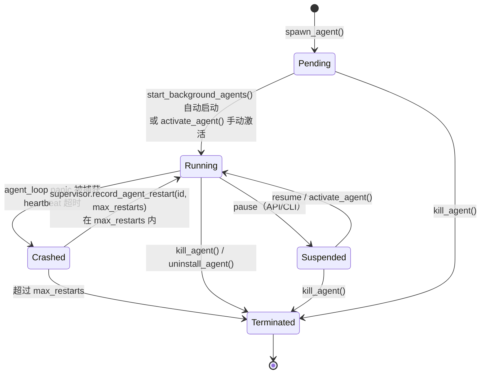

# OpenFang Agent Model — Agent as Process

> 回答 goal §8-10、§43-45

---

## 1. Agent Process Model（goal §8）

| 传统 OS | OpenFang | 源码 | 相似度 | 关键差异 |
|---------|----------|------|--------|---------|
| Process | Agent | `AgentEntry` | 高 | 无独立地址空间 |
| PID | AgentId(Uuid) | `types/agent.rs` | 高 | UUID，无复用问题 |
| Process State | AgentState | 5 态枚举 | 高 | 无 Zombie 态 |
| Process Image | AgentManifest | TOML | 高 | 声明式，比 ELF 更高层 |
| Parent/Child | parent_id/children | `AgentEntry.children` | 中 | 无 wait()/waitpid() |
| Address Space | — | **不存在** | 无 | 所有 Agent 共享进程内存 |
| File Descriptor | — | **不存在** | 无 | 无 fd 表 |
| Credentials | Capability list | `Vec<Capability>` | 中 | 细粒度但无 setuid |
| Scheduler slot | — | **不存在** | 无 | Tokio task，无 OS scheduler slot |
| Signal | Event/AbortHandle | `EventBus` + `running_tasks` | 低 | 无信号掩码 |
| IPC | agent_send tool | 同进程函数调用 | 低 | 不是真 IPC |

**最关键的差距：Agent 没有独立地址空间。** 所有 Agent 运行在同一 Rust 进程内，
共享堆。一个 Agent 的 bug 可以读写另一个 Agent 的数据。

---

## 2. AgentEntry — Agent 的完整状态

```rust
pub struct AgentEntry {
    pub id: AgentId,               // UUID v4
    pub name: String,              // 唯一名称
    pub manifest: AgentManifest,   // TOML 声明（含工具/能力/模型等）
    pub state: AgentState,         // 运行状态
    pub mode: AgentMode,           // interactive / autonomous
    pub session_id: SessionId,     // 当前会话
    pub created_at: DateTime<Utc>,
    pub last_active: DateTime<Utc>,
    pub parent_id: Option<AgentId>,   // spawn 父 Agent
    pub children: Vec<AgentId>,       // spawn 的子 Agent
    pub tags: Vec<String>,
    pub description: String,
    pub workspace: Option<PathBuf>,   // 工作目录
    pub state_dir: Option<PathBuf>,   // 私有状态目录（issue #1097）
    pub identity: serde_json::Value,  // Ed25519 相关身份信息
    pub model_provider: String,       // 当前使用的 LLM 提供商
    pub model_name: String,
}
```

`workspace` 和 `state_dir` 分离（issue #1097）：
- `workspace`：用户可见的工作目录，`file_read`/`file_write` 的默认路径
- `state_dir`：私有状态（session、per-agent memory），与 workspace 隔离

这是一个好的设计——用户代码和系统状态不混在一起。

---

## 3. AgentState 生命周期（goal §9）



**注意**：没有 Zombie 态。子 Agent 终止后，父 Agent 的 `children` 列表不清除
（`registry.add_child` 只追加，无移除），这是一个小的内存泄漏（边际影响）。

**`Crashed → Running` 的实际路径**：

```rust
// kernel.rs（heartbeat 超时后调用）
match self.supervisor.record_agent_restart(id, manifest.autonomous.max_restarts) {
    Ok(_count) => { /* 重新 spawn */ }
    Err(count) => {
        tracing::error!(agent = %id, restarts = count, "Max restarts exceeded");
        self.registry.set_state(id, AgentState::Terminated)?;
    }
}
```

---

## 4. AgentManifest 解剖（goal §10）

goal 问：AgentManifest 是否等价于 Process Descriptor + Application Manifest + Security Policy + Capability Declaration？

**是全部四者的组合**，逐一验证：

### 4.1 Process Descriptor

```toml
[agent]
name = "researcher"
description = "Autonomous research agent"
model = "claude-sonnet-4-20250514"
```

`name` 是 process 标识（唯一性由 `registry.register` 强制），
`model` 是"运行时选择的解释器"（类比 `#!/usr/bin/python`）。

### 4.2 Application Manifest

```toml
tools = ["web_search", "file_write", "memory_store"]
tags = ["research", "autonomous"]
workspace = "~/research-workspace"

[agent.autonomous]
max_iterations = 30
max_restarts = 5
heartbeat_interval_secs = 60
quiet_hours = "0 22 * * *"
```

工具列表是 "可用功能清单"（类比 App Store 权限声明）。
`quiet_hours` 是应用层的执行约束，无 OS 对应。

### 4.3 Security Policy

```toml
capabilities = [
    { type = "FileRead", value = "~/research-workspace/**" },
    { type = "NetConnect", value = "*.googleapis.com:443" },
    { type = "LlmMaxTokens", value = 100000 },
]

[agent.exec_policy]
mode = "allowlist"
allowed_commands = ["python3", "git", "curl"]
timeout_secs = 30
```

`capabilities` + `exec_policy` 构成了安全策略。
`exec_policy.mode` 有 `Deny`/`Allowlist`/`Full` 三档——这是 MAC 的简化实现。

### 4.4 Capability Declaration

```toml
capabilities = [
    { type = "AgentSpawn" },
    { type = "AgentMessage", value = "helper-*" },
    { type = "MemoryWrite", value = "agent:research/*" },
    { type = "ShellExec", value = "git *" },
]
```

显式声明，`spawn_agent_checked` 强制子集关系。

### 4.5 额外要素（OS manifest 没有的）

```toml
[agent.routing]
simple_model = "claude-haiku-4-5-20251001"
complex_model = "claude-sonnet-4-20250514"
simple_threshold = 100
complex_threshold = 500

[agent.fallback_model]
provider = "openai"
model = "gpt-4o"

[[agent.channels.telegram]]
dm_policy = "respond"
group_policy = "mention_only"
```

模型路由和 channel 配置是 Agent-specific 要素，OS 进程描述符没有类比物。

### 4.6 结论

AgentManifest 的 **Process Descriptor + Security Policy + Capability Declaration** 
三重性已通过源码验证。它比 ELF binary + `/etc/apparmor.d` + `capabilities(7)` 
的组合**更声明式、更自描述**，但缺少签名链（只有 manifest hash，无 CA 链）。

---

## 5. Agent Identity（goal §43）

goal 问：Agent Identity 是 Name / UUID / Cryptographic Identity？

**答：三者都是，优先级不同。**

```rust
pub struct AgentEntry {
    pub id: AgentId,           // 主键：Uuid v4，不可重复，跨重启稳定
    pub name: String,          // 友好名：唯一，用于 find_by_name + agent_send by name
    pub identity: serde_json::Value,  // 加密身份：Ed25519 相关
}
```

- **Name**：人类可读标识，用于 CLI 和跨 Agent 寻址
  (`send_to_agent("helper-bot", "...")` 先按名查 UUID)
- **UUID**：系统内唯一 ID，稳定跨重启，用于所有内部引用
- **Cryptographic**：`manifest_signing.rs` 的 SHA-256 manifest hash
  + `identity` 字段存 Ed25519 相关信息（但 **issue**：agent-to-agent
  通信时不验证对方的 Ed25519，只靠 OFP HMAC——这是 security gap）

**当前实现的 identity 强度**：Name + UUID = 稳定且唯一，但不是密码学强身份。
manifest hash 是完整性保证，不是身份认证（没有 CA / PKI 链）。

---

## 6. Agent Package（goal §45）

goal 问：是否形成 Agent Package Format？

**有三种不同的打包格式，互相不统一**：

```
格式 1：Agent Manifest（agent.toml）
～/.openfang/agents/<name>/agent.toml
  → 直接是 AgentManifest 结构体的 TOML 序列化

格式 2：Skill Package（~/.openfang/skills/<name>/）
  ├── SKILL.toml  → SkillManifest
  ├── main.py / index.js / main.sh  → 执行入口
  └── SKILL.md  → prompt context（被扫描注入检测）

格式 3：Hand（编译时内置，HAND.toml in binary）
  ├── HAND.toml  → HandDefinition（含 agent_manifest 模板字段）
  └── 激活时渲染 manifest + spawn Agent
```

goal §45 给出的理想包格式：
```text
Agent Package
├── Manifest      → agent.toml（已有）
├── Prompt        → system_prompt 字段（已有）
├── Skills        → 引用已安装的 skill（通过工具列表间接）
├── Tools         → tools 字段（已有）
├── Policy        → capabilities + exec_policy（已有）
├── Memory        → memory_config（已有，但无 bundle schema）
├── Model         → model / routing 字段（已有）
└── Signature     → manifest hash（有），但无 CA 链（无）
```

**缺少的**：
1. 没有统一的 bundle 格式（agent + skills + config 无法打包成单文件分发）
2. 没有数字签名链（只有 manifest hash，无 CA）
3. Skill 和 Hand 是独立系统，无法在一个 agent.toml 里声明"带 Skill A 的 Agent"

这对 Bianbu Agent Bundle 设计有直接指导意义（见 to-bianbu.md §4）。
