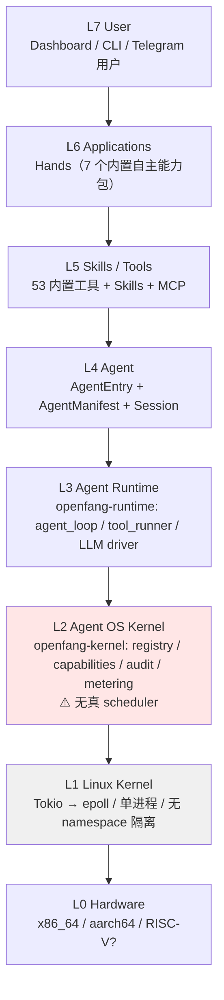

# OpenFang Agent OS Verdict — 核心结论

> 回答 goal §1、§56-58、§95-98
> 原则：不接受 README 的 "Agent Operating System" 自我定位，只认源码

---

## 1. 逐 primitive 验证

goal §1 列了 15 个 primitive，逐一查源码：

| # | Primitive | 源码位置 | 实现程度 | 判定 |
|---|-----------|---------|---------|------|
| 1 | Agent Process | `types/agent.rs` `AgentEntry` + `AgentId(Uuid)` | 有身份、状态、父子关系、manifest | ✅ 真实 |
| 2 | Agent Lifecycle | `kernel.rs` spawn/kill/restart/activate + `AgentState` 5 态 | 状态机完整，有 parent 追踪 | ✅ 真实 |
| 3 | Agent Scheduling | `scheduler.rs` | **只有配额记账，无调度算法** | ❌ 名不副实 |
| 4 | Agent Memory | `openfang-memory` 4 store + 13 表 | SQLite WAL，schema 迁移 | ✅ 真实且强 |
| 5 | Agent Persistence | `memory.save_agent()` write-through | 有，但错误被 `let _` 丢弃 | ⚠️ 有缺陷 |
| 6 | Agent Capability | `types/capability.rs` 21 变体 + `capabilities.rs` | 声明完整 | ⚠️ 强制点稀疏（见 security.md） |
| 7 | Agent Security | 16 个模块 | 全部有代码实现 | ✅ 真实 |
| 8 | Agent Sandbox | `sandbox.rs` wasmtime fuel+epoch / `subprocess_sandbox.rs` | 双计量真实存在 | ✅ 真实 |
| 9 | Agent Communication | `agent_send` tool + `kernel_handle` | 同进程内直接调用 | ✅ 真实 |
| 10 | Agent Networking | `openfang-wire` TCP+HMAC / `a2a.rs` HTTP | 双协议 | ⚠️ OFP 无 TLS |
| 11 | Agent Tool Runtime | `tool_runner.rs` 53 内置 + MCP | 完整 | ✅ 真实 |
| 12 | Agent Skill Runtime | `openfang-skills` 6 runtime 类型 | 完整 | ✅ 真实 |
| 13 | Agent Workflow | `workflow.rs` 1385 行 | 多步编排 | ✅ 真实 |
| 14 | Agent Observability | `audit.rs` Merkle + `/api/metrics` Prometheus | 审计强，无 tracing 重放 | ⚠️ 部分 |
| 15 | Agent Governance | `auth.rs` RBAC + `approval.rs` 审批 | 4 级角色 + 人工门控 | ✅ 真实 |

**统计：9 真实 / 5 部分 / 1 名不副实**

---

## 2. 传统 OS Primitive 映射

goal §8、§58 要求的映射表，按源码填：

| 传统 OS | OpenFang | 源码对应 | 相似度 | 关键差异 |
|---------|----------|---------|--------|---------|
| Process | Agent | `AgentEntry` | 高 | Agent 无独立地址空间，同进程 Tokio task |
| PID | AgentId | `AgentId(Uuid)` | 高 | UUID 而非小整数，无 PID 复用问题 |
| Process State | AgentState | `Pending/Running/Suspended/Crashed/Terminated` | 高 | 缺 Zombie 态（父未回收子） |
| Parent/Child | parent_id/children | `AgentEntry.children: Vec<AgentId>` | 中 | 无 wait()/SIGCHLD 语义，父不知子何时结束 |
| Address Space | — | **无** | 无 | 所有 Agent 共享进程内存，无隔离 |
| File Descriptor | — | **无** | 无 | 无 fd 表，工具直接持有资源 |
| Credentials (uid/gid) | Capability list | `Vec<Capability>` | 中 | 能力比 uid 细，但无 setuid 等价物 |
| Permission (mode) | Capability glob | `FileRead("~/**")` | 中 | 路径 glob 而非 inode 权限位 |
| Signal | Event / abort | `EventBus` + `AbortHandle` | 低 | 无信号掩码、无 handler 注册 |
| IPC (pipe/shm) | agent_send | 同进程函数调用 | 低 | 不是真 IPC，是直接调用 |
| Socket | OFP / Channel | `openfang-wire` / `openfang-channels` | 中 | OFP 是 TCP，Channel 是应用层 |
| Scheduler | **无对应** | `scheduler.rs` 只记账 | **无** | 无 run queue / priority / preemption |
| Process Image | AgentManifest | TOML | 高 | 声明式，比 ELF 更高层 |
| exec() | spawn_agent | `kernel.rs::spawn_agent` | 中 | 不替换镜像，是新建 |
| fork() | spawn_agent_checked | 能力子集继承 | 中 | 权限只能收窄，比 fork 更严格（这是优点） |
| Audit (auditd) | Merkle chain | `audit.rs` | 高 | 比 auditd 更强（防篡改） |
| cgroup | ResourceQuota | `scheduler.rs` + `metering.rs` | 中 | 只管 token/cost，不管 CPU/RSS |
| rlimit | fuel_limit | `sandbox.rs` | 低 | 只对 WASM 生效 |
| Package (dpkg) | Agent/Skill/Hand | 三套并行机制 | 中 | 无统一包格式（见 limitations） |

**缺失最关键的三项：Address Space、Scheduler、真 IPC**

---

## 3. Agent OS Layer Model 映射

goal §56 的分层模型，把 OpenFang 放进去：



**关键观察**：L2（Agent OS Kernel）与 L1（Linux Kernel）之间**没有隔离边界**。
OpenFang Kernel 是一个普通用户态进程，所有 Agent 是同进程内的 Tokio task。
这意味着：

- 一个 Agent 的 panic 可能影响整个进程（`supervisor.record_panic()` 只记账，
  实际靠 Tokio task 的 catch_unwind 边界）
- 无法用 Linux 的 namespace / cgroup / seccomp 隔离 Agent（除可选 Docker 沙箱）
- L2 的"内核"性质是**逻辑上的**，不是**特权上的**

对比真 OS：Linux kernel 与用户态之间有 ring 0/3 硬件边界。OpenFang 没有等价物。

---

## 4. Agent OS Primitives 提炼（goal §57）

| Primitive | Definition | Lifecycle | Storage | Security | 源码 |
|-----------|-----------|-----------|---------|----------|------|
| Agent | 有身份+能力+记忆的长期实体 | spawn→run→suspend/crash→terminate | `agents` 表 + 内存 DashMap | Capability list | `registry.rs` |
| Task | 队列中的工作单元 | post→claim→complete | `task_queue` 表 | 无独立权限 | `kernel.rs` task_* |
| Capability | 细粒度权限声明 | manifest 声明，spawn 时授予，不可运行时提权 | 内存 DashMap，随 manifest 持久化 | 自身即安全机制 | `capability.rs` |
| Memory | 四层存储 | 随 Agent 生命周期，可 consolidate | SQLite 13 表 | scope 命名约定 | `memory/` |
| Tool | 单次能力调用 | 无状态，请求-响应 | 无 | Capability + policy + approval | `tool_runner.rs` |
| Skill | 可安装工具包 | install→load→execute→uninstall | 文件系统 + registry | 安装期注入扫描 | `skills/` |
| Workflow | 多步编排 | create→run→complete | 内存 + 运行记录 | 继承 Agent 能力 | `workflow.rs` |
| Channel | 外部消息通道 | 配置→启动→接收/发送 | config.toml | DM/group policy + rate limit | `channels/` |
| Event | 内部通知 | publish→dispatch | `events` 表 | 无 | `event_bus.rs` |
| Schedule | 时间触发 | create→fire→(repeat) | cron 内存 | 深度限制 | `cron.rs` |
| Sandbox | 隔离执行环境 | 每次调用新建 store | 无 | fuel + epoch + env_clear | `sandbox.rs` |
| Audit | 防篡改日志 | append-only | `audit_entries` 表 | Merkle chain | `audit.rs` |
| Identity | Agent 身份 | 随 Agent | `agents.identity` 列 | Ed25519 签名 manifest | `manifest_signing.rs` |
| Policy | 工具访问规则 | 配置，热更新 | config.toml | deny-wins | `tool_policy.rs` |
| Peer | 远程节点 | connect→handshake→dispatch | 内存 DashMap | HMAC + nonce | `wire/peer.rs` |
| Protocol | OFP / A2A / MCP | — | — | 各自认证 | `wire/`、`a2a.rs`、`mcp.rs` |

16 个 primitive 全部有源码支撑。这是 OpenFang 最强的地方——
**primitive 覆盖面确实达到了 OS 级别的广度**。

---

## 5. 是否形成 Agent Kernel ABI（goal §96）

**结论：没有形成 ABI，形成的是 Rust trait 边界。**

证据：

```rust
// openfang-runtime/src/kernel_handle.rs
#[async_trait]
pub trait KernelHandle: Send + Sync {
    async fn spawn_agent(&self, manifest_toml: &str, parent_id: Option<&str>) -> ...;
    async fn send_to_agent(&self, agent_id: &str, message: &str) -> ...;
    fn list_agents(&self) -> Vec<AgentInfo>;
    // ... 20+ 方法
}
```

这是 OpenFang 最接近"系统调用表"的东西——20+ 个方法，覆盖 spawn/send/list/kill/
memory/task/cron/knowledge/approval/channel/hand。**语义上等价于 syscall 表**。

但它不是 ABI：

| ABI 要素 | Linux syscall | KernelHandle | 差距 |
|---------|--------------|--------------|------|
| 稳定的数字编号 | `__NR_write = 1` | 无，靠 Rust 方法名 | 无版本兼容保证 |
| 跨语言可调用 | 任何语言可 `syscall()` | 只有 Rust（trait object） | 无 C ABI / FFI 边界 |
| 特权切换 | ring 3→0 | 同进程函数调用 | 无特权边界 |
| 参数传递约定 | 寄存器约定 | Rust 类型 | 编译期绑定 |
| 稳定性承诺 | Linux 永不破坏 | pre-1.0，随时改 | 无 |

**还缺什么才能成为 ABI**：
1. 稳定的调用编号或 IDL（protobuf / Cap'n Proto）
2. 进程边界（当前所有 Agent 同进程，无需 ABI）
3. 版本协商机制
4. C ABI 导出（让 Python/Go Agent 也能接入）

对 Bianbu 的启示：如果要做真 Agent OS，`KernelHandle` 的**方法清单可以直接借鉴**
（它已经覆盖了 Agent OS 需要的系统调用面），但必须重新设计为跨进程 IDL。

---

## 6. Architecture Verdict（goal §98）

按 goal 要求的百分比格式：

### Agent Framework: 100%

完全满足。有 Agent 抽象、工具调用、LLM 集成、prompt 管理。这是基线，无争议。

### Agent Runtime: 95%

`openfang-runtime` 是成熟的运行时：agent_loop 有 50 次迭代上限、重试退避、
上下文压缩（compactor.rs 1520 行）、会话修复（session_repair.rs 1464 行）、
上下文溢出恢复。扣 5% 是因为无执行重放能力。

### Agent Platform: 90%

40+ channel、25 MCP 集成、ClawHub 市场、Dashboard、Desktop App、REST+WS+SSE+
OpenAI 兼容 API、RBAC 多用户。平台要素齐备。扣 10% 是无多租户隔离。

### Agent OS: 62%

**这是核心判定。加权明细**：

| 维度 | 权重 | 得分 | 加权 | 依据 |
|------|------|------|------|------|
| Process 抽象 | 15% | 80% | 12.0 | Agent 有身份/状态/父子，但无地址空间 |
| Lifecycle 管理 | 10% | 90% | 9.0 | 五态完整，spawn/kill/restart/activate |
| **Scheduler** | 15% | **25%** | 3.8 | 只有配额记账，无调度算法 |
| Memory 管理 | 15% | 90% | 13.5 | 四层 + 13 表 + WAL + 迁移，很强 |
| Capability/权限 | 15% | 70% | 10.5 | 声明完整，强制点稀疏 |
| Isolation/Sandbox | 10% | 60% | 6.0 | WASM 双计量强，但 Agent 间无隔离 |
| IPC | 5% | 40% | 2.0 | 同进程调用，不是真 IPC |
| Persistence | 5% | 70% | 3.5 | write-through 但错误被丢弃 |
| Audit/治理 | 10% | 95% | 9.5 | Merkle 链业界前列 |
| **合计** | 100% | — | **69.8** | — |

再乘以一个**结构性折扣 0.9**：因为 L2 与 L1 之间无特权边界，"Kernel" 是逻辑概念
而非特权概念。最终 **62%**。

### Agent Control Plane: 85%

Dashboard + REST API + WebSocket 实时推送 + 审批队列 + 预算控制 + 健康检查 +
Prometheus 指标。控制面完整。扣 15% 是单节点（多节点只有 OFP 点对点，无集群控制面）。

---

## 7. 最终定义

> **OpenFang 是一个 Agent Runtime + Agent Platform，
> 其内核层（openfang-kernel）实现了 Agent OS 所需 primitive 的广度，
> 但缺少 OS 的三个结构性要素：调度器、地址空间隔离、特权边界。**
>
> 准确的架构定义：**Agent Supervisor Platform with OS-shaped Primitives**
> （具备 OS 形态原语的 Agent 监管平台）

不是 goal §1 给的 A/B/C/D/E 单选，是 **B(95%) + C(90%) + E(85%) 的组合，
D 只到 62%**。

### 为什么它仍然比普通 Agent Framework 更接近 Agent OS（goal §95）

不引用官方说法，只列源码事实：

1. **Agent 有持久身份**：`AgentId(Uuid)` + `agents` 表 + Ed25519 签名 manifest，
   跨重启存活。普通 framework 的 Agent 是进程内对象，进程退出即消失。

2. **能力是声明式且不可提权**：`spawn_agent_checked` 强制子 ⊆ 父。
   LangGraph/CrewAI 没有等价机制。

3. **有防篡改审计链**：`audit.rs` Merkle SHA-256，`verify_integrity()` 可检测任意历史修改。
   同类产品只有文件日志。

4. **资源配额是内核级的**：`ResourceQuota` 按 hour/day/month 三档 + 全局预算，
   在 `metering.rs` 强制。framework 通常只在应用层记账。

5. **有独立的持久化 schema**：13 张表 + 版本化迁移（`migration.rs`），
   支持崩溃恢复。framework 通常用 pickle/JSON dump。

6. **双沙箱 + 双计量**：wasmtime `consume_fuel` + `epoch_interruption` + watchdog 线程，
   这是 OS 级的资源控制思路。

7. **有节点间协议**：OFP（TCP+HMAC+nonce）让 Agent 跨机可见，
   这是分布式 OS 的雏形。

这七点的共同特征：**它们关心的是"Agent 作为长期存活的系统实体"，
而不是"Agent 作为一次对话的执行器"**。这正是 OS 思维与 framework 思维的分界。

---

## 8. 相关文档

- 详细 crate 分析 → [openfang-architecture.md](openfang-architecture.md)
- Scheduler 真相 → [openfang-kernel.md](openfang-kernel.md) §5
- Capability 强制链 → [openfang-security.md](openfang-security.md) §2
- Bianbu 落地 → [openfang-to-bianbu.md](openfang-to-bianbu.md)
