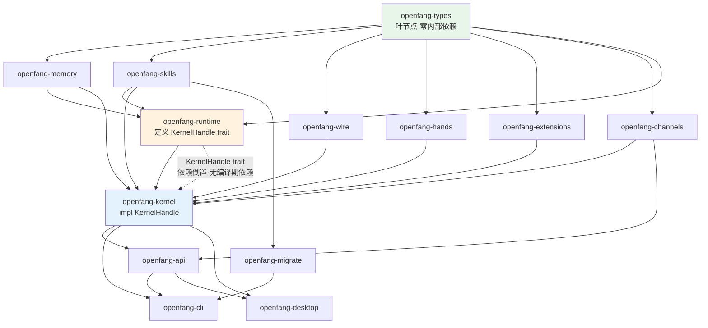

# OpenFang Repository & Crate Architecture

> 回答 goal §3-5、§48-49

---

## 1. Repository Structure（实际扫描结果）

```
openfang/
├── Cargo.toml               # workspace，14 members（含 xtask）
├── Cargo.lock
├── rust-toolchain.toml      # 固定工具链
├── rustfmt.toml
├── Cross.toml               # ← 交叉编译配置（RISC-V 相关，见 riscv-edge.md）
├── flake.nix                # Nix 构建
├── Dockerfile
├── docker-compose.yml
├── crates/                  # 259 个 .rs 文件
│   ├── openfang-types/      # 20 文件，纯数据类型
│   ├── openfang-memory/     # 10 文件，SQLite 四存储
│   ├── openfang-runtime/    # 51 文件（含 drivers/），执行环境
│   ├── openfang-wire/       # 4 文件，OFP 协议
│   ├── openfang-kernel/     # 23 文件，内核
│   ├── openfang-api/        # 13 文件，HTTP/WS
│   ├── openfang-channels/   # 46 文件，40+ 渠道
│   ├── openfang-skills/     # 10 文件，插件系统
│   ├── openfang-hands/      # 3 文件，自主能力包
│   ├── openfang-extensions/ # 8 文件，MCP 集成 + Vault
│   ├── openfang-migrate/    # 3 文件，OpenClaw 迁移
│   ├── openfang-desktop/    # 7 文件，Tauri
│   └── openfang-cli/        # 10 文件 + tui/
├── xtask/                   # 构建辅助
├── agents/                  # 示例 Agent 定义
├── sdk/
├── packages/
├── public/
├── docs/
├── deploy/
├── scripts/
└── llmwiki/ + Deepdive/     # 本次调研产出
```

`Cross.toml` 的存在是一个重要信号——项目已考虑交叉编译。

---

## 2. Crate 逆向分析表（goal §4）

| Crate | 职责 | 依赖 | 被依赖 | Runtime 角色 | 关键类型 |
|-------|------|------|--------|-------------|---------|
| **openfang-types** | 共享数据类型，零业务逻辑 | 无内部依赖（叶节点） | 全部 | 类型契约层 | `AgentManifest`、`Capability`、`Message`、`ToolDefinition`、`KernelConfig`、`TaintLabel` |
| **openfang-memory** | SQLite 四存储 + 迁移 | types | kernel、runtime | 持久化层 | `MemorySubstrate`、`SessionStore`、`KnowledgeStore`、`StructuredStore`、`UsageStore` |
| **openfang-runtime** | Agent 执行、LLM 驱动、工具、沙箱 | types、memory、skills | kernel | 执行层 | `run_agent_loop`、`LlmDriver`、`KernelHandle`(trait)、`WasmSandbox`、`AuditLog` |
| **openfang-wire** | OFP 点对点协议 | types | kernel | 网络层 | `PeerNode`、`PeerRegistry`、`WireMessage`、`NonceTracker` |
| **openfang-skills** | 插件系统 + ClawHub | types | kernel、runtime | 扩展层 | `SkillRegistry`、`SkillManifest`、`SkillVerifier` |
| **openfang-hands** | 自主能力包 | types | kernel | 应用层 | `HandRegistry`、`HandDefinition`、`HandInstance` |
| **openfang-extensions** | MCP 集成 + 凭证保管库 | types | kernel | 集成层 | `IntegrationRegistry`、`CredentialResolver`、`Vault` |
| **openfang-channels** | 40+ 消息渠道 | types | kernel、api | I/O 层 | `ChannelAdapter`(trait)、`ChannelRouter`、`BridgeManager` |
| **openfang-kernel** | 内核：注册表/能力/配额/审计 | types、memory、runtime、skills、hands、extensions、wire、channels | api、cli、desktop | 控制层 | `OpenFangKernel`、`AgentRegistry`、`CapabilityManager`、`MeteringEngine` |
| **openfang-api** | HTTP/WS/SSE 服务 | kernel + 全部 | cli、desktop | 接口层 | `AppState`、`build_router` |
| **openfang-migrate** | OpenClaw 迁移 | types、skills | cli | 工具 | `openclaw.rs`（4606 行） |
| **openfang-cli** | 交互式命令行 + TUI | 全部 | — | 用户接口 | `main.rs`（7478 行） |
| **openfang-desktop** | Tauri 2.0 桌面封装 | api、kernel | — | 用户接口 | `tray.rs`、`updater.rs` |
| **xtask** | 构建任务 | — | — | 构建工具 | — |

### 单 crate 深入：最重要的三个

**openfang-types（20 文件）**
- 唯一无内部依赖的 crate，是类型契约的单一真相源
- `config.rs` 4701 行（最大的单文件之一）—— 所有配置类型
- 有一个值得注意的工具函数 `truncate_str()`：安全截断 UTF-8，
  注释说明它修复了 em dash（3 字节）导致的生产 panic（issue #104）
- 有测试覆盖中文、emoji、em dash 边界

**openfang-runtime（51 文件）**
- 定义 `KernelHandle` trait 实现依赖倒置（ADR-001）
- `drivers/` 子目录 10 个 LLM 提供商
- 深度工程的证据：`compactor.rs`（1520 行上下文压缩）、
  `session_repair.rs`（1464 行会话修复）、`llm_errors.rs`（1049 行错误归一化）
- 这三个文件说明团队处理过大量真实的 LLM 边界情况

**openfang-kernel（23 文件）**
- `kernel.rs` 9415 行 —— God Object（见 limitations L-01）
- 但子系统拆分是清晰的：registry / capabilities / scheduler / metering /
  audit / cron / triggers / workflow / approval / auth 各自独立文件

---

## 3. 依赖图（goal §5）



### 3.1 是否真正分层（goal §5 的核心问题）

**是，且分层是被 Rust 编译器强制的。**

验证方法：检查 `openfang-runtime/Cargo.toml` 的依赖列表——
**没有 `openfang-kernel`**。而 `openfang-kernel/Cargo.toml` 有
`openfang-runtime = { path = "../openfang-runtime" }`。

如果依赖反向，Rust 编译器会直接拒绝（cargo 检测循环依赖）。
所以这个分层不是文档约定，是**编译期保证**。

### 3.2 循环依赖检查

**零循环依赖。** 唯一的"逻辑循环"（runtime 需要调 kernel）被
`KernelHandle` trait 打破：

```rust
// runtime 侧定义接口
pub trait KernelHandle: Send + Sync { ... }
// runtime 侧只持有 trait object
kernel: Option<Arc<dyn KernelHandle>>
// kernel 侧实现
impl KernelHandle for OpenFangKernel { ... }
```

这是教科书级的依赖倒置应用（见 ADR-001）。

### 3.3 三个边界

| 边界 | 位置 | 强度 | 说明 |
|------|------|------|------|
| Kernel 边界 | `KernelHandle` trait | **强**（编译期） | runtime 只能通过 20+ trait 方法访问内核 |
| API 边界 | `AppState` | 中 | API 层通过 `state.kernel` 直接访问，无限制 |
| Runtime 边界 | 函数参数 | 弱 | `run_agent_loop(manifest, session, driver, kernel, ...)` 参数式注入 |

**API 边界是最弱的**——`AppState.kernel: Arc<OpenFangKernel>` 让 API handler
可以调用内核的任意 pub 方法，没有权限收窄。routes.rs 12975 行里
直接操作 `state.kernel.registry`、`state.kernel.memory` 的地方很多。

---

## 4. 为什么是 Rust（goal §49）

从源码找证据，而非引用营销：

| 理由 | 源码证据 |
|------|---------|
| 单二进制 | `Cargo.toml` `[profile.release] lto = true, codegen-units = 1, strip = true` |
| WASM 沙箱 | `wasmtime = "43"`，Rust 是 wasmtime 的原生宿主语言 |
| 无 GC 停顿 | 40MB idle 内存（README 数据），适合长期运行的 daemon |
| 并发安全 | `DashMap`/`RwLock`/`Arc` 的类型系统保证，编译期防数据竞争 |
| 交叉编译 | `Cross.toml` 存在，`rust-toolchain.toml` 固定版本 |
| SQLite 静态链接 | `rusqlite = { features = ["bundled"] }` → 无运行时 libsqlite 依赖 |
| TLS 无 OpenSSL 依赖 | `rustls` + `ring`，另有 `openssl = { features = ["vendored"] }` 兜底 |
| 内存安全 | 见 code quality 分析 |

**关键的工程选择**：`bundled` SQLite + `vendored` OpenSSL + `rustls`
= 二进制无外部 .so 依赖。这直接支撑了"单文件分发"的产品主张，
也是 RISC-V 部署的前提（见 riscv-edge.md）。

---

## 5. Deployment 形态（goal §48）

| 形态 | 实现 | 源码/配置 |
|------|------|----------|
| 单二进制 | `openfang` 一个可执行文件 ~32MB | `[profile.release]` |
| Daemon | `openfang start` + `~/.openfang/daemon.json` | `api/server.rs::DaemonInfo` |
| In-process | CLI 直接构造 kernel，不走 HTTP | `cli/launcher.rs` |
| Docker | `Dockerfile` + `docker-compose.yml` | 仓库根目录 |
| Desktop | Tauri 2.0，`openfang-desktop` | `desktop/main.rs`、`tray.rs` |
| Nix | `flake.nix` | 仓库根目录 |

**为什么同时有 Daemon 和 In-process（goal §36）**：

```rust
// api/server.rs 注释
/// This is extracted from `run_daemon()` so that embedders
/// (e.g. openfang-desktop) can create the router without
/// starting the full daemon lifecycle.
pub async fn build_router(kernel: Arc<OpenFangKernel>, listen_addr: SocketAddr)
```

Desktop app 需要在同进程内嵌入 kernel（避免启动子进程 + IPC 开销），
而 CLI 需要连接到已运行的 daemon。`build_router` 的抽取让两种模式共享代码。

**对 Agent OS 的意义**：这说明 kernel 是**可嵌入的库**，不是必须独立运行的
系统服务。真 OS kernel 不可能被"嵌入"到应用里。这再次印证 verdict.md 的结论——
OpenFang Kernel 是逻辑内核，不是特权内核。

**Daemon 是否等价于 systemd（goal §37）**：

| systemd 特性 | OpenFang daemon | 判定 |
|-------------|----------------|------|
| PID 1 | 否，普通进程 | ❌ |
| 服务依赖排序 | 无 | ❌ |
| socket activation | 无 | ❌ |
| 服务重启策略 | 有（`max_restarts`，但针对 Agent 不是服务） | ⚠️ |
| 统一日志（journald） | tracing → stderr/文件 | ⚠️ |
| 资源控制（cgroup） | 无 | ❌ |
| 健康检查 | 有（`/api/health`、`/api/health/detail`） | ✅ |

**不等价**。OpenFang daemon 是"管理 Agent 的应用进程"，
更接近 `dockerd` 或 `nginx master`，而非 `systemd`。
它自己需要被 systemd 管理（`deploy/` 目录应有 unit 文件）。
