# OpenFang 架构图集

> 回答 goal §82
> **数据来源**：全部基于其他 Deepdive 文档中已核实的源码事实，无新增未验证断言。
> 每张图标注了依据来源。

---

## D-1 死代码分层：为什么只有工具授权层失效

> 依据：[openfang-security.md](openfang-security.md) §1-3

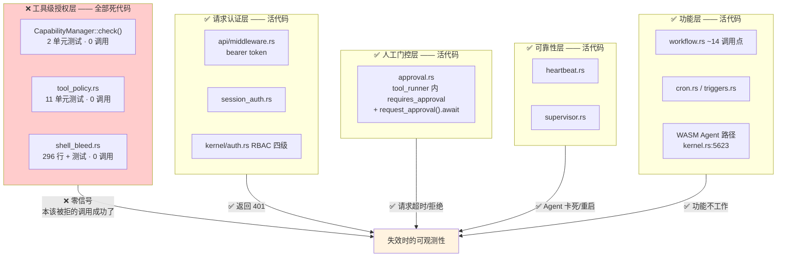

**核心**：死代码全部落在唯一"缺席时系统仍完全正常工作"的层。

---

## D-2 Capability 生命周期：grant 活，check 死

> 依据：[openfang-security.md](openfang-security.md) §1.2

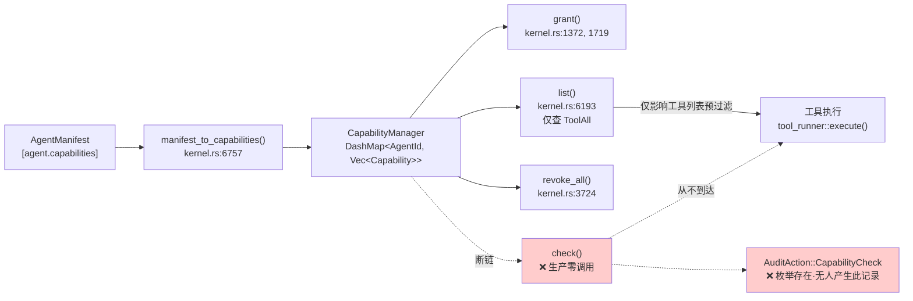

---

## D-3 工具门控真实路径：fail-open

> 依据：[openfang-security.md](openfang-security.md) §2

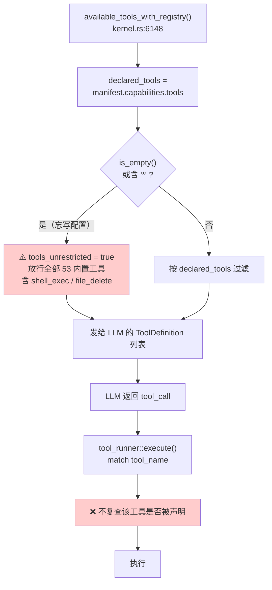

**两个缺陷**：空配置得到最高权限；预过滤不是强制（LLM 幻觉工具名 / MCP 动态工具可绕过）。

---

## D-4 测试覆盖叠加死代码

> 依据：[openfang-test-analysis.md](openfang-test-analysis.md) §0, §3

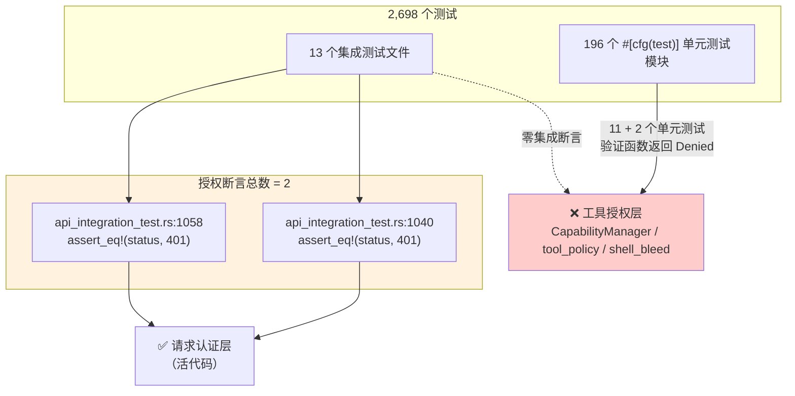

**唯二的授权断言恰好覆盖活着的那一层，死掉的那一层零断言。**

---

## D-5 Scheduler 名实之别

> 依据：[openfang-kernel.md](openfang-kernel.md) §5

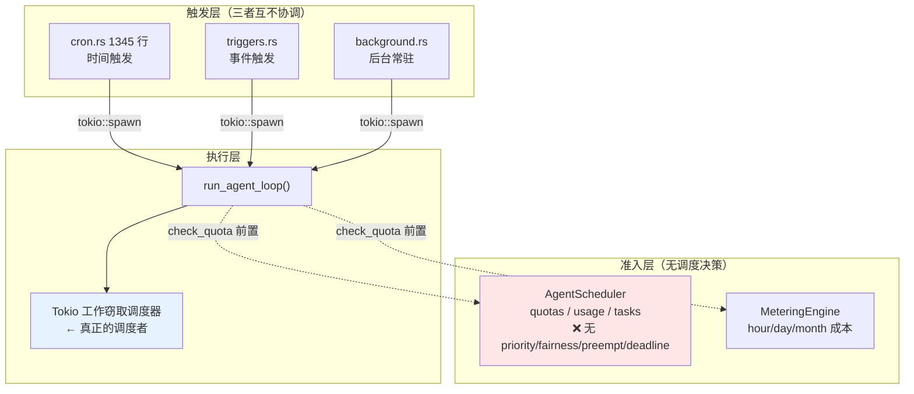

---

## D-6 崩溃恢复：什么活下来

> 依据：[openfang-kernel.md](openfang-kernel.md) §7，[openfang-memory.md](openfang-memory.md) §5.2

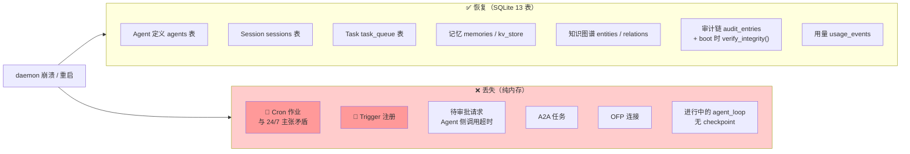

---

## D-7 内存层与单锁瓶颈

> 依据：[openfang-memory.md](openfang-memory.md) §1-2

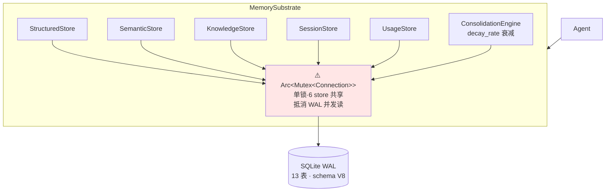

---

## D-8 六层记忆模型

> 依据：[openfang-memory.md](openfang-memory.md) §2

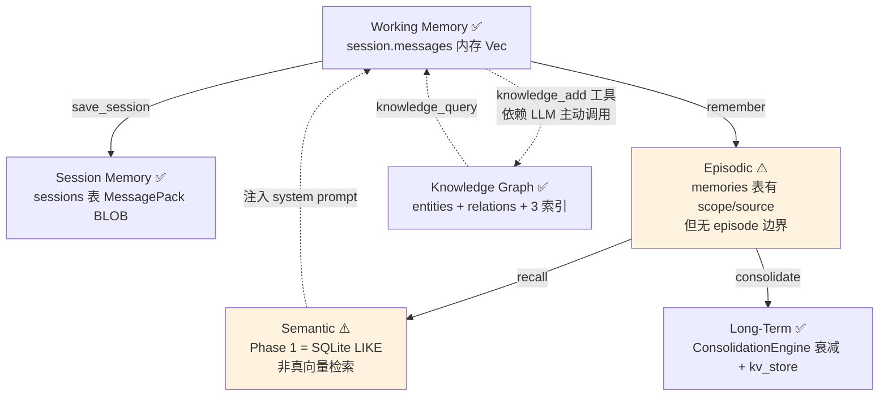

---

## D-9 依赖倒置打破循环

> 依据：[openfang-architecture.md](openfang-architecture.md) §3

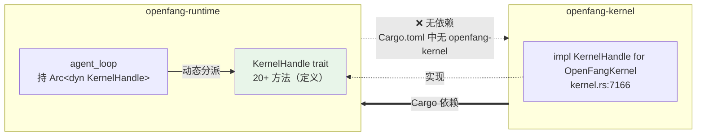

**分层由 Rust 编译器强制，非文档约定。**

---

## D-10 TCB 构成

> 依据：[openfang-security.md](openfang-security.md) §6

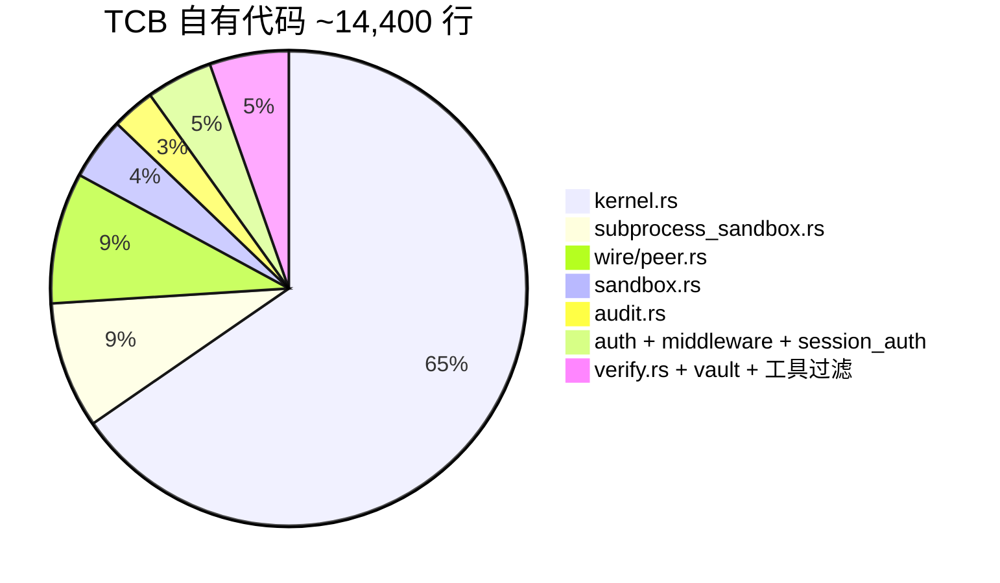

`kernel.rs` 占 65%。加上 SQLite（~150K）+ wasmtime（~200K）依赖，
TCB 总量 > 360K 行。理想 Agent OS TCB 应 < 2000 行。

---

## D-11 OFP 握手：认证有，加密无

> 依据：[openfang-wire](../llmwiki/wire-protocol.md)，[openfang-security.md](openfang-security.md) §4

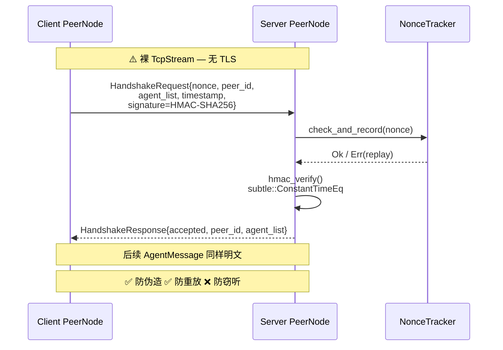

---

## D-12 Bianbu Capability Token 流

> 依据：[openfang-to-bianbu.md](openfang-to-bianbu.md) §3

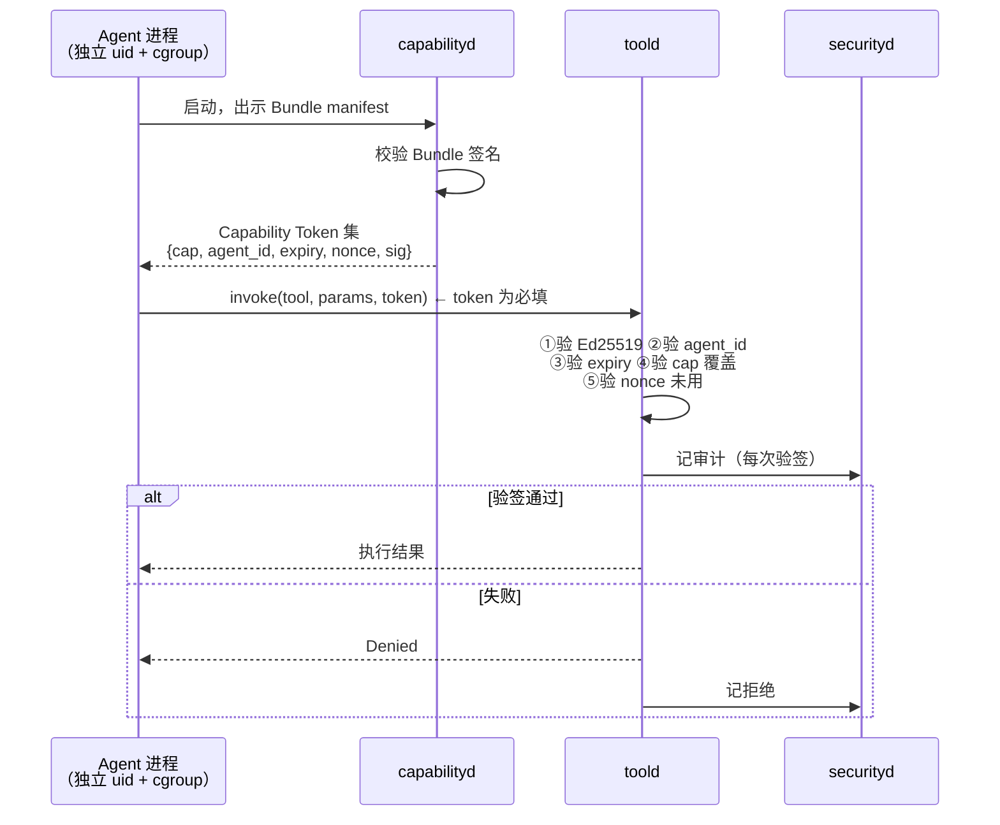

**关键**：token 是协议必填参数，无 token 的请求在协议层无法构造——
消除 OpenFang 的旁路（D-2）。

---

## D-13 三套包格式无法组合

> 依据：[openfang-agent-model.md](openfang-agent-model.md) §6

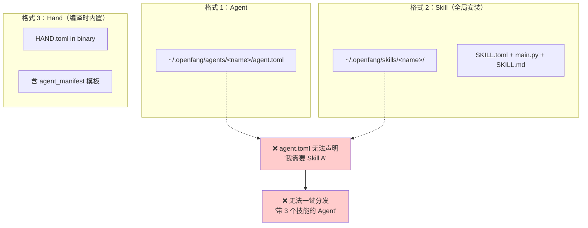

---

## D-14 五维评分

> 依据：[openfang-agent-os-verdict.md](openfang-agent-os-verdict.md) §6

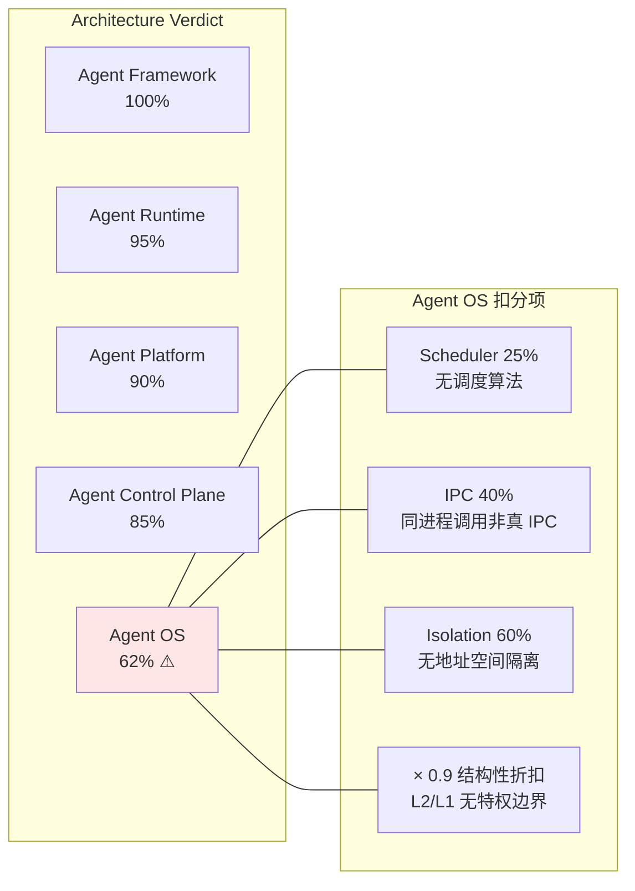

---

## D-15 Agent OS 分层与缺失的特权边界

> 依据：[openfang-agent-os-verdict.md](openfang-agent-os-verdict.md) §3

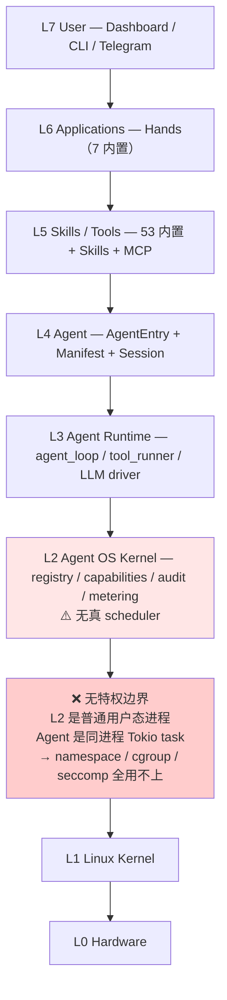

---

## D-16 Channel 路由解析层级

> 依据：`channels/src/router.rs` 的 20 个 pub fn（双方法核实计数与名称）
> 及 [../llmwiki/channels.md](../llmwiki/channels.md) 的路由模型

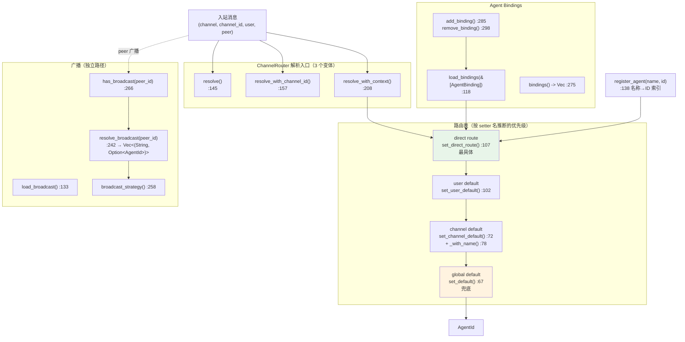

**观察 1**：三个 `resolve` 变体（`resolve` / `resolve_with_channel_id` /
`resolve_with_context`）对应输入具体度递增——这是渐进增强的演进痕迹，
新变体加参数而非改签名，保持向后兼容。

**观察 2**：四级路由表（direct → user → channel → global）中，
只有 `channel_default` 有配套的 `_with_name()` 和 `update_channel_default()`
（:96）与 `channel_default_name()`（:89）——说明 channel 级默认值是
Dashboard 里用户最常改的一层，为它做了额外的读写 API。

**观察 3**：广播是完全独立的路径（`resolve_broadcast` 返回
`Vec<(String, Option<AgentId>)>` 而非单个 `AgentId`），
不走四级解析。`Option<AgentId>` 说明广播目标可以没有绑定 Agent。

> **精度声明**：20 个 pub fn 的名称与行号经双方法核实。
> 四级优先级顺序是**从 setter 命名推断**，未逐行读 `resolve_with_context` 的
> 分支顺序核实（该处读取落在通道不稳定窗口）。若需精确顺序，
> 应重读 `router.rs:208-241`。

---

## 图集索引

| # | 图 | 依据文档 |
|---|---|---|
| D-1 | 死代码分层 | security §1-3 |
| D-2 | Capability 生命周期 | security §1.2 |
| D-3 | 工具门控 fail-open | security §2 |
| D-4 | 测试覆盖叠加 | test-analysis §0,§3 |
| D-5 | Scheduler 名实 | kernel §5 |
| D-6 | 崩溃恢复 | kernel §7 / memory §5.2 |
| D-7 | 内存单锁瓶颈 | memory §1-2 |
| D-8 | 六层记忆 | memory §2 |
| D-9 | 依赖倒置 | architecture §3 |
| D-10 | TCB 构成 | security §6 |
| D-11 | OFP 握手 | security §4 |
| D-12 | Bianbu Token 流 | to-bianbu §3 |
| D-13 | 三套包格式 | agent-model §6 |
| D-14 | 五维评分 | verdict §6 |
| D-15 | 分层与特权边界 | verdict §3 |
| D-16 | Channel 路由解析层级 | `router.rs` 20 个 pub fn |

**本文件 16 张 + 其他文档 12 张 = 28 张**，达到 goal §82 要求。

其他文档的 12 张分布：`kernel.md` 2、`memory.md` 2、`security.md` 2、
`agent-model.md` 1、`agent-os-verdict.md` 1、`architecture.md` 1、
`riscv-edge.md` 1、`to-bianbu.md` 1、`hands-workflow.md` 1。
