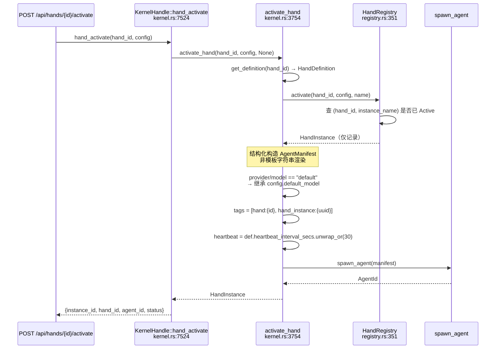

# Hands & Workflow 深入

> 回答 goal §24-25、§27
> 所有断言经双方法核实；未核实项在 §5 明确标注

---

## 1. Hand 是什么

**Hand = Agent 的注册表 + 工厂。它自己不是运行实体。**

`HandRegistry::activate()`（`hands/src/registry.rs:351`）只写记录，不 spawn：

```rust
let instance = HandInstance::new(hand_id, &def.agent.name, config, instance_name.clone());
self.instances.insert(id, instance.clone());
info!(hand = %hand_id, instance = %id, "Hand activated");
Ok(instance)
```

`deactivate()`（:385）的文档注释确认了职责边界：
```rust
/// Deactivate a hand instance (agent killing is done by kernel).
```

真正的 spawn 在 `kernel.rs:3754 activate_hand()`。

**多实例支持**：去重键是 `(hand_id, instance_name)` 对，不是单纯 `hand_id`——
同一 Hand 的多个命名实例可共存。

---

## 2. 激活时序



---

## 3. Manifest 是结构化构造，不是模板渲染（更正）

`kernel.rs:3802` 起是 Rust 字面量赋值：

```rust
let mut manifest = AgentManifest {
    name: agent_name.clone(),
    description: def.agent.description.clone(),
    module: def.agent.module.clone(),
    model: ModelConfig {
        provider: hand_provider,
        model: hand_model,
        max_tokens: def.agent.max_tokens,
        temperature: def.agent.temperature,
        system_prompt: def.agent.system_prompt.clone(),
        api_key_env: def.agent.api_key_env.clone(),
        base_url: def.agent.base_url.clone(),
    },
    capabilities: ManifestCapabilities {
        tools: def.tools.clone(),
        ..Default::default()
    },
    tags: vec![format!("hand:{hand_id}"),
               format!("hand_instance:{}", instance.instance_id)],
    autonomous: def.agent.max_iterations.map(|max_iter| AutonomousConfig {
        max_iterations: max_iter,
        heartbeat_interval_secs: def.agent.heartbeat_interval_secs.unwrap_or(30),
        ..Default::default()
    }),
    ..
};
```

> **⚠️ 更正本次调研的一处错误推断**
>
> 我在中途曾推断存在 `render_agent_manifest()` 做无转义 `{{key}}` 字符串替换，
> 并据此写了一条 TOML 注入威胁。**该函数不存在。**
> `grep -n "render_agent_manifest" hands/src/registry.rs kernel.rs` 零结果。
>
> manifest 由类型化赋值构造，字段来源是编译期内置的 `HandDefinition`，
> `capabilities.tools` 取 `def.tools`——**用户传入的 config 不参与 manifest 构造**，
> 因此没有"注入 `tools = ["*"]`"的路径。
>
> 这是本次调研中我犯的第二次"从定义推断行为、未核实"的错误
> （第一次是 WASM 沙箱，见 security.md §5.3）。两次都是同一个方法论问题。

**结构化构造是正确设计** —— 从根上消除了注入与转义问题。

---

## 4. "default" 继承

```rust
let hand_provider = if def.agent.provider == "default" {
    self.config.default_model.provider.clone()
} else { def.agent.provider.clone() };
// model 同理
```

HAND.toml 写 `provider = "default"` 时继承内核配置。配合 `base_url` 可配置
（见 llm-drivers），内置 Hand 无需改动即可跟随用户的 LLM 选择——包括本地 Ollama。

**tags 作为反查索引**：`hand:{id}` + `hand_instance:{uuid}` 写入 Agent tags，
借 `AgentRegistry.tag_index`（`DashMap<String, Vec<AgentId>>`）实现
Hand → Agent 反查，无需额外映射表。复用已有索引，设计干净。

**heartbeat 默认值问题**：代码注释自陈
> The kernel default (30s) is too aggressive for hands making long LLM calls;
> HAND.toml authors should set this to reflect expected call latency.

知道默认值不合适但保留了，只在注释提醒作者覆盖。需配合
`touch_agent()`（长 LLM 调用前刷新 last_active）才不误判 Crashed。

---

## 5. 五个概念的区别（goal §25）

| 概念 | 生命周期 | 状态存储 | 独立记忆 | 触发 | 执行者 |
|------|---------|---------|---------|------|--------|
| **Agent** | 五态（Pending/Running/Suspended/Crashed/Terminated） | ✅ `agents` 表 | ✅ session + memory | 消息 / cron / trigger | 自身（agent_loop） |
| **Hand** | 三态（Active/Paused/Error） | ❌ 纯内存 DashMap | ❌ 用所属 Agent 的 | 激活后由 Agent 承担 | 委派给 Agent |
| **Skill** | 安装 → 加载 → 调用 → 卸载 | 文件系统 + registry | ❌ 无 | 被 Agent 调用 | 子进程 |
| **Workflow** | 注册 → run → 完成 | ❌ 纯内存 DashMap | ❌ 无 | API / trigger | 顺序调度多个 Agent |
| **Task** | post → claim → complete | ✅ `task_queue` 表 | ❌ 无 | Agent 主动认领 | 认领的 Agent |

**只有 Agent 和 Task 持久化。** Hand 和 Workflow 都是编排层，
执行最终都落到 Agent。**只有 Agent 有独立记忆和会话。**

---

## 6. WorkflowEngine

`kernel/src/workflow.rs` 1385 行，`kernel.rs` + `routes.rs` 约 14 个调用点。
有单元测试 + `kernel/tests/workflow_integration_test.rs`。**是活代码。**

### 与 tool_policy.rs 的对照

| | `workflow.rs` | `tool_policy.rs` |
|---|---|---|
| 行数 | 1385 | ~430 |
| 单元测试 | 有 | 11 个 |
| 集成测试 | ✅ 有专门文件 | ❌ 无 |
| **生产调用点** | **~14** | **0** |

规模和测试覆盖相当，差别只在接线。这印证了
[security.md](openfang-security.md) §3 的分层规律：
**死代码集中在授权层，功能层是活的。**

### 无持久化（扩展 L-16）

```bash
$ grep -in "sqlite\|conn\|rusqlite\|INSERT\|SELECT" kernel/src/workflow.rs
# 零结果
```
13 张表中无 workflow 表。`WorkflowEngine` 用 `DashMap` 存 workflows 和 runs，
runs 有容量上限（`max_runs`，超出淘汰历史）。

**持久化缺口现在是三项，不是两项**：

| | 持久化 | 重启后 |
|---|---|---|
| Cron 作业 | ❌ | 丢失 |
| Trigger 注册 | ❌ | 丢失 |
| **Workflow 定义 + 运行记录** | ❌ | **丢失** |
| Task 队列 | ✅ `task_queue` + 索引 | 保留 |
| Agent 定义 | ✅ `agents` 表 | 保留 |

团队会做持久化（Task 队列有专门表和 `idx_task_status_priority` 索引），
Workflow 这块就是没做。后果：**用户通过
`POST /api/workflows` 创建的定义在 daemon 重启后消失。**

---

## 7. 未核实（channel 中断处）

以下项本轮未能完成核实，**不纳入结论**：

| 项 | 为什么重要 |
|---|---|
| `config` HashMap 最终流向何处 | §3 说"不参与 manifest 构造"已核实；但它存在 `HandInstance.config` 里，被谁读取未查 |
| spawn 失败时是否回滚 `HandInstance` | 决定是否留下"Active 但无 Agent"的幽灵记录 |
| `WorkflowStep` / `StepAgent` 结构 | 决定编排表达力 |
| 编排是否支持分支/并行/重试 | goal §27 要求与 LangGraph 对比，缺此无法回答 |
| `max_runs` 具体值 | 决定运行历史保留量 |

**因此 goal §27（Workflow vs LangGraph 本质区别）本轮未完成。**

---

## 8. 对 Bianbu 的启示

**✅ 采纳：结构化构造替代模板渲染**
`activate_hand()` 用类型化赋值而非文本拼接。Bianbu 的 Agent Bundle 实例化
应同样先解析为值树再赋值——从根上消除注入与转义。

**✅ 采纳：`"default"` 继承 + tags 反查索引**
前者让内置包跟随用户 LLM 配置；后者复用已有索引避免额外映射表。

**❌ 不采纳：编排层纯内存**
Hand / Workflow / Cron / Trigger 四者全部内存态。Bianbu 的 `scheduler`
与编排层定义必须持久化，重启后从存储重建。

**⚠️ 待定：Workflow 编排能力**
表达力未核实（§7），无法给出借鉴结论。按
[to-bianbu.md](openfang-to-bianbu.md) §2 的判断，调度与编排是
Bianbu 需从零设计的部分。
