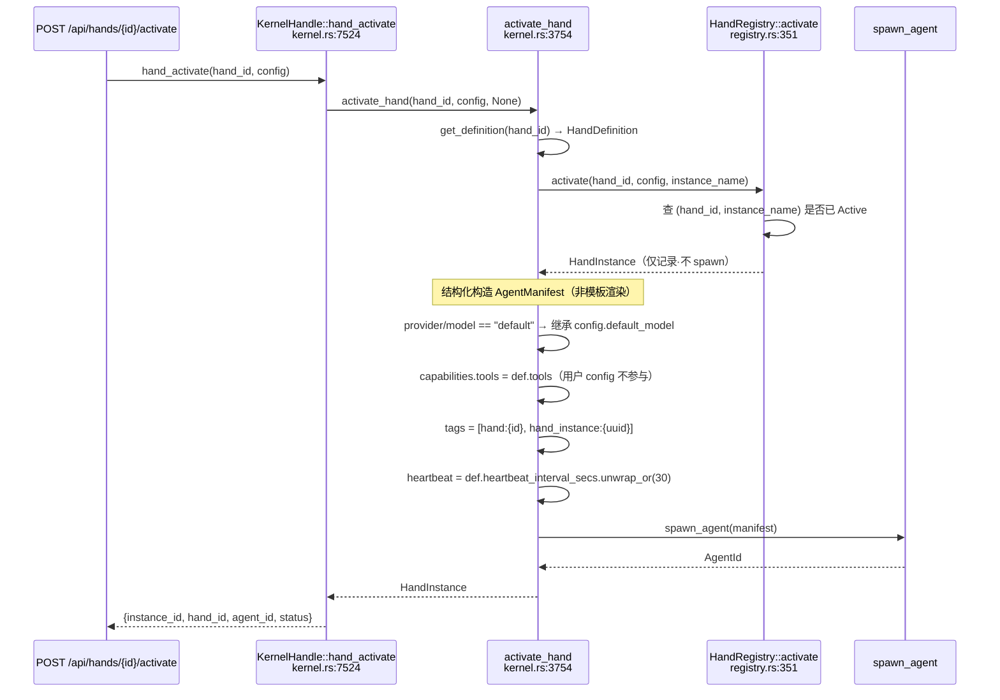

# Hands & Workflow 深入

> 回答 goal §24-25、§27
> 所有断言经双方法核实（`wc -l`/`awk`、`grep -c`/`grep -o|wc -l`）

---

## 1. Hand 是什么

**Hand = Agent 的注册表 + 工厂，自己不是运行实体。**

`HandRegistry::activate()`（`hands/src/registry.rs:351`）只写记录，不 spawn：

```rust
let instance = HandInstance::new(hand_id, &def.agent.name, config, instance_name.clone());
self.instances.insert(id, instance.clone());
Ok(instance)
```

`deactivate()`（:385）的文档注释确认职责边界：

```rust
/// Deactivate a hand instance (agent killing is done by kernel).
```

真正的 spawn 在 `kernel.rs:3754 activate_hand()`。

**多实例**：去重键是 `(hand_id, instance_name)` 对，同一 Hand 的多个命名实例可共存。

---

## 2. Manifest 是结构化构造，不是模板渲染

`kernel.rs:3802` 起是 Rust 字面量赋值：

```rust
let mut manifest = AgentManifest {
    name: agent_name.clone(),
    model: ModelConfig {
        provider: hand_provider,   // def.agent.provider == "default" → 继承内核配置
        model: hand_model,
        system_prompt: def.agent.system_prompt.clone(),
        base_url: def.agent.base_url.clone(),
        ..
    },
    capabilities: ManifestCapabilities {
        tools: def.tools.clone(),          // ← 取自 HandDefinition，非用户 config
        ..Default::default()
    },
    tags: vec![format!("hand:{hand_id}"),
               format!("hand_instance:{}", instance.instance_id)],
    autonomous: def.agent.max_iterations.map(|max_iter| AutonomousConfig {
        max_iterations: max_iter,
        heartbeat_interval_secs: def.agent.heartbeat_interval_secs.unwrap_or(30),
        ..Default::default()
    }),
    ..
};
```

> **⚠️ 更正本次调研的一处错误推断**
>
> 我曾推断存在 `render_agent_manifest()` 做无转义 `{{key}}` 替换，并据此写了
> TOML 注入威胁。**该函数不存在**（grep 零结果）。manifest 由类型化赋值构造，
> `capabilities.tools` 取 `def.tools`——**用户 config 不参与 manifest 构造**，
> 无"注入 `tools = ["*"]`"路径。
>
> 结构化构造是正确设计：从根上消除注入与转义问题。

**`"default"` 继承**：HAND.toml 写 `provider = "default"` 时继承内核配置，
配合 `base_url` 可配置，内置 Hand 无需改动即可跟随用户的 LLM 选择（含本地 Ollama）。

**tags 作反查索引**：借 `AgentRegistry.tag_index` 实现 Hand → Agent 反查，
复用已有索引，无需额外映射表。

**heartbeat 默认值**：代码注释自陈 30s 对长 LLM 调用过于激进，
但保留了该默认值，只提醒 HAND.toml 作者覆盖。

---

## 2b. 激活时序



---

## 3. 五个概念的区别（goal §25）

| 概念 | 生命周期 | 状态存储 | 独立记忆 | 触发 | 执行者 |
|------|---------|---------|---------|------|--------|
| **Agent** | 五态 | ✅ `agents` 表 | ✅ session + memory | 消息/cron/trigger | 自身 |
| **Hand** | 三态 | ❌ 纯内存 DashMap | ❌ 用所属 Agent 的 | 激活后由 Agent 承担 | 委派给 Agent |
| **Skill** | 装→载→调→卸 | 文件系统 + registry | ❌ | 被 Agent 调用 | 子进程 |
| **Workflow** | 注册→run→完成 | ❌ 纯内存 DashMap | ❌ | API / trigger | 顺序+并行调度多 Agent |
| **Task** | post→claim→complete | ✅ `task_queue` 表 | ❌ | Agent 主动认领 | 认领的 Agent |

**只有 Agent 和 Task 持久化。只有 Agent 有独立记忆和会话。**

---

## 4. Workflow 编排表达力（goal §27）

`kernel/src/workflow.rs` 1385 行，`kernel.rs`+`routes.rs` 约 14 个调用点，
有单元测试 + `kernel/tests/workflow_integration_test.rs`。**是活代码。**

### 4.1 类型定义

```rust
pub enum StepAgent {
    ById { id: String },      // UUID 引用
    ByName { name: String },  // 名称引用（首个匹配）
}

pub enum StepMode {
    #[default] Sequential,  // 顺序：上一步完成后执行
    FanOut,                 // 扇出：与后续 FanOut 步骤并行，直到 Collect
    Collect,                // 收集：汇总先前所有 fan-out 结果
    Conditional,            // 条件：previous output 不含 condition 则跳过（大小写不敏感）
}

pub struct WorkflowStep {
    pub name: String,
    pub agent: StepAgent,
    pub prompt_template: String,   // {{input}} = 上一步输出，{{var_name}} = 变量
    pub mode: StepMode,
    pub timeout_secs: u64,         // 默认 120
    pub error_mode: ErrorMode,     // 默认 Fail
    pub output_var: Option<String>, // 可选：把本步输出存入变量
}
```

### 4.2 FanOut 是真并行（已核实）

执行器在 `workflow.rs`，不在 `kernel.rs`：

```bash
$ grep -c "StepMode::" crates/openfang-kernel/src/workflow.rs   # 27
$ grep -c "StepMode::" crates/openfang-kernel/src/kernel.rs     # 0
```

`workflow.rs:571` 的并发实现：

```rust
// 收集 fan-out 步骤的 future，每个带独立超时
step_infos.push((*idx, fan_step.name.clone(), agent_id, agent_name));
futures.push(tokio::time::timeout(
    timeout_dur,
    send_message(agent_id, prompt),
));
// ...
let start = std::time::Instant::now();
let results = futures::future::join_all(futures).await;   // ← 真并发
let duration_ms = start.elapsed().as_millis() as u64;
```

并发原语计数（双方法一致）：`join_all: 1`、`futures::future: 1`、
`tokio::spawn: 0`、`JoinSet: 0`。

用 `join_all` 而非 `tokio::spawn`：所有 fan-out 在同一 task 内并发，
不额外派生 task。对 IO-bound 的 LLM 调用是正确选择。

> **⚠️ 更正第二处错误推断**
>
> 我曾用 `grep "parallel\|branch\|retry\|depends_on"` 得到 8 个关键词全零，
> 据此断定 Workflow 是"纯线性管道"。**这个结论错误。**
>
> 原因：代码的词汇是 **FanOut / Collect / Conditional**，不是 parallel / branch。
> **按概念搜关键词会漏掉领域特定命名。** 必须读类型定义和调用点。

### 4.3 与 LangGraph 对比

| 维度 | OpenFang Workflow | LangGraph |
|------|------------------|-----------|
| 拓扑 | 顺序 + FanOut/Collect 并行 | 有向图（DAG） |
| 分支 | Conditional（线性跳过） | 条件边（真分支） |
| 依赖声明 | ❌ 无 `depends_on` | ✅ 显式边 |
| 并行 | ✅ `join_all` | ✅ |
| 状态传递 | `{{input}}` + `{{var_name}}` + `output_var` | 结构化 State |
| **检查点/恢复** | ❌ 无 | ✅ Checkpointer |
| **持久化** | ❌ 定义和运行记录全内存 | ✅ 可持久化 |
| 错误处理 | 每步 ErrorMode（Fail/Continue） | 图级重试策略 |
| 超时 | 每步 `timeout_secs`（默认 120） | 需自行实现 |

**本质区别不在表达力，在持久化与检查点。** 编排能力比初判接近得多——
有并行、有条件跳过、有 per-step 超时和错误模式。差距在：
无依赖图（只能线性+扇出，不能任意 DAG）、无检查点、不持久化。

### 4.4 无持久化（扩展 L-16）

```bash
$ grep -in "sqlite\|rusqlite\|INSERT\|SELECT" crates/openfang-kernel/src/workflow.rs
# 零结果
```

13 张表中无 workflow 表。`WorkflowEngine` 用 `DashMap` 存 workflows 和 runs，
runs 有 `max_runs` 容量上限（超出淘汰历史）。

**持久化缺口是三项**：

| | 持久化 | 重启后 |
|---|---|---|
| Cron 作业 | ❌ | 丢失 |
| Trigger 注册 | ❌ | 丢失 |
| Workflow 定义 + 运行记录 | ❌ | 丢失 |
| Task 队列 | ✅ `task_queue` + `idx_task_status_priority` | 保留 |
| Agent 定义 | ✅ `agents` 表 | 保留 |

团队会做持久化（Task 队列有专门表和索引），Workflow 这块就是没做。
后果：`POST /api/workflows` 创建的定义在 daemon 重启后消失。

### 4.5 与 tool_policy.rs 的对照

| | `workflow.rs` | `tool_policy.rs` |
|---|---|---|
| 行数 | 1385 | ~430 |
| 单元测试 | 有 | 11 个 |
| 集成测试 | ✅ 专门文件 | ❌ 无 |
| **生产调用点** | **~14** | **0** |

规模和测试覆盖相当，差别只在接线。印证
[security.md](openfang-security.md) §3 的分层规律：
**死代码集中在授权层，功能层是活的。**

---

## 5. 未核实

| 项 | 说明 |
|---|---|
| `ErrorMode` 全部变体 | 已确认含 Fail（默认）/ Continue，是否还有其他未查 |
| `Collect` 的聚合语义 | 如何合并多个 fan-out 输出（拼接？JSON 数组？）未读 |
| `max_runs` 具体值 | 决定运行历史保留量 |
| `config` HashMap 最终流向 | 已确认不参与 manifest 构造，存于 `HandInstance.config`，被谁读取未查 |
| spawn 失败是否回滚 `HandInstance` | 决定是否留下"Active 但无 Agent"的幽灵记录 |

---

## 6. 对 Bianbu 的启示

**✅ 采纳：结构化构造替代模板渲染**（§2）——从根上消除注入与转义。

**✅ 采纳：`"default"` 继承 + tags 反查索引**——前者让内置包跟随用户 LLM 配置，
后者复用已有索引。

**✅ 采纳：`join_all` 而非 spawn 做 IO 密集并发**——不额外派生 task。

**⚠️ 部分采纳：编排模型**
FanOut/Collect/Conditional 覆盖了常见场景，可作起点。但需补：
依赖图（任意 DAG 而非仅线性+扇出）、检查点/恢复、持久化。

**❌ 不采纳：编排层纯内存**
Hand / Workflow / Cron / Trigger 四者全部内存态。Bianbu 的 `scheduler`
与编排层定义必须持久化，重启后从存储重建。
