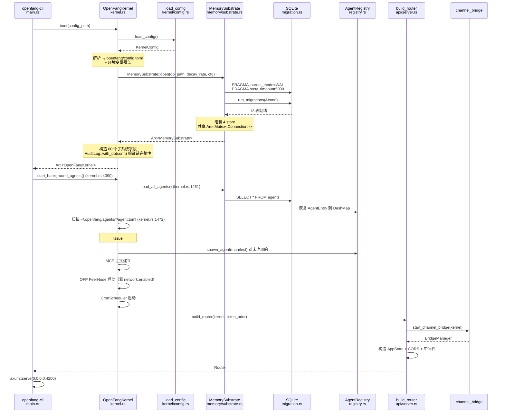
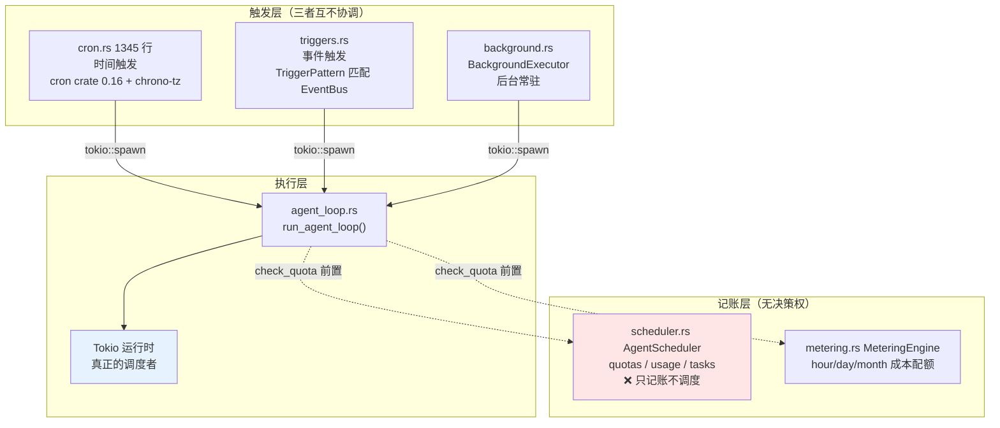

# OpenFang Kernel 逆向分析

> 回答 goal §6-7、§26、§41-42、§50-51

---

## 1. Kernel 到底是什么

`crates/openfang-kernel/src/kernel.rs`，9415 行，`OpenFangKernel` 结构体约 60 个字段。

**判定：它是一个 Subsystem Composition Root（子系统组装根），
兼具部分内核职责，但不是特权内核。**

证据 —— 字段按职责分类：

| 类别 | 字段 | 内核性质 |
|------|------|---------|
| 真内核职责 | `registry`、`capabilities`、`scheduler`、`metering`、`audit_log`、`supervisor` | ✅ 是 |
| 资源管理 | `memory`、`wasm_sandbox`、`process_manager` | ✅ 是 |
| 编排 | `workflows`、`triggers`、`cron_scheduler`、`background` | ⚠️ 半内核 |
| 应用服务 | `web_ctx`、`browser_ctx`、`media_engine`、`tts_engine` | ❌ 不是内核该管的 |
| 集成 | `mcp_connections`、`a2a_task_store`、`channel_adapters`、`extension_registry` | ❌ 应在上层 |
| 配置缓存 | `default_model_override`、`fallback_providers_override`、`skill_config_overrides` | ❌ 配置管理 |

**约 40% 的字段不是内核职责**。`tts_engine`（文字转语音）和 `browser_ctx`
（Playwright 浏览器）出现在"内核"结构体里，说明这是一个 God Object 而非
分层内核。这是 goal §68 要求找的架构债之一。

---

## 2. Boot 时序（goal §7）

入口：`kernel.rs:551 pub fn boot(config_path)` → `:590 boot_with_config(config)`



### Boot 关键细节

**1. 两阶段构造**：`boot()` 只构造子系统，`start_background_agents()`
才真正启动 Agent。这是因为很多子系统需要 `Weak<OpenFangKernel>` 自引用
（`self_handle: OnceLock<Weak<OpenFangKernel>>`），必须在 `Arc::new` 之后设置。

**2. Agent 恢复有两条路径**：
- 路径 A：`memory.load_all_agents()` 从 SQLite `agents` 表恢复
- 路径 B：扫描 `~/.openfang/agents/<name>/agent.toml` 自动 spawn 未注册的

路径 B 的注释（kernel.rs:1466）说明了原因：用户手动放的 agent 目录
不会出现在 `GET /api/agents`，需要 boot 时扫描。这是补丁式设计——
**两个真相来源（DB + 文件系统）需要在 boot 时对账**。

**3. 审计链在 boot 时验证**：
```rust
// audit.rs::with_db
if count > 0 {
    if let Err(e) = log.verify_integrity() {
        tracing::error!("Audit trail integrity check FAILED on boot: {e}");
    }
}
```
注意：验证失败**只记 error 日志，不阻止启动**。被篡改的审计链仍会继续追加。
这是一个安全设计缺陷（详见 security.md）。

---

## 3. Kernel State 与并发原语

goal §50 要求的并发模型分析。统计 `kernel.rs` 中的同步原语选择：

| 原语 | 用途 | 字段举例 | 理由 |
|------|------|---------|------|
| `DashMap` | 高频并发读写 | `running_tasks`、`agent_msg_locks`、`channel_adapters` | 分段锁，无全局竞争 |
| `RwLock` | 读多写少 | `model_catalog`、`skill_registry`、`effective_mcp_servers` | 热重载场景 |
| `Mutex` | 串行化 | `mcp_connections`、`credential_resolver`、`a2a_external_agents` | 需要独占 |
| `OnceLock` | 延迟单次初始化 | `peer_registry`、`peer_node`、`self_handle` | 需要 Arc 之后才能构造 |
| `Arc` | 共享所有权 | `memory`、`audit_log`、`metering`、`process_manager` | 跨 task 共享 |
| `tokio::sync::Mutex` | 异步串行化 | `mcp_connections` | 持锁跨 await |

**一个 Agent 对应什么**（goal §50 的核心问题）：

```rust
// kernel.rs
pub running_tasks: dashmap::DashMap<AgentId, tokio::task::AbortHandle>,
agent_msg_locks: dashmap::DashMap<AgentId, Arc<tokio::sync::Mutex<()>>>,
```

答案：**一个 Agent 对应一个 `tokio::task::AbortHandle` + 一个 per-agent 互斥锁**。

- 不是 OS thread（Tokio 多路复用到线程池）
- 不是独立进程（无地址空间隔离）
- `agent_msg_locks` 保证同一 Agent 的消息串行处理（防会话损坏），
  不同 Agent 可并行

代码注释直接说明了 per-agent 锁的动机：
> serializes LLM calls for the same agent to prevent session corruption
> when multiple messages arrive concurrently (e.g. rapid voice messages via Telegram)

这是**正确的设计**——Agent 的 session 是有状态的，并发写会损坏消息历史配对。

---

## 4. Kernel Shutdown

`Supervisor` 用 `tokio::sync::watch::channel<bool>` 广播关机：

```rust
// supervisor.rs
pub fn shutdown(&self) {
    info!("Supervisor: initiating graceful shutdown");
    let _ = self.shutdown_tx.send(true);
}
pub fn subscribe(&self) -> watch::Receiver<bool> { self.shutdown_rx.clone() }
```

各子系统 `subscribe()` 后在 `select!` 中监听。另有：
- `graceful_shutdown.rs` in runtime
- `whatsapp_gateway_pid` 用于清理子进程
- `AppState.shutdown_notify: Arc<Notify>` 用于 API 层

**问题**：没有关机顺序编排。理想的 OS 关机是有序的
（停止接受新请求 → 等待进行中的任务 → 刷盘 → 关闭连接）。
OpenFang 是广播式的，各子系统自行决定何时退出，无依赖顺序保证。

---

## 5. Scheduler 真相（最重要发现）

goal §26 问 "Scheduler 是 Kernel subsystem 还是 Runtime subsystem"，
goal §42 问 "是否存在 Priority / Fairness / Quota / Preemption / Deadline / Retry"。

### 5.1 AgentScheduler 的全部内容

`crates/openfang-kernel/src/scheduler.rs` 完整结构：

```rust
pub struct AgentScheduler {
    quotas: DashMap<AgentId, ResourceQuota>,   // 配额表
    usage:  DashMap<AgentId, UsageTracker>,    // 用量表（滚动 1 小时窗口）
    tasks:  DashMap<AgentId, JoinHandle<()>>,  // task 句柄
}
```

方法清单：`register` / `record_usage` / `check_quota` / `reset_usage` /
`abort_task` / `unregister`。

**没有任何调度方法**。没有 `schedule()`、没有 `next_to_run()`、
没有 run queue、没有优先级比较、没有时间片。

`UsageTracker` 只做一件事：
```rust
fn reset_if_expired(&mut self) {
    if self.window_start.elapsed() >= Duration::from_secs(3600) {
        self.total_tokens = 0;
        self.tool_calls = 0;
        self.window_start = Instant::now();
    }
}
```
滚动小时窗口的配额记账。

### 5.2 goal §42 逐项回答

| 调度特性 | 是否存在 | 证据 |
|---------|---------|------|
| Priority | ❌ 无 | 无优先级字段，无比较逻辑 |
| Fairness | ❌ 无 | 无轮转、无 vruntime、无权重 |
| Quota | ✅ 有 | `ResourceQuota.max_llm_tokens_per_hour` + `metering.rs` 三档成本 |
| Preemption | ❌ 无 | 只有 `abort_task()` 硬中止，无抢占后恢复 |
| Deadline | ❌ 无 | 工具有 timeout，但不是调度 deadline |
| Retry | ⚠️ 部分 | agent_loop 内有 LLM 重试；Agent 级重启在 `supervisor.record_agent_restart` |

**1 有 / 1 部分 / 4 无**。

### 5.3 真正决定"何时执行"的三个组件



**真正的调度器是 Tokio 的工作窃取调度器**。OpenFang 把调度委托给了 Tokio，
自己只做准入控制（quota check）。

这在工程上**是合理选择**——重写调度器没必要。但在架构判定上，
这意味着 OpenFang **不拥有调度语义**：
- 无法表达"这个 Agent 比那个重要"
- 无法保证"每个 Agent 每小时至少跑一次"
- 无法在过载时优雅降级（只能靠 quota 硬拒绝）

### 5.4 24/7 自主执行是否真实（goal §26）

**是真实的**，但机制是 cron + trigger，不是 scheduler：

```rust
// cron.rs — 每个 Agent 可注册多个 cron job
// 支持时区（chrono-tz）
// 结果通过 WebSocket 推送到 Dashboard（ws.rs::start_ws_cron_broadcaster）
```

`AutonomousConfig` 提供守护参数：
```rust
pub struct AutonomousConfig {
    pub quiet_hours: Option<String>,      // cron 表达式，静默时段
    pub max_iterations: u32,
    pub max_restarts: u32,
    pub heartbeat_interval_secs: u64,
}
```

配合 `heartbeat.rs` 探活 + `supervisor.record_agent_restart(id, max_restarts)`
限制重启次数。这套组合能实现 24/7 运行，**但它是 supervisor 模式
（类似 systemd 的 Restart=always），不是 scheduler 模式**。

---

## 6. Resource Management（goal §41）

Agent OS 需要管理 CPU / Memory / Storage / Network / LLM tokens / Concurrency。逐项查：

| 资源 | 是否管理 | 机制 | 源码 | 缺口 |
|------|---------|------|------|------|
| LLM tokens | ✅ 强 | `ResourceQuota.max_llm_tokens_per_hour` + 滚动窗口 | `scheduler.rs::check_quota` | — |
| LLM 成本 | ✅ 强 | hour/day/month 三档 + 全局预算 | `metering.rs::check_quota` / `check_global_budget` | — |
| CPU（WASM） | ✅ 有 | `fuel_limit: 1_000_000` 默认 | `sandbox.rs` | 只对 WASM |
| CPU（原生/子进程） | ❌ 无 | — | — | 无 cgroup / nice |
| Wall-clock | ✅ 有 | epoch_interruption + watchdog 线程 | `sandbox.rs:185-190` | 只对 WASM |
| Memory（RSS） | ❌ 无 | — | — | Agent 可无限增长 |
| Storage | ❌ 无 | — | — | 无 session/memory 大小上限 |
| Network 带宽 | ❌ 无 | — | — | 只有 SSRF 白名单，无限速 |
| Network 请求数 | ⚠️ 部分 | GCRA per-IP（仅 API 入口） | `rate_limiter.rs` | 出向无限制 |
| Concurrency | ⚠️ 部分 | `subagent_max_concurrent = 5`、`subagent_max_depth = 10` | `tool_policy.rs` | 无全局 Agent 并发上限 |
| 工具超时 | ✅ 有 | 120s 普通 / 600s Agent 间 | `agent_loop.rs` | 可被 env 设 0 禁用 |

**Token 和成本管理是一流的，物理资源（CPU/RSS/磁盘）几乎不管。**

这对边缘部署是关键风险：4GB RAM 的 RISC-V 设备上，一个 Agent 的 session
无限增长会 OOM，OpenFang 没有防护（详见 riscv-edge.md）。

---

## 7. Failure / Recovery（goal §51、§79）

模拟 goal §79 的七种故障：

| 故障 | OpenFang 行为 | 源码 | 评价 |
|------|--------------|------|------|
| LLM timeout | 指数退避重试，`MAX_RETRIES=3`，`BASE_RETRY_DELAY_MS=1000` | `agent_loop.rs` + `retry.rs` | ✅ 完善 |
| LLM 认证失败 | 触发提供商冷却，切换 fallback 链 | `auth_cooldown.rs` + `drivers/fallback.rs` | ✅ 完善 |
| LLM 上下文溢出 | 三级恢复：截断 → 压缩 → 新 session | `context_overflow.rs::RecoveryStage` | ✅ 完善 |
| Tool failure | 返回 `is_error: true` 给 LLM，注入防幻觉引导 | `tool_runner.rs` | ✅ 完善 |
| Agent panic | `supervisor.record_panic()` 计数 + heartbeat 检测 → Crashed | `supervisor.rs` + `heartbeat.rs` | ⚠️ 被动 |
| Agent crash 后恢复 | `max_restarts` 内自动重启，超限永久停止 | `supervisor.record_agent_restart` | ✅ 有 |
| SQLite 失败 | **多数调用点 `let _ =` 静默丢弃** | `kernel.rs:3398/3434/3473` | ❌ 危险 |
| Sandbox 违规 | fuel 耗尽 / epoch 超时 → trap，返回错误 | `sandbox.rs:241-248` | ✅ 完善 |
| Capability 拒绝 | 返回 `CapabilityDenied`，记审计 | `capabilities.rs` | ✅ 完善 |
| Kernel crash | 进程退出，靠外部 systemd/Docker 重启 | — | ⚠️ 无自愈 |
| 会话损坏 | `session_repair.rs` 1464 行专门修复工具调用配对 | `session_repair.rs` | ✅ 罕见的深度设计 |

### 崩溃后什么能恢复（goal §19）

| 数据 | 能否恢复 | 机制 |
|------|---------|------|
| Agent 定义（manifest） | ✅ 能 | `agents` 表 + `~/.openfang/agents/*/agent.toml` |
| Agent 运行时状态 | ⚠️ 部分 | `state` 列持久化，但 `children`/`last_active` 等可能不同步 |
| Session 消息历史 | ✅ 能 | `sessions` 表，MessagePack BLOB |
| Task 队列 | ✅ 能 | `task_queue` 表 |
| KV / 记忆 | ✅ 能 | `kv_store` / `memories` 表 |
| 知识图谱 | ✅ 能 | `entities` / `relations` 表 |
| 审计链 | ✅ 能 | `audit_entries` 表 + boot 时验证 |
| 用量/成本 | ✅ 能 | `usage_events` 表 |
| Cron 作业 | ❌ **不能** | `CronScheduler` 纯内存，重启后需重新注册 |
| Trigger 注册 | ❌ **不能** | `TriggerEngine` 纯内存 |
| A2A 任务 | ❌ 不能 | `A2aTaskStore` 纯内存（符合 A2A 无状态语义） |
| 待审批请求 | ❌ 不能 | `ApprovalManager.pending` 纯内存，重启后 Agent 卡住的调用会超时 |
| OFP 连接 | ❌ 不能 | 需重新握手（TCP 本质如此，可接受） |
| 进行中的 Agent 执行 | ❌ 不能 | 无 checkpoint，`agent_loop` 中途崩溃则该轮丢失 |

**最严重的两条：Cron 和 Trigger 不持久化。**

这意味着"24/7 自主 Agent"在 daemon 重启后**停止工作**，
除非 Agent 的 cron 是从 manifest 的 `autonomous` 配置重建的。
对声称 24/7 的产品，这是实质性缺陷（见 limitations.md L-07）。

**无 checkpoint 机制**：agent_loop 是一个 50 次迭代的循环，中途崩溃
无法从第 N 次迭代恢复，只能从头开始。真 OS 有进程 checkpoint/restore（CRIU）。

---

## 8. Kernel 边界问题（goal §20）

goal 问 "Runtime 和 Kernel 的边界是什么"。

**依赖方向**（已在 llmwiki/architecture.md 验证）：
```
openfang-kernel  ──依赖──→  openfang-runtime
openfang-runtime ──不依赖──→ openfang-kernel（通过 KernelHandle trait 反转）
```

**边界定义**：

| 层 | 职责 | 不该做的事 |
|----|------|-----------|
| runtime | 无状态执行：agent_loop、tool 执行、LLM 调用、sandbox | 不知道有多少 Agent、不管配额 |
| kernel | 有状态管理：registry、capability、quota、audit、persistence | — |

**边界是清晰的**，`KernelHandle` 是唯一的反向通道。这是全项目最好的架构决策
（见 ADR-001）。

**但边界被污染了**：kernel 持有 `browser_ctx`、`tts_engine`、`media_engine`、
`web_ctx` —— 这些是 runtime 的执行资源，不是内核状态。它们出现在 kernel
是因为需要在 Agent 间共享实例，但正确做法是放在一个 `RuntimeContext` 里
由 kernel 持有引用，而不是内核直接拥有。
