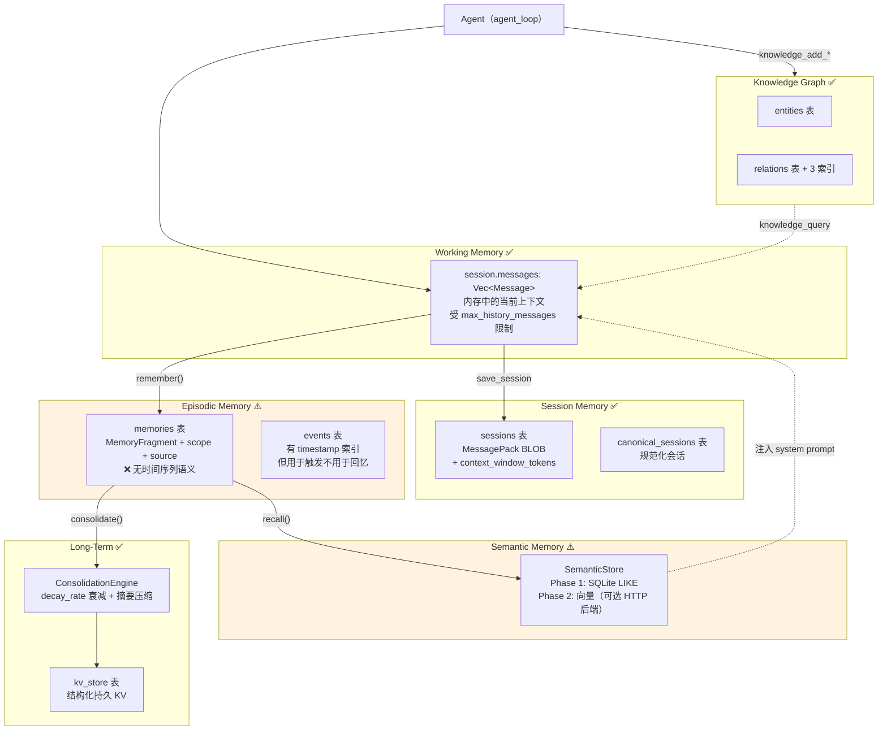
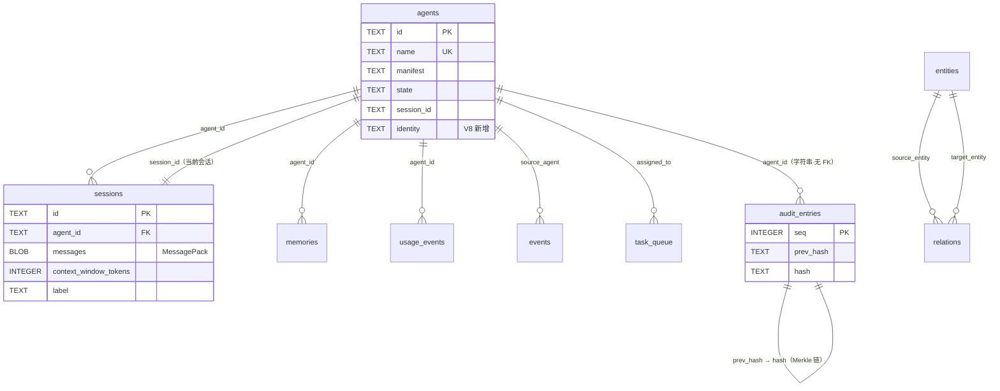

# OpenFang Memory Substrate — Memory OS 架构

> 回答 goal §16-19、§84

---

## 1. 四存储组合

`crates/openfang-memory/src/substrate.rs` —— `MemorySubstrate` 实现 `Memory` trait：

```rust
pub struct MemorySubstrate {
    conn: Arc<Mutex<Connection>>,          // ⚠️ 单一全局锁
    structured:    StructuredStore,        // KV + agents 表
    semantic:      SemanticStore,          // 语义检索（可选 HTTP 后端）
    knowledge:     KnowledgeStore,         // entities + relations
    sessions:      SessionStore,           // 会话消息（MessagePack）
    consolidation: ConsolidationEngine,    // 记忆整合 + 衰减
    usage:         UsageStore,             // 计量事件
}
```

打开时的 SQLite 配置：

```rust
conn.execute_batch("PRAGMA journal_mode=WAL; PRAGMA busy_timeout=5000;")?;
run_migrations(&conn)?;
```

**WAL 模式**：允许一写多读并发，是长期运行 daemon 的正确选择。
**busy_timeout=5000**：锁竞争时等 5 秒而非立即失败。

### 1.1 架构缺陷：单一 Mutex

`conn: Arc<Mutex<Connection>>` 被全部 6 个 store 共享（`Arc::clone(&shared)`）。
这意味着**所有内存操作串行化**——一个 Agent 的知识图谱查询会阻塞
另一个 Agent 的 session 保存。

WAL 允许并发读，但 `Mutex<Connection>` 在应用层把并发读也串行化了，
抵消了 WAL 的收益。正确做法是连接池（`r2d2_sqlite`）或每 store 独立只读连接。

**这是 Agent 数量扩展时的首要瓶颈**（见 limitations L-04）。

---

## 2. Memory Layers（goal §17）

goal 问是否具有 Working / Session / Episodic / Semantic / Knowledge Graph / Long-Term 六层。
按源码验证：



**逐层判定**：

| 层 | 存在？ | 实现 | 缺口 |
|----|--------|------|------|
| Working | ✅ | `session.messages` 内存 Vec | — |
| Session | ✅ | `sessions` + `canonical_sessions` 表 | — |
| Episodic | ⚠️ | `memories` 表有 scope/source，但**无 episode 边界概念** | 无"某次任务的完整经历"抽象 |
| Semantic | ⚠️ | Phase 1 是 LIKE 匹配，非真语义 | 向量检索需外部服务 |
| Knowledge Graph | ✅ | `entities` + `relations` + 3 索引 | — |
| Long-Term | ✅ | `ConsolidationEngine` + `decay_rate` | — |

**六层中 4 层真实，2 层部分。** 比大多数 Agent framework（通常只有
Working + 一个向量库）完整得多，这是 OpenFang 最强的子系统。

### 2.1 记忆衰减（少见的设计）

`MemorySubstrate::open(db_path, decay_rate, memory_config)` —— `decay_rate`
传给 `ConsolidationEngine`。这是模仿生物记忆衰减：久未访问的记忆
重要性降低，最终被整合或淘汰。

大多数 Agent 系统的记忆是只增不减的，长期运行后检索质量下降。
OpenFang 有主动淘汰机制，这是"为长期运行设计"的证据。

---

## 3. SQLite Schema（goal §84）

`SCHEMA_VERSION = 8`，13 张表 + 13 个索引（共 26 条 DDL）：

| # | 表 | 用途 | 关键列 | 索引 |
|---|-----|------|--------|------|
| 1 | `agents` | Agent 持久化 | id, name, manifest, state, session_id, identity | — |
| 2 | `sessions` | 会话历史 | id, agent_id, messages(BLOB/MessagePack), context_window_tokens, label | — |
| 3 | `events` | 事件日志 | timestamp, source_agent | `idx_events_timestamp`、`idx_events_source` |
| 4 | `kv_store` | 结构化 KV | scope, key, value | — |
| 5 | `task_queue` | 任务队列 | status, priority, assigned_to | `idx_task_status_priority(status, priority DESC)` |
| 6 | `memories` | 记忆片段 | agent_id, scope, content, source, importance | `idx_memories_agent`、`idx_memories_scope` |
| 7 | `entities` | 知识图谱实体 | id, entity_type, name, properties(JSON) | — |
| 8 | `relations` | 知识图谱关系 | source_entity, target_entity, relation_type | `idx_relations_source/target/type` |
| 9 | `migrations` | schema 版本 | version | — |
| 10 | `usage_events` | 计量事件 | agent_id, timestamp, tokens, cost | `idx_usage_agent_time`、`idx_usage_timestamp` |
| 11 | `canonical_sessions` | 规范化会话 | — | — |
| 12 | `paired_devices` | 设备配对 | — | — |
| 13 | `audit_entries` | Merkle 审计链 | seq(PK), timestamp, agent_id, action, detail, outcome, prev_hash, hash | — |

### 3.1 ER 关系



### 3.2 Schema 演进痕迹

`structured.rs` 中的向后兼容处理（三级 fallback 查询）：

```rust
// V8 有 identity 列
.prepare("SELECT id, name, manifest, state, created_at, updated_at, session_id, identity FROM agents WHERE id = ?1")
.or_else(|| {
    // V7 有 session_id 无 identity
    conn.prepare("SELECT id, name, manifest, state, created_at, updated_at, session_id FROM agents WHERE id = ?1")
})
.or_else(|| {
    // V6 及更早
    conn.prepare("SELECT id, name, manifest, state, created_at, updated_at FROM agents WHERE id = ?1")
})
```

配合 `ALTER TABLE agents ADD COLUMN session_id TEXT DEFAULT ''` 和
`ADD COLUMN identity TEXT DEFAULT '{}'`。

**评价**：这是防御性编程，能在迁移失败时降级工作。但三级 fallback 说明
迁移不是原子的——如果 `ALTER TABLE` 失败，代码靠 fallback 继续跑，
数据以旧格式写入，问题被掩盖而非暴露。

### 3.3 缺失的索引

`agents` 表**无索引**（只有隐式主键索引）。`registry.find_by_name()`
走内存 DashMap 所以无影响，但 `load_all_agents()` 全表扫描。
Agent 数量大时（>1000）boot 会变慢。

`sessions.agent_id` **无索引** —— `list_sessions(agent_id)` 全表扫描。
session 数量随时间无限增长（无清理机制），这会逐渐变慢。

`kv_store` 无 `(scope, key)` 复合索引。

---

## 4. Knowledge Graph（goal §18）

### 4.1 写入路径

```rust
// KnowledgeStore::add_entity —— UPSERT 语义
"INSERT INTO entities (id, entity_type, name, properties, created_at, updated_at)
 VALUES (?1, ?2, ?3, ?4, ?5, ?5)
 ON CONFLICT(id) DO UPDATE SET name = ?3, properties = ?4, updated_at = ?5"
```

`properties` 是 `serde_json::to_string(&entity.properties)` —— JSON 字符串列。
这意味着**无法按 property 值做 SQL 查询**（除 LIKE），图查询能力受限。

### 4.2 谁触发写入（goal §18 的核心问题）

三条路径：

| 触发者 | 机制 | 源码 |
|--------|------|------|
| Agent 主动 | `knowledge_add` 工具 → `KernelHandle::knowledge_add_entity` | `tool_runner.rs` |
| Hand 自动 | Hand 的 system prompt 指导 LLM 调用 knowledge 工具 | HAND.toml |
| API | `POST /api/knowledge/entities` | `routes.rs` |

**答案：是 Agent（LLM 决策）通过工具写入，不是系统自动抽取。**

没有自动的 entity extraction pipeline —— 不会自动从对话中抽取实体建图。
建图质量完全依赖 LLM 是否记得调用 `knowledge_add`。

**这是一个可靠性问题**：LLM 可能忘记调用，导致知识图谱有洞。
理想设计应该有一个后台 consolidation 任务定期扫描 session 自动抽取。

### 4.3 查询能力

`GraphPattern` 支持 `(entity_type, relation, target_type)` 三元组匹配。
三个索引（`idx_relations_source/target/type`）支撑单跳查询。

**不支持多跳遍历**——没有递归 CTE，没有 `WITH RECURSIVE`。
"A 的朋友的朋友"需要应用层多次查询。对真正的知识推理是限制。

### 4.4 无投毒防护

`add_entity` / `add_relation` 不校验来源可信度。一个被提示注入劫持的 Agent
可以写入任意虚假实体和关系，之后所有 Agent 的 `knowledge_query`
都会得到污染数据，且**无法区分哪条是可信的**（无 source/confidence 列）。

这是威胁模型 T-17，也是 goal §54 要求分析的 Knowledge Graph Poisoning。

---

## 5. Persistence 与崩溃恢复（goal §19）

### 5.1 事务与并发

| 属性 | 实现 | 评价 |
|------|------|------|
| journal_mode | WAL | ✅ 正确 |
| busy_timeout | 5000ms | ✅ 合理 |
| 应用层并发 | 单一 `Mutex<Connection>` | ❌ 抵消 WAL |
| 显式事务 | 未见 `BEGIN`/`COMMIT` 包裹多表操作 | ⚠️ 跨表一致性无保证 |
| 迁移原子性 | `run_migrations` 逐条执行 + fallback 查询 | ⚠️ 非原子 |

**跨表一致性问题**：`spawn_agent` 会写 `agents` 表，同时可能创建 `sessions` 行。
这两个写入不在同一事务里。中间崩溃会留下孤立的 agent 行（无 session）
或孤立 session（无 agent）。

### 5.2 崩溃恢复矩阵

（完整表见 `openfang-kernel.md` §7.1，此处只列内存相关）

| 数据 | 恢复？ | 机制 |
|------|--------|------|
| Session 消息 | ✅ | `sessions.messages` MessagePack BLOB |
| KV | ✅ | `kv_store` 表 |
| 记忆片段 | ✅ | `memories` 表 |
| 知识图谱 | ✅ | `entities` + `relations` |
| 用量/成本 | ✅ | `usage_events` 表 |
| 审计链 | ✅ | `audit_entries` + boot 时 `verify_integrity()` |
| 任务队列 | ✅ | `task_queue` 表 |
| **Agent 运行时状态** | ⚠️ | `state` 列有，但 `let _ = save_agent()` 可能丢更新 |
| **进行中的 agent_loop** | ❌ | 无 checkpoint，该轮迭代全丢 |

### 5.3 持久化错误被静默丢弃（重要缺陷）

```rust
// kernel.rs:3398、3434、3473；routes.rs:5803、6108、9674
let _ = self.memory.save_agent(&entry);
```

只有 kernel.rs:1754 和 routes.rs:9928 处理了错误。其余 6 处用 `let _ =` 丢弃。

**后果**：磁盘满、DB 锁超时、schema 不匹配时，内存中的 `AgentRegistry`（DashMap）
与 SQLite 分叉。重启后 Agent 状态回退到上次成功写入的版本，
且**无任何日志提示发生了丢失**。

这是 write-through 缓存的经典失败模式——写穿失败必须让调用方知道。

---

## 6. MessagePack 序列化选择

```rust
let messages: Vec<Message> = rmp_serde::from_slice(&messages_blob)?;
```

用 `rmp-serde` 而非 JSON 存 session 消息。理由（推断）：
- 体积小 40-60%（session 是最大的表）
- 序列化快
- 二进制，避免 JSON 转义开销

**代价**：BLOB 不可读，无法用 `sqlite3` CLI 直接查看/修复 session。
调试时必须写 Rust 程序反序列化。`session_repair.rs`（1464 行）
的存在说明 session 损坏是真实发生过的问题。

---

## 7. HTTP 内存后端（可选）

```rust
#[cfg(feature = "http-memory")]
if memory_config.backend == "http" {
    match MemoryApiClient::new(url, token_env) {
        Ok(client) => {
            match client.health_check() { /* best-effort */ }
            return SemanticStore::new_with_http(conn, client);
        }
        Err(e) => warn!("falling back to SQLite"),
    }
}
```

**只有 SemanticStore 可切到 HTTP**，KV / 知识图谱 / session 始终本地 SQLite。
这是为了接入外部向量数据库（Qdrant 等）而设计的。

feature gate + graceful fallback 是好设计。但注意 `health_check()` 失败
只 warn 不阻止启动，运行时才发现后端不可用。
