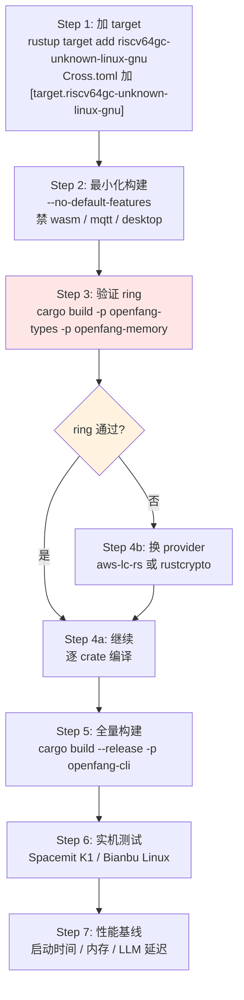

# OpenFang on RISC-V / Edge / Offline

> 回答 goal §69-71
> **重要限制**：本文档基于依赖清单与构建配置的静态分析。
> 无 RISC-V 工具链可用，**未实际编译验证**。所有可行性判断为推断，
> 标注了置信度。实机验证是必需的下一步。

---

## 1. 现状：官方零 RISC-V 支持

### 1.1 构建配置扫描结果

```bash
$ grep -rni "riscv" --include=*.toml --include=*.yml --include=*.sh --include=*.rs .
# 零结果
```

**全仓库没有任何 RISC-V 提及。**

`Cross.toml` 只配置了两个交叉目标：
```toml
[target.aarch64-unknown-linux-gnu]
pre-build = ["dpkg --add-architecture $CROSS_DEB_ARCH",
             "apt-get install libssl-dev:$CROSS_DEB_ARCH"]
[target.armv7-unknown-linux-gnueabihf]
pre-build = [同上]
```

`.github/workflows/release.yml` 的 7 个发布目标：

| # | Target | 平台 |
|---|--------|------|
| 1 | `x86_64-unknown-linux-gnu` | Linux x64 |
| 2 | `aarch64-unknown-linux-gnu` | Linux ARM64 |
| 3 | `armv7-unknown-linux-gnueabihf` | Linux ARMv7 |
| 4 | `x86_64-apple-darwin` | macOS Intel |
| 5 | `aarch64-apple-darwin` | macOS Apple Silicon |
| 6 | `x86_64-pc-windows-msvc` | Windows x64 |
| 7 | `aarch64-pc-windows-msvc` | Windows ARM64 |

**无 `riscv64gc-unknown-linux-gnu`。**

好消息：已有 armv7（32 位 ARM）目标说明团队考虑过低端嵌入式，
交叉编译流程（`cross` 工具 + pre-build 钩子）已经跑通，
加一个 RISC-V 目标在流程上是增量工作，不是从零开始。

---

## 2. 依赖可行性逐项分析

从 `Cargo.lock` 提取实际解析版本，评估 riscv64gc 支持：

| 依赖 | 版本 | RISC-V 风险 | 置信度 | 说明 |
|------|------|------------|--------|------|
| `wasmtime` | 43.0.2 | 🟡 中 | 低 | Cranelift 有 riscv64 后端，但需验证 v43 是否完整支持；另有 Pulley 解释器可作 fallback |
| `cranelift-codegen` | 0.130.2 | 🟡 中 | 低 | riscv64 后端存在但成熟度低于 x64/aarch64 |
| `ring` | 0.17.14 | 🔴 **高** | 中 | **最大风险点**，见 §2.1 |
| `rusqlite` (bundled) | 0.31.0 | 🟢 低 | 高 | 编译 SQLite C 源码，架构中立 |
| `libsqlite3-sys` | 0.28.0 | 🟢 低 | 高 | 同上 |
| `openssl-src` (vendored) | 300.5.5+3.5.5 | 🟡 中 | 中 | OpenSSL 3.5 支持 riscv64，但需正确的 Configure target |
| `tokio` | 1.x | 🟢 低 | 高 | 纯 Rust + libc，epoll 在 RISC-V Linux 可用 |
| `dashmap`/`serde`/`chrono` | — | 🟢 无风险 | 高 | 纯 Rust，架构无关 |
| `tauri` (desktop) | 2.x | 🔴 高 | 中 | 需 WebKitGTK，RISC-V 上生态不全 |

### 2.1 ring 是首要阻塞点

`ring` 通过 `rustls` 引入：
```toml
rustls = { version = "0.23", default-features = false, features = ["ring"] }
```

`ring` 使用手写汇编实现密码学原语，历史上对新架构支持滞后。
0.17.x 系列增加了部分 riscv64 支持，但**我无法在此环境验证 0.17.14
是否能在 riscv64gc 上完整编译**。

**这是必须实机验证的第一项。**

**如果 ring 失败，有明确的替代路径**：rustls 支持 `aws-lc-rs` 后端，
或改用 `rustls-rustcrypto`（纯 Rust 实现，无汇编）：

```toml
# 替代方案 A
rustls = { version = "0.23", default-features = false, features = ["aws-lc-rs"] }
# 替代方案 B（纯 Rust，性能较低但可移植性最好）
# 使用 rustls-rustcrypto provider
```

代价：性能下降（纯 Rust 密码学比汇编慢 2-5 倍），
对 TLS 密集场景（40+ channel 轮询）有影响。

### 2.2 wasmtime 的双重出路

即使 Cranelift 的 riscv64 后端有问题，wasmtime 43 提供 **Pulley**
（可移植解释器后端），可以在任何 Rust 支持的架构上运行 WASM，
只是性能大幅下降（解释执行 vs JIT）。

**更重要的是：WASM 技能运行时当前未启用**
（`loader.rs` 返回 `RuntimeNotAvailable`，见 security.md §5.3）。
所以对 RISC-V 移植，**wasmtime 可以直接 feature-gate 掉**：

```toml
# RISC-V 构建时禁用 WASM（反正未启用）
[features]
default = ["wasm"]
wasm = ["wasmtime"]
```

这一步能消除最大的编译复杂度来源，且不损失任何现有功能。

### 2.3 native-tls / rumqttc 链

```toml
native-tls = { version = "0.2", features = ["vendored"] }
rumqttc = { version = "0.25", features = ["use-native-tls"] }
```

MQTT channel 依赖 `native-tls` → vendored OpenSSL。这条链在 RISC-V 上
需要 OpenSSL 正确交叉编译。若受阻，可 feature-gate 掉 MQTT channel
（40+ channel 中的一个，损失可接受）。

---

## 3. 移植路线图（推荐顺序）



### Step 1 的具体配置

```toml
# Cross.toml 追加
[target.riscv64gc-unknown-linux-gnu]
pre-build = [
  "dpkg --add-architecture $CROSS_DEB_ARCH",
  "apt-get update && apt-get install --assume-yes libssl-dev:$CROSS_DEB_ARCH"
]
```

```yaml
# .github/workflows/release.yml 追加
- target: riscv64gc-unknown-linux-gnu
  os: ubuntu-latest
  use_cross: true
```

**预估工作量**：若 ring 顺利，1-2 天；若需换 crypto provider，1-2 周
（含回归测试 1744+ 用例）。

---

## 4. Edge 部署可行性（goal §70）

### 4.1 内存足迹

README 声称 40MB idle。这个数字在 x86_64 上可信（Rust 无 GC）。
但**边缘场景的真实风险不是 idle，而是峰值**：

| 内存消耗源 | 大小 | 是否有上限 | 风险 |
|-----------|------|-----------|------|
| Kernel 基线 | ~40MB | — | 🟢 |
| 每 Agent session（内存中 `Vec<Message>`） | 可达数 MB | `max_history_messages`（默认 200 条） | 🟡 |
| SQLite page cache | 默认 ~2MB/连接 | SQLite 默认 | 🟢 |
| LLM 响应缓冲 | 单次 `max_tokens` | 有 | 🟢 |
| **WASM store** | `fuel_limit` 不限内存 | ❌ 只限 CPU | 🔴 当前未启用，启用后有风险 |
| **工具结果** | `truncate_tool_result_dynamic` 动态截断 | ⚠️ 有截断但无硬上限 | 🟡 |
| **并发 Agent 数** | 无全局上限 | ❌ **无** | 🔴 |
| 40+ channel 连接 | 每个 WebSocket/TCP | 按启用数 | 🟡 |

**核心问题（对应 security.md G-17）：无 RSS 配额。**

`ResourceQuota` 只管 token 和成本，不管物理内存。
`scheduler.rs` 的 `check_quota()` 检查 `max_llm_tokens_per_hour`，
但没有 `max_memory_bytes`。

在 4GB RAM 的 K1 上，10 个 Agent 各持有大 session +
每个 channel 连接 + SQLite cache，OOM 是现实风险。
Linux OOM killer 会杀整个 openfang 进程 —— **所有 Agent 一起死**
（因为无地址空间隔离，见 verdict.md §3）。

### 4.2 二进制体积

`[profile.release] lto = true, codegen-units = 1, strip = true` → ~32MB (x86_64)。

RISC-V 二进制通常比 x86_64 大 10-20%（RVI 指令密度较低），
预估 **35-40MB**。对有 eMMC/SD 卡的设备可接受。

禁用 wasmtime 可显著减小（wasmtime + cranelift 是最大的单一依赖，
估计占 8-12MB）。**禁 WASM 后预估 22-28MB**。

### 4.3 CPU 与并发

`tokio` 默认 worker 线程数 = CPU 核心数。K1 是 8 核 RISC-V，
默认配置合理。但需注意：

- LLM 调用是 IO-bound（等网络），不吃 CPU
- 本地 LLM 推理是 CPU-bound，会与 kernel 竞争
- 建议限制 tokio worker 数为 `cores - 2`，给推理留余量

```rust
// 建议的边缘配置
tokio::runtime::Builder::new_multi_thread()
    .worker_threads(std::cmp::max(2, num_cpus::get() - 2))
```

当前代码用 `#[tokio::main]` 默认配置，未做边缘优化。

### 4.4 边缘部署必须的改造清单

| 改造 | 原因 | 优先级 |
|------|------|--------|
| 加 RSS 配额 + Agent 并发上限 | 防 OOM 杀全进程 | 🔴 P0 |
| feature-gate wasmtime | 减 10MB + 消除移植风险 | 🔴 P0 |
| feature-gate 未用的 channel | 减体积 + 减 TLS 依赖 | 🟡 P1 |
| session 大小硬上限 + 主动清理 | `sessions` 表无限增长 | 🟡 P1 |
| SQLite `PRAGMA cache_size` 调小 | 省内存 | 🟡 P1 |
| tokio worker 数可配置 | 给本地推理留 CPU | 🟡 P1 |
| 连接池替代单 Mutex | 见 memory.md §1.1 | 🟢 P2 |

---

## 5. 离线模式（goal §71）

### 5.1 现有的离线能力

| 组件 | 离线可用？ | 依据 |
|------|-----------|------|
| Kernel / Registry / 生命周期 | ✅ | 纯本地 |
| SQLite 全部 13 表 | ✅ | bundled，本地文件 |
| 知识图谱 | ✅ | 本地 SQLite |
| 会话历史 | ✅ | 本地 |
| 审计链 | ✅ | 本地 |
| 内置工具（file / shell / process） | ✅ | 本地 |
| **LLM 调用** | ⚠️ | 需 Ollama/vLLM 等本地服务 |
| **Embedding** | ⚠️ | `EmbeddingDriver` trait 可接本地，但默认无 |
| 语义检索 | ✅ | Phase 1 是 SQLite LIKE，不需外部服务 |
| Skill 执行（Python/Shell/Node） | ✅ | 本地子进程 |
| **Skill 安装（ClawHub）** | ❌ | 需网络 |
| **Extensions（25 MCP 模板）** | ❌ | 多数 MCP server 需 `npx` 下载 |
| Channel（Telegram 等） | ❌ | 本质需网络 |
| Channel（CLI / Web / MQTT 本地 broker） | ✅ | 可本地 |
| OFP 局域网 | ✅ | 局域网内可用 |
| A2A | ⚠️ | 局域网内可用 |
| Web 工具（fetch / search） | ❌ | 需网络 |

### 5.2 离线配置示例

OpenFang 的 OpenAI 兼容驱动让接本地 LLM 很直接：

```toml
# ~/.openfang/config.toml —— 全离线配置
[providers.openai_compat]
name = "ollama"
base_url = "http://127.0.0.1:11434/v1"
api_key = "ollama"                      # Ollama 不校验
models = ["qwen2.5-coder:7b", "llama3.2:3b"]

[model]
default = "qwen2.5-coder:7b"

[memory]
backend = "sqlite"                       # 不用 HTTP 后端

[network]
enabled = true
listen_addr = "0.0.0.0:5678"            # 局域网 OFP
secret = "<shared>"

# 只启用本地 channel
[channels.webhook]
enabled = true
path = "/webhook"

# 关闭需要外网的
[channels.telegram]
enabled = false
```

**关键发现：离线模式几乎无需改代码。**
`drivers/openai.rs` 的 base_url 可配置，这一个设计决策就打开了
全部本地推理生态（Ollama / vLLM / LocalAI / llama.cpp server）。

### 5.3 离线模式需要改的部分

| 需改动 | 现状 | 建议 |
|--------|------|------|
| Embedding 默认值 | 无 embedding 则回退文本匹配 | 加 Ollama embedding 驱动（`nomic-embed-text`） |
| Skill 分发 | 只能从 ClawHub | 支持本地 tarball / 局域网镜像 |
| MCP server 分发 | `npx` 需网络 | 预置常用 MCP 到镜像内 |
| 模型目录 | `model_catalog.rs` 硬编码云模型的价格/上下文 | 需支持本地模型的 catalog 条目（成本为 0） |
| 提供商健康探测 | `provider_health.rs` 探测云端点 | 离线时应跳过或指向本地 |

### 5.4 模型目录对本地模型的支持缺口

`model_catalog.rs`（4866 行）为 100+ 云模型硬编码了
`context_window` / `cost_per_1m_input` / `supports_tools`。

本地模型（`qwen2.5-coder:7b`）不在目录中，会导致：
- 成本计算为 0 或未知（其实本地推理成本确实是 0，可接受）
- **上下文窗口未知 → `context_budget.rs` 无法正确截断** ← 这是实际问题
- `supports_tools` 未知 → 可能给不支持 function calling 的模型发工具定义

需要一个用户可扩展的本地模型 catalog：

```toml
[[local_models]]
name = "qwen2.5-coder:7b"
context_window = 32768
max_output_tokens = 4096
supports_tools = true
supports_vision = false
cost_per_1m_input = 0.0
cost_per_1m_output = 0.0
```

---

## 6. Bianbu / Spacemit 特定评估

### 6.1 K1 / K3 适配性

| 指标 | Spacemit K1 | OpenFang 需求 | 判定 |
|------|-------------|--------------|------|
| 架构 | RISC-V 64 (RV64GCVB) | 需加 target | 🟡 待验证 |
| 核心数 | 8 核 | tokio 多线程可用 | 🟢 |
| RAM | 4-16GB | 40MB idle，但无 RSS 上限 | 🟡 需加配额 |
| 存储 | eMMC / NVMe | ~35MB 二进制 + SQLite | 🟢 |
| 向量扩展 | RVV 1.0 | 项目无 SIMD 依赖 | 🟢 无影响 |
| OS | Bianbu Linux (Debian 系) | `cross` 的 Debian 流程可复用 | 🟢 |

**RVV（向量扩展）对 OpenFang 无影响** —— 项目没有手写 SIMD，
也不做本地推理。若后续在 K1 上跑本地 LLM，RVV 对推理框架
（llama.cpp 的 RVV 后端）有价值，但那是 OpenFang 之外的组件。

### 6.2 端到端可行性结论

**推断结论（置信度：中）**：
OpenFang 大概率可以移植到 riscv64gc-unknown-linux-gnu，
主要阻塞是 `ring`，有明确替代方案。

**必须实机验证的三项**：
1. `ring 0.17.14` 能否在 riscv64gc 编译（最高优先）
2. `wasmtime 43 / cranelift 0.130` 的 riscv64 后端是否可用
   （若不可，feature-gate 掉——反正 WASM 技能未启用）
3. `openssl-src 300.5.5` vendored 交叉编译

**推荐的最小可行路径**：
```bash
# 禁掉高风险 + 未使用的部分，先证明核心可跑
cargo build --release --target riscv64gc-unknown-linux-gnu \
  -p openfang-cli --no-default-features \
  --features "core,sqlite"   # 需先在 Cargo.toml 定义这些 feature
```

当前 `Cargo.toml` **没有定义 feature flags**（除 `http-memory`），
所以这个最小化路径需要先做 feature 拆分工作。这是移植的前置任务。
