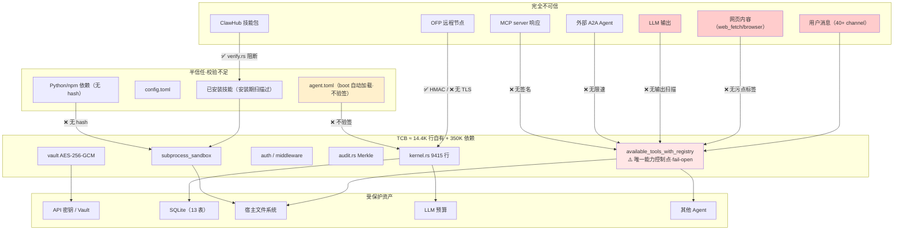

# OpenFang Security Architecture — 源码级验证

> 回答 goal §11-15、§54-55、§89-90
> **本文档包含本次调研最重要的发现**

---

## 0. 三行摘要

1. `CapabilityManager::check()` **在生产代码中零调用** —— 能力系统只声明不强制
2. `tool_policy.rs` 整个模块（deny-wins 策略 + 子 Agent 深度限制）**是死代码**
3. 真正的工具控制是 manifest 工具列表**预过滤**，且 `tools` 为空时 **fail-open 放行全部**

---

## 1. Capability 系统（goal §11）

### 1.1 声明侧：完整

`crates/openfang-types/src/capability.rs` 定义 21 个变体：

```rust
pub enum Capability {
    FileRead(String), FileWrite(String),
    NetConnect(String), NetListen(u16),
    ToolInvoke(String), ToolAll,
    LlmQuery(String), LlmMaxTokens(u64),
    AgentSpawn, AgentMessage(String), AgentKill(String),
    MemoryRead(String), MemoryWrite(String),
    ShellExec(String), EnvRead(String),
    OfpDiscover, OfpConnect(String), OfpAdvertise,
    EconSpend(f64), EconEarn, EconTransfer(String),
}
```

`capability_matches(granted, required)` 实现 glob 匹配，`ToolAll` 蕴含任意 `ToolInvoke`。
`CapabilityManager`（`kernel/capabilities.rs`）用 `DashMap<AgentId, Vec<Capability>>` 存储。

manifest 中的声明形式不是 `Vec<Capability>` 而是结构化的 `AgentCapabilities`：

```toml
[agent.capabilities]
tools = ["web_search", "file_write"]
network = ["*.googleapis.com:443"]
shell = ["git *"]
memory_read = ["agent:research/*"]
memory_write = ["agent:research/*"]
agent_spawn = true
agent_message = ["helper-*"]
ofp_discover = false
```

`manifest_to_capabilities()`（kernel.rs:6757）把它展开成 `Vec<Capability>`，
并支持 `profile` 预设展开（`ToolProfile::implied_capabilities()`）。

### 1.2 强制侧：几乎不存在

全仓 grep `CapabilityManager` 的四个方法：

| 方法 | 生产调用点 | 说明 |
|------|-----------|------|
| `grant()` | kernel.rs:1372、1719 | ✅ boot 恢复时 + spawn 时授予 |
| `list()` | kernel.rs:6193 | ✅ 但只用于查 `ToolAll` 做工具过滤 |
| `revoke_all()` | kernel.rs:3724 | ✅ Agent 删除时清理 |
| **`check()`** | **无** | ❌ **仅 capabilities.rs 自身单元测试** |

```bash
$ grep -rn "capabilities.check\|CapabilityCheck\|\.require()\|is_granted()" \
    --include=*.rs crates/ | grep -v capability
# 输出只有 audit.rs 的 AuditAction::CapabilityCheck 枚举变体（审计动作分类）
# 和 routes.rs 的字符串解析 —— 没有任何一处真正的能力检查
```

**结论：`Capability` 被授予、被存储、被列出，但从不被检查。**

`AuditAction::CapabilityCheck` 这个审计动作类型存在，却没有代码产生这类审计记录。

### 1.3 唯一真正生效的能力强制：spawn 继承

`kernel.rs:7836`：

```rust
async fn spawn_agent_checked(
    &self, manifest_toml: &str, parent_id: Option<&str>,
    parent_caps: &[Capability],
) -> Result<(String, String), String> {
    let child_manifest: AgentManifest = toml::from_str(manifest_toml)?;
    let child_caps = manifest_to_capabilities(&child_manifest);
    // ← 这是全项目唯一真实的能力强制
    validate_capability_inheritance(parent_caps, &child_caps)?;
    tracing::info!(/* Capability inheritance validated */);
    KernelHandle::spawn_agent(self, manifest_toml, parent_id).await
}
```

子 Agent 能力必须 ⊆ 父 Agent。这一处是真的，有效防止 spawn 提权。

---

## 2. 真实的工具控制机制（goal §12）

既然 `check()` 不被调用，工具是怎么被限制的？答案在 `kernel.rs:6148
available_tools_with_registry()`：

```rust
// 提取 manifest 声明的工具列表
let declared_tools: Vec<String> = entry.as_ref()
    .map(|e| e.manifest.capabilities.tools.clone())
    .unwrap_or_default();

// ⚠️ fail-open：空列表 或 含 "*" → 不受限
let tools_unrestricted =
    declared_tools.is_empty() || declared_tools.iter().any(|t| t == "*");

let mut all_tools: Vec<ToolDefinition> = if !tools_unrestricted {
    // 只保留声明过的内置工具
    all_builtins.into_iter()
        .filter(|t| declared_tools.iter().any(|d| d == &t.name))
        .collect()
} else {
    // 回退到 profile 或全部内置工具
    match &tool_profile { ... }
};
```

**机制本质：预过滤工具定义列表，只把允许的工具描述发给 LLM。**

代码注释自己说明了这一点：
> This is the primary mechanism: only send declared tools to the LLM.

### 2.1 这个机制的三个问题

**问题 1：fail-open 默认值**

`capabilities.tools` 为空 → `tools_unrestricted = true` → 全部 53 个内置工具可用，
包括 `shell_exec`、`file_delete`、`agent_spawn`。

安全默认值应该是 deny-all。一个忘记写 `tools = [...]` 的 manifest 得到的是**最高权限**。

**问题 2：预过滤不是强制**

预过滤只影响"LLM 看到哪些工具"。它假设 LLM 不会调用没见过的工具。但：

- LLM 可能幻觉出工具名（尤其是它在训练数据里见过 `shell_exec`）
- `tool_runner.rs::execute()` 的 `match tool_name` 分支**不校验该工具是否在
  declared_tools 里**
- MCP 工具是运行时动态加入的，`declared_tools` 过滤只作用于 `all_builtins`

**问题 3：只覆盖工具维度**

`Capability` 有 21 个变体，但预过滤机制只处理 `ToolInvoke` 语义。
`FileRead("~/docs/**")`、`NetConnect("*.example.com")`、`MemoryWrite("agent:x/*")`
这些声明**完全不生效** —— 一个声明了 `tools = ["file_read"]` 的 Agent，
可以读取文件系统上任何它有 OS 权限读的文件，`FileRead` 的 glob 限制无人执行。

### 2.2 运行时真正的检查点（完整清单）

`tool_runner.rs::execute()` 中实际存在的检查，共 4 类：

| 工具 | 检查 | 行号 | 强度 |
|------|------|------|------|
| `shell_exec` | exec_policy 模式（Deny/Allowlist/Full） | ~270 | ✅ 真实 |
| `shell_exec` | `contains_shell_metacharacters()` | 37 | ✅ 真实 |
| `shell_exec` | 启发式黑名单（curl/wget/\|sh/base64/eval） | 45 | ⚠️ 易绕过 |
| `web_fetch` | URL 参数黑名单（api_key=/token=/...） | 215 | ⚠️ 易绕过 |
| `browser_navigate` | 同上 | 382 | ⚠️ 易绕过 |
| `web_fetch` | SSRF 私有 IP 阻断 | web_fetch.rs | ✅ 真实 |
| 文件工具 | `safe_resolve_path()` 路径穿越 | subprocess_sandbox.rs | ✅ 真实 |
| 配置的工具 | `requires_approval()` → 人工审批 | approval.rs | ✅ 真实 |
| `agent_spawn` | `MAX_AGENT_CALL_DEPTH = 5` | tool_runner.rs:20 | ✅ 真实 |

**注意：`file_write`、`file_delete`、`memory_write`、`agent_kill` 没有任何
运行时能力检查** —— 只靠 2.1 的工具列表预过滤（fail-open）+ 路径穿越防护。

### 2.3 权限检查发生在哪一层（goal §12 的核心问题）

goal 问：Kernel / Runtime / Tool / Sandbox / API？

```mermaid
sequenceDiagram
    participant A as Agent (LLM)
    participant L as agent_loop<br/>(runtime)
    participant K as kernel<br/>available_tools_with_registry
    participant TR as tool_runner<br/>(runtime)
    participant AP as ApprovalManager<br/>(kernel)
    participant CM as CapabilityManager<br/>(kernel)

    Note over K: ① 预过滤（唯一的能力相关控制）
    K->>K: declared_tools = manifest.capabilities.tools
    K->>K: fail-open if empty
    K-->>L: Vec<ToolDefinition>（已过滤）

    L->>A: CompletionRequest{tools: 过滤后的列表}
    A-->>L: tool_call{name, input}

    Note over L,TR: ② 无"该工具是否被声明"的复查
    L->>TR: execute(tool_name, input)

    TR->>TR: ③ exec_policy（仅 shell_exec）
    TR->>TR: ④ 元字符/污点/SSRF（仅 shell/web）
    TR->>TR: ⑤ safe_resolve_path（仅文件工具）
    TR->>AP: ⑥ requires_approval? → 人工门控
    AP-->>TR: Approved / Denied / TimedOut

    Note over CM: ❌ CapabilityManager::check()<br/>从不被调用
    CM-.->|dead path|TR

    TR-->>L: ToolResult
```

**答案：主要在 Kernel 层的工具列表构造阶段（预过滤），
少量在 Tool 层（shell/web 专项检查 + 审批）。
Capability 层完全不参与运行时决策。**

---

## 3. tool_policy.rs 是死代码（第三个死代码模块）

`crates/openfang-runtime/src/tool_policy.rs` 实现了完整的策略引擎：

- `resolve_tool_access(tool_name, policy, depth)` —— deny-wins，agent 规则 > global 规则
- `filter_tools_by_depth(tools, depth, max_depth)` —— 子 Agent 工具剥离
- `SUBAGENT_DENY_ALWAYS`：`cron_create`、`cron_cancel`、`schedule_create`、
  `schedule_delete`、`hand_activate`、`hand_deactivate`、`process_start`
- `SUBAGENT_DENY_LEAF`：`agent_spawn`、`agent_kill`
- 11 个单元测试全部通过

调用点检查：

```bash
$ grep -rn "resolve_tool_access\|filter_tools_by_depth" --include=*.rs crates/ \
    | grep -v "tool_policy.rs"
# 无输出
```

**零调用点。** 这意味着：

1. `ToolPolicy` 配置（`agent_rules` / `global_rules` / `groups`）写在 config.toml 里**无效**
2. **子 Agent 可以调用 `cron_create`、`hand_activate`、`process_start`** ——
   `SUBAGENT_DENY_ALWAYS` 名单不生效
3. `subagent_max_depth` / `subagent_max_concurrent` 不被 `resolve_tool_access` 强制
   （深度限制只有 `tool_runner.rs:20` 的 `MAX_AGENT_CALL_DEPTH = 5` 硬编码常量生效）

这是本仓库第三个"实现完整 + 有测试 + 零调用"的模块：

| 死代码模块 | 行数 | 测试 | 发现于 |
|-----------|------|------|--------|
| `shell_bleed.rs` | 296 | 有 | llmwiki/prompt-injection.md |
| `tool_policy.rs` | ~430 | 11 个 | 本文档 |
| `CapabilityManager::check()` | ~30 | 2 个 | 本文档 |

**模式性问题**：团队编写安全模块 → 写单元测试 → 测试通过 → 未接线 → 
CI 全绿 → 认为已交付。单元测试给了虚假的安全感（见 ADR-016、L-11）。

---

## 4. 16 层安全矩阵验证（goal §13）

README 声称 "16 discrete security layers"。SECURITY.md 列出了具体机制。
逐一验证是否真正生效：

| # | 机制 | 代码 | 强制点 | 生效？ | 威胁 |
|---|------|------|--------|--------|------|
| 1 | Capability 权限 | `capability.rs`、`capabilities.rs` | **无** | ❌ **仅声明** | 越权访问 |
| 2 | RBAC 多用户 | `kernel/auth.rs` | API/channel 入口 | ✅ | 未授权操作 |
| 3 | 权限非升级 | `spawn_agent_checked` | spawn 时 | ✅ | 提权 |
| 4 | API 认证 | `api/middleware.rs`、`session_auth.rs` | HTTP 入口 | ✅ | 未授权 API |
| 5 | 路径穿越防护 | `safe_resolve_path/parent` | 文件工具内 | ✅ | 任意文件读写 |
| 6 | SSRF 防护 | `web_fetch.rs` | fetch 前 | ✅ | 内网探测/元数据窃取 |
| 7 | 图片校验 | `types/media.rs` | 媒体处理 | ✅ | 恶意图片 |
| 8 | 注入扫描（技能） | `skills/verify.rs` | 安装/加载时 | ✅ **真阻断** | 恶意技能 |
| 9 | Ed25519 manifest 签名 | `manifest_signing.rs` | 计算 hash | ⚠️ 只算不验 | manifest 篡改 |
| 10 | HMAC-SHA256 线协议 | `wire/peer.rs` | 握手 | ✅ | 节点伪造 |
| 11 | Secret 零化 | `Zeroizing<String>` | drop 时 | ✅ | 内存转储 |
| 12 | WASM 双计量 | `sandbox.rs` | WASM 执行 | ⚠️ 无调用方 | WASM 资源耗尽 |
| 13 | 子进程沙箱 | `subprocess_sandbox.rs` | 技能执行 | ✅ | 环境泄露 |
| 14 | 污点追踪 | `taint.rs` | 3 个检查点 | ⚠️ 标签硬编码 | 注入/外泄 |
| 15 | GCRA 速率限制 | `api/rate_limiter.rs` | HTTP 入口 | ✅ | DoS/爆破 |
| 16 | Merkle 审计链 | `runtime/audit.rs` | record 时 | ✅ | 日志篡改 |
| — | 工具策略引擎 | `tool_policy.rs` | **无** | ❌ **死代码** | 越权工具调用 |
| — | Shell Bleed 扫描 | `shell_bleed.rs` | **无** | ❌ **死代码** | 密钥泄露 |
| — | 人工审批 | `kernel/approval.rs` | 工具执行前 | ✅ | 危险操作 |
| — | 凭证保管库 | `extensions/vault.rs` | 凭证读取 | ✅ | 凭证泄露 |
| — | HTTP 安全头 | `api/middleware.rs` | 响应 | ✅ | XSS/clickjack |

**统计：机制总数 21（不是 16），其中 13 真实生效 / 5 部分 / 3 死代码。**

README 的 "16 layers" 数字大致对应 SECURITY.md 的列表，
**代码文件确实都存在** —— 这一点 README 没有说谎。
但"存在文件"和"生效"是两件事，其中 3 个未接线、2 个只算不验。

---

## 5. WASM 沙箱（goal §14-15）

### 5.1 双计量实现（真实且设计正确）

`crates/openfang-runtime/src/sandbox.rs`，614 行：

```rust
// 引擎级：同时开启两种计量
let mut config = Config::new();
config.consume_fuel(true);          // ① CPU 指令计量（确定性）
config.epoch_interruption(true);    // ② 墙钟中断

// Store 级：设置预算
if config.fuel_limit > 0 {
    store.set_fuel(config.fuel_limit)?;   // 默认 1_000_000
}
store.set_epoch_deadline(1);

// watchdog 线程推进 epoch
let _watchdog = std::thread::spawn(move || {
    std::thread::sleep(timeout);
    engine_clone.increment_epoch();       // 触发中断
});

// trap 区分两种超限
// fuel 耗尽 → OutOfFuel trap
// epoch 到期 → "WASM execution timed out after {}s (epoch interrupt)"

// 计量回报
let fuel_remaining = store.get_fuel().unwrap_or(0);
let fuel_consumed = config.fuel_limit.saturating_sub(fuel_remaining);
```

有测试：`test_fuel_exhaustion`（fuel_limit: 10_000 + 无限循环模块）。

### 5.2 与 cgroup / rlimit / seccomp / namespace 对比（goal §15）

| 维度 | OpenFang WASM | cgroup | rlimit | seccomp | namespace |
|------|--------------|--------|--------|---------|-----------|
| CPU 限制 | fuel（**确定性指令计数**） | cpu.max（时间片） | RLIMIT_CPU（秒） | — | — |
| 墙钟限制 | epoch + watchdog | — | — | — | — |
| 内存限制 | wasmtime 线性内存上限 | memory.max | RLIMIT_AS | — | — |
| 系统调用 | **默认零**（无 host func 即无能力） | — | — | 白名单过滤 | — |
| 文件系统 | 无（除显式 host func） | — | — | 可过滤 | mount ns |
| 网络 | 无 | net_cls | — | 可过滤 | net ns |
| 可移植性 | **跨平台**（含 Windows/macOS） | Linux only | POSIX | Linux only | Linux only |
| 逃逸难度 | wasmtime 漏洞 | 内核漏洞 | — | 内核漏洞 | 内核漏洞 |

**fuel 的独特价值：确定性。** 同一 WASM 模块在任何机器上消耗相同 fuel，
与系统负载无关。cgroup 的 CPU 配额受调度影响，无法用于可复现的计费。
这对"按计算量向 Agent 计费"是必要属性。

**默认拒绝 vs 白名单**：WASM 模块启动时**零能力** —— 没有 host function
就连不上任何外部资源。这比 seccomp 的"过滤已有的系统调用"更强：
seccomp 是减法，WASM 是加法。

### 5.3 WASM Skill 未实现，但 WASM Agent 是活代码

> **本节已更正。初稿断言"WASM 沙箱完全未被使用、是 dark code"，该断言错误。**

**WASM Skill 确实未实现** —— `crates/openfang-skills/src/loader.rs`：

```rust
SkillRuntime::Wasm => Err(SkillError::RuntimeNotAvailable(
    "WASM skill runtime not yet implemented".to_string(),
)),
```

**但 WASM Agent 路径是活的。** 整个 Agent 可以是一个 WASM 模块
（`AgentManifest` 有 `module` 字段），执行入口在 `kernel.rs:5623`。
`kernel/tests/wasm_agent_integration_test.rs` 有真实断言：

```rust
assert_eq!(result.response, "hello from wasm");   // :167
assert_eq!(result.iterations, 1);                  // :168
// test_wasm_agent_fuel_exhaustion                  :202
```

`test_wasm_agent_fuel_exhaustion` 验证了 §5.1 的 fuel 计量真实生效。

**所以 goal §14 的"Agent 能访问什么"是有意义的问题** —— WASM Agent 确实在跑。
它默认零能力（无 host function 即无外部访问），`host_functions.rs` 的
`dispatch(state, method, params)` 是唯一的 host 边界。

**Skill 隔离**仍靠 `subprocess_sandbox.rs`（`env_clear()` + 受限 PATH），
强度低于 WASM —— 这一点初稿的判断是对的。

**因此死代码是 3 个，不是 4 个**（WASM 不在其中）。这处错误的成因与
`tool_policy.rs` 的发现相反：那次是"看定义以为生效、实际零调用"，
这次是"看 loader 返回 NotAvailable 就以为整条 WASM 路径都死"，
**没查 Agent 侧的调用点和集成测试**。同一个方法论问题的两个方向。

---

## 6. TCB 分析（goal §89）

必须信任的代码（被攻破即全系统失守）：

| 组件 | 行数 | 攻破后果 |
|------|------|---------|
| `kernel.rs` | 9415 | 全部 —— 持有所有子系统 + 60 字段 |
| `available_tools_with_registry` | ~120 | 工具越权（这是唯一的能力控制点） |
| `kernel/auth.rs` | ~250 | RBAC 绕过 |
| `api/middleware.rs` + `session_auth.rs` | ~400 | API 认证绕过 |
| `runtime/audit.rs` | 422 | 审计伪造 |
| `sandbox.rs` | 614 | WASM 逃逸（当前未启用） |
| `subprocess_sandbox.rs` | 1240 | 技能逃逸 + 元字符绕过 |
| `wire/peer.rs` | 1284 | 节点伪造 |
| `extensions/vault.rs` | ~300 | 全部凭证泄露 |
| `skills/verify.rs` | 294 | 恶意技能放行 |
| SQLite (bundled C) | ~150K | 数据完整性 |
| wasmtime | ~200K | 沙箱逃逸 |

**自有代码 TCB ≈ 14,400 行，其中 kernel.rs 占 65%。**

理想的 Agent OS TCB 应该 < 2000 行（只含能力判定 + 沙箱边界 + 审计）。
OpenFang 的 TCB 因为 `kernel.rs` 是 God Object 而膨胀了一个数量级。
形式化验证或第三方审计在这个规模下不现实。

**加上 C/Rust 依赖（SQLite + wasmtime ≈ 350K 行），TCB 总量 > 360K 行。**

---

## 7. 威胁模型（goal §54，24 项）

| # | 威胁 | 资产 | 攻击方式 | 影响 | 现有防御 | Gap |
|---|------|------|---------|------|---------|-----|
| T-01 | 直接提示注入 | Agent 行为 | 用户输入含覆盖指令 | 越权操作 | phantom_action（条件极窄） | 无系统性检测 |
| T-02 | 间接提示注入 | Agent 行为 | 恶意网页 → web_fetch → 上下文 | 越权操作 | taint（标签不传播） | **污点不传播** |
| T-03 | 恶意技能 | 宿主 | ClawHub 投毒（341 起真实事件） | RCE | `verify.rs` 真阻断 | 字符串匹配易绕 |
| T-04 | 恶意 MCP | 宿主 | 配置指向恶意 MCP server | RCE + 工具注入 | **无** | 无签名/信任校验 |
| T-05 | 恶意 manifest | 权限 | 放置 agent.toml 到 `~/.openfang/agents/` | 全权限（`tools=["*"]`） | 只算 hash 不验签 | **boot 自动加载** |
| T-06 | 凭证窃取 | API 密钥 | `shell_exec` 读 env | 密钥泄露 | Zeroizing + env_clear | shell_bleed 死代码 |
| T-07 | URL 参数外泄 | 密钥 | `web_fetch?api_key=xxx` | 密钥泄露 | 参数名黑名单 | POST body 可绕 |
| T-08 | LLM 输出泄密 | 密钥 | LLM 回复中打印密钥 | 密钥泄露 | **无** | 无输出扫描 |
| T-09 | 命令注入 | 宿主 | shell 元字符 | RCE | 元字符检测 | `exec_policy=Full` 跳过 |
| T-10 | 路径穿越 | 文件系统 | `../../etc/passwd` | 任意读写 | `safe_resolve_path` | ✅ 覆盖 |
| T-11 | SSRF | 内网 | fetch `169.254.169.254` | 云凭证窃取 | 私有 IP 阻断 | ✅ 覆盖 |
| T-12 | 沙箱逃逸 | 宿主 | wasmtime 漏洞 | RCE | fuel+epoch | 当前 WASM 未启用 |
| T-13 | 供应链 | 宿主 | PyPI/npm 投毒 | RCE | **无** | 无 hash 校验 |
| T-14 | 提权 | 权限 | 子 Agent 声明超集能力 | 越权 | `validate_capability_inheritance` | ✅ 覆盖 |
| T-15 | Agent 劫持 | Agent | 注入改变 Agent 目标 | 任意 | 无 | 依赖 T-01/T-02 |
| T-16 | 记忆投毒 | 决策 | 写入虚假记忆 | 长期误导 | **无** | 无来源可信度 |
| T-17 | 知识图谱投毒 | 决策 | 注入虚假 entity/relation | 长期误导 | **无** | 无来源追踪 |
| T-18 | A2A 滥用 | 配额 | 外部 Agent 大量提交任务 | 成本耗尽 | 无限速 | **A2A 入口无 rate limit** |
| T-19 | OFP 伪造 | 节点信任 | 伪造握手 | 假节点接入 | HMAC + nonce | ✅ 覆盖 |
| T-20 | OFP 窃听 | 通信内容 | 局域网抓包 | 信息泄露 | **无 TLS** | **明文传输** |
| T-21 | 重放攻击 | 握手 | 重放 handshake | 会话劫持 | NonceTracker 5min | ✅ 覆盖 |
| T-22 | DoS（配额） | 成本 | 触发大量 LLM 调用 | 账单爆炸 | metering 三档 | ✅ 覆盖 |
| T-23 | DoS（资源） | 宿主 | session 无限增长 | OOM | **无** | 无 RSS/磁盘配额 |
| T-24 | 审计篡改 | 审计链 | 直接改 SQLite | 掩盖痕迹 | Merkle 可检测 | **boot 失败不阻止启动** |
| T-25 | 跨 Agent 混淆代理 | 其他 Agent 资源 | `agent_send` 诱导高权 Agent 操作 | 越权 | 无 | **无跨 Agent 权限检查** |

**统计：6 项完整覆盖 / 5 项部分 / 14 项明确 Gap。**

---

## 8. Security Gap 分析（goal §55，按严重性）

### P0 —— 架构级缺陷

**G-01：Capability 运行时零强制**
- 证据：`CapabilityManager::check()` 生产零调用
- 后果：`FileWrite("~/safe/**")`、`NetConnect("*.example.com")`、
  `MemoryWrite("agent:x/*")`、`ShellExec("git *")` 全部不生效
- 修复：在 `tool_runner.rs::execute()` 入口按工具类型映射到 Capability 并调 `check()`
- 工作量：中（需为 53 个工具建立 tool→capability 映射表）

**G-02：tool_policy.rs 死代码**
- 证据：`resolve_tool_access` / `filter_tools_by_depth` 零调用
- 后果：config.toml 的策略配置无效；子 Agent 可调 `cron_create`/`hand_activate`/`process_start`
- 修复：`available_tools_with_registry` 末尾接 `filter_tools_by_depth`，
  `execute()` 入口接 `resolve_tool_access`
- 工作量：小（约 20 行）

**G-03：工具列表 fail-open**
- 证据：`declared_tools.is_empty() → tools_unrestricted = true`
- 后果：忘写 `tools` 的 manifest 获得全部 53 工具（含 shell_exec）
- 修复：改为 deny-all 默认；需要全权限的显式写 `tools = ["*"]`
- 工作量：小（5 行），但**破坏向后兼容**，需 migration

**G-04：OFP 明文传输**
- 证据：`peer.rs` 用裸 `TcpStream`，仅 HMAC 签名不加密
- 后果：局域网可窃听全部跨节点 Agent 通信
- 修复：`tokio-rustls` 包裹
- 工作量：中（200-300 行）

**G-05：boot 时 manifest 无签名校验**
- 证据：`kernel.rs:1472` 扫描 `~/.openfang/agents/*/agent.toml` 直接 `spawn_agent`；
  `manifest_signing.rs` 只 `hash_manifest()` 不验签
- 后果：文件写权限 = 全 Agent 权限（放一个 `tools=["*"]` 的 manifest）
- 修复：boot 时验 Ed25519 签名，拒绝未签名/签名不符的 manifest
- 工作量：中

### P1 —— 直接可利用

**G-06：shell_bleed 死代码** —— 见 llmwiki/prompt-injection.md Gap-2（10 行可修）

**G-07：LLM 输出无密钥扫描** —— 密钥可经 channel 发给用户（30-50 行可修）

**G-08：污点不传播** —— 标签在检查点硬编码，`merge_taint`/`declassify` 零调用（大改）

**G-09：exec_policy=Full 跳过全部污点检查** —— Hand agent 为用 curl 被配成 Full

**G-10：MCP 无信任校验** —— MCP 工具定义直接注入 LLM，无签名

**G-11：审计链验证失败不阻止启动** —— `tracing::error!` 后继续追加

### P2 —— 加固建议

**G-12：持久化错误静默丢弃** —— `let _ = self.memory.save_agent(&entry)` 多处

**G-13：Agent 间无地址空间隔离** —— 同进程，一崩全崩

**G-14：记忆/知识图谱无来源可信度** —— 投毒后无法区分

**G-15：A2A 入口无速率限制** —— 外部 Agent 可耗尽配额

**G-16：依赖包无 hash 校验** —— 无 `--require-hashes`

**G-17：无 RSS/磁盘配额** —— 边缘设备 OOM 风险（见 riscv-edge.md）

**G-18：跨 Agent 调用无权限检查** —— T-25 混淆代理

### P3 —— 长期

G-19 多租户隔离 / G-20 TEE 支持 / G-21 PKI 体系（当前只有 hash）
/ G-22 对抗性输入检测（无 jailbreak 分类器）

---

## 9. Trust Boundary 与 Attack Surface（goal §90）



**Attack Surface 清单**：HTTP API (4200) / WebSocket / SSE / OpenAI 兼容端点 /
OFP TCP (5678) / 40+ channel webhook / ClawHub / MCP stdio+SSE+HTTP /
A2A HTTP / `~/.openfang/agents/` 文件系统 / config.toml / Vault / SQLite

---

## 10. 对 llmwiki 安全文档的修正

本次源码审查发现前述文档三处高估：

| 文档 | 原判断 | 修正 |
|------|--------|------|
| `llmwiki/security.md` §1 | "Capability 系统：Agent 只能执行被显式授权的操作" | ❌ `check()` 零调用，仅声明不强制 |
| `llmwiki/security.md` §4 | "工具策略引擎：deny-wins 完整实现" | ❌ `tool_policy.rs` 死代码 |
| `llmwiki/agent-security-deep-dive.md` S3 | 工具执行控制 100% | 应为 ~50%（预过滤+审批生效，策略引擎+深度限制失效） |
| `llmwiki/agent-security-deep-dive.md` 总计 | 70.0% | 应下调至 ~58% |

**方法论教训（第二次验证同一结论）**：
读函数定义 + 看单元测试通过 ≠ 该防护生效。必须 grep 调用点。
本次共发现 3 个"实现完整 + 测试通过 + 零调用"的安全模块
（`shell_bleed.rs`、`tool_policy.rs`、`CapabilityManager::check()`）。

初稿把 WASM 列为第四个，已在 §5.3 更正 —— WASM **Skill** 未实现，
但 WASM **Agent** 路径有生产调用点（`kernel.rs:5623`）和集成测试断言。
