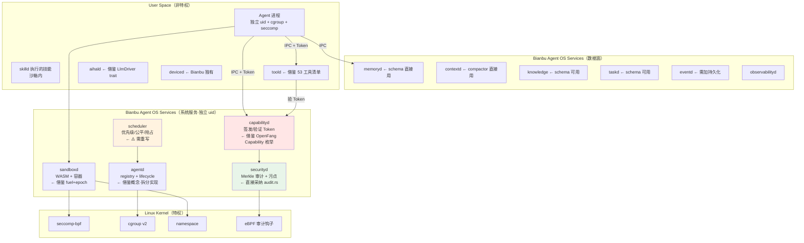

# OpenFang → Bianbu Agent OS 架构映射

> 回答 goal §66-67、§72-75、§92、§97

---

## 1. 逐组件映射

goal 给的 Bianbu 参考架构有 16 个守护服务。按源码逐项映射：

| Bianbu 服务 | OpenFang 对应 | 源码 | 可复用度 | 说明 |
|------------|--------------|------|---------|------|
| `agentd` | `OpenFangKernel` + `AgentRegistry` | `kernel.rs`、`registry.rs` | 🟡 概念可用，代码需重写 | kernel.rs 是 God Object（L-01），必须拆分 |
| `taskd` | `task_queue` 表 + `task_post/claim/complete` | `kernel.rs` task_* | 🟢 **schema 可直接借鉴** | `idx_task_status_priority(status, priority DESC)` 设计正确 |
| `memoryd` | `MemorySubstrate` 四存储 | `memory/` | 🟢 **最高复用价值** | schema 可直接用，但换连接池（L-02） |
| `contextd` | `compactor.rs` + `context_budget.rs` + `context_overflow.rs` | runtime | 🟢 **高复用价值** | 三级溢出恢复设计成熟 |
| `skilld` | `SkillRegistry` + 6 runtime 类型 | `skills/` | 🟡 概念好，安装模型需改 | 全局安装改为 bundle 内置（L-03） |
| `toold` | `tool_runner.rs` 53 工具 + MCP | runtime | 🟢 工具清单可借鉴 | 但需加能力强制（L-06） |
| `securityd` | `audit.rs` + `taint.rs` + `verify.rs` | 分散 | 🟢 **审计链可直接用** | Merkle 实现是业界前列 |
| `capabilityd` | `Capability` enum + `CapabilityManager` | `capability.rs` | 🟡 **枚举可用，强制必须重做** | check() 零调用（L-06） |
| `sandboxd` | `sandbox.rs` WASM 双计量 | runtime | 🟢 **fuel+epoch 思路必学** | 但当前未启用（L-07） |
| `scheduler` | `cron.rs` + `triggers.rs` | kernel | 🔴 **无可借鉴** | AgentScheduler 无调度语义（L-23） |
| `aihald` | `LlmDriver` trait + 10 driver | `runtime/drivers/` | 🟢 **trait 抽象可直接用** | `base_url` 可配置是关键设计 |
| `knowledge` | `KnowledgeStore` entities+relations | memory | 🟡 schema 可用 | 但需加来源可信度（L-12 类问题） |
| `eventd` | `EventBus` + `events` 表 | kernel | 🟡 概念可用 | 需持久化（L-16） |
| `observabilityd` | `/api/metrics` Prometheus + tracing | api | 🟡 部分 | 无执行重放能力 |
| `deviced` | **无对应** | — | 🔴 空白 | **Bianbu 独有价值** |
| `storaged` | `Arc<Mutex<Connection>>` | memory | 🔴 需重做 | 单锁架构（L-02） |

**统计：8 项高复用 / 5 项部分 / 3 项无可借鉴**

---

## 2. MUST / SHOULD / MODIFY / NOT ADOPT（goal §67）

### A. MUST ADOPT —— 直接采纳

**A-1：Merkle 哈希链审计（`runtime/audit.rs` 422 行）**

```rust
Entry[N].hash = SHA256(seq + ts + agent_id + action + detail + outcome + Entry[N-1].hash)
```

理由：实现简洁（422 行含测试），防篡改可验证，SQLite 持久化 + boot 时校验。
同类产品只有文件日志。

**但必须改进一点**：OpenFang 在 `verify_integrity()` 失败时只 `tracing::error!`
继续启动（L-14）。Bianbu 的 `securityd` 应进入安全降级模式。

**A-2：`KernelHandle` trait 的方法清单**

20+ 方法覆盖 spawn/send/list/kill/memory/task/cron/knowledge/approval/channel/hand。
**这是一份经过实战验证的 Agent OS 系统调用面清单**，
Bianbu 的 IPC 接口设计可以直接以此为起点。

注意：借鉴的是**方法清单**，不是 trait 形式。Bianbu 需要跨进程 IDL
（protobuf / Cap'n Proto），不是 Rust trait object（见 verdict.md §5）。

**A-3：依赖倒置打破循环（ADR-001）**

runtime 定义 trait，kernel 实现。Rust 编译器强制分层。
Bianbu 的服务间依赖应同样由构建系统强制，不靠文档约定。

**A-4：WASM fuel + epoch 双计量思路**

fuel 的**确定性**是 cgroup 无法提供的：同一模块在任何机器上消耗相同 fuel，
可用于可复现计费。`sandboxd` 应保留这个特性。

**A-5：`compactor.rs` + `context_overflow.rs` 三级恢复**

截断 → 压缩 → 新 session 的降级链。`contextd` 直接借鉴。
这是 1520 + ~400 行的实战积累，重新发明代价高。

**A-6：Memory schema（13 表 + 索引设计）**

尤其 `idx_task_status_priority(status, priority DESC)`（任务队列查询）
和 `idx_usage_agent_time(agent_id, timestamp)`（计量查询）。
`memoryd` 可直接用这套 schema 起步。

**A-7：`base_url` 可配置的 OpenAI 兼容驱动**

一个配置项打开全部本地推理生态（Ollama/vLLM/LocalAI/llama.cpp）。
`aihald` 必须有这个能力——对边缘/离线场景是决定性的。

---

### B. SHOULD ADOPT —— 采纳但需改进

**B-1：Capability 枚举（21 变体）**

`FileRead/FileWrite/NetConnect/ToolInvoke/MemoryRead/ShellExec/AgentSpawn/...`
覆盖面完整，glob 匹配语义合理。

**必须改的**：强制机制。见 §3 的 Capability Token 设计。

**B-2：`spawn_agent_checked` 能力继承**

`validate_capability_inheritance(parent_caps, child_caps)` 强制子 ⊆ 父。
这是 OpenFang 唯一真实生效的能力强制，思路正确。

**改进**：扩展到所有权限操作，不只是 spawn。

**B-3：`ResourceQuota` 三档成本（hour/day/month）**

`metering.rs` 的成本配额设计合理。

**必须补**：RSS / 磁盘 / Agent 并发配额（L-21）。Bianbu 有 cgroup v2 可用，
这是相对 OpenFang 的天然优势。

**B-4：AgentManifest 的三重性**

Process Descriptor + Security Policy + Capability Declaration 合一，
声明式 TOML。

**改进**：加签名链（L-09），加 Skill 内联声明（L-03）。

**B-5：审批系统（`approval.rs`）**

`oneshot::channel` 阻塞等待 + 超时自动拒绝 + per-agent 待审上限 5（防 DoS）。
设计干净。

**B-6：40+ Channel 的 `ChannelAdapter` trait**

统一抽象 + 每渠道的 `dm_policy`/`group_policy`/`rate_limit_per_user` 覆盖配置。
Bianbu 若需多渠道接入，这个抽象可用。

**改进**：必须 feature-gate（L-04）。

---

### C. SHOULD MODIFY —— 借鉴思路但重新实现

**C-1：Scheduler —— 几乎全部重写**

OpenFang 的 `AgentScheduler` 只是配额记账器（L-23）。
Bianbu 的 `scheduler` 需要从零设计：

```text
必须有的（OpenFang 都没有）：
- 优先级（至少 3 档：interactive / normal / background）
- 公平性（防单个 Agent 饿死其他）
- 抢占（长任务可被高优先级打断并恢复）
- deadline（对时间敏感任务）
- 持久化作业定义（OpenFang 的 cron 重启即丢，L-16）
- 过载降级（不是硬拒绝，而是排队/降级）

可借鉴的：
- cron.rs 的 chrono-tz 时区处理
- AutonomousConfig 的 quiet_hours 概念
```

**C-2：存储层 —— 换连接池**

保留 schema，替换 `Arc<Mutex<Connection>>` 为 `r2d2_sqlite` 连接池
或按 Agent 分库。

**C-3：包格式 —— 三合一**

Agent + Skill + Hand 三套格式合并为单一 Bundle（见 §4）。

**C-4：污点追踪 —— 改为真传播**

保留 `TaintLabel` 枚举和 `TaintSink` 概念，
但标签必须随 `ToolResult` 传播（L-12），不是检查点硬编码。

---

### D. SHOULD NOT ADOPT —— 不要采纳

**D-1：God Object kernel**

不要把 60 个字段塞进一个结构体。`agentd` 只保留 registry + lifecycle。

**D-2：kernel 可嵌入模式**

OpenFang 为了 Desktop app 让 kernel 可被嵌入进程（L-05）。
Bianbu 的 `agentd` 应该是独立系统服务，UI 通过 IPC 连接，不嵌入。

**D-3：fail-open 默认值**

`declared_tools.is_empty() → 全部工具可用`（L-08）。
Bianbu 必须 deny-all 默认。

**D-4：`let _ =` 丢弃持久化错误**

L-17。任何存储写入失败必须至少 warn。

**D-5：无 feature flags 的单体构建**

L-04。Bianbu 面向边缘，必须可裁剪。

**D-6：审计失败继续启动**

L-14。

---

## 3. Capability Token 设计（goal §73）

OpenFang 的 capability model 如何升级为 Bianbu Capability Token？

### 3.1 问题诊断

OpenFang 的失败模式：能力存在 `DashMap<AgentId, Vec<Capability>>` 里，
**检查是可选的**（`check()` 从不被调用），因为检查点和存储点在不同模块，
没有任何机制强制调用方去查。

### 3.2 Token 化方案

核心思路：**让"不出示 token 就无法调用"在架构上成立**，
而不是依赖调用方自觉查表。

```text
Agent 启动时：
  capabilityd 根据 manifest 签发一组 Capability Token
  每个 token = { capability, agent_id, expiry, nonce, signature }
  signature = Ed25519(capabilityd_private_key, 上述字段)

Agent 调用工具时：
  agentd → toold: invoke(tool_name, params, capability_token)
  toold 必须验签才执行：
    1. 验 Ed25519 签名（防伪造）
    2. 验 agent_id 匹配调用方（防盗用）
    3. 验 expiry（防长期有效）
    4. 验 capability 覆盖本次操作（glob 匹配，复用 OpenFang 的 capability_matches）
    5. 验 nonce 未用过（防重放，复用 OpenFang 的 NonceTracker 设计）
  验签失败 → 拒绝 + 审计

关键：toold 的 IPC 接口把 token 设为**必填参数**。
      无 token 的请求在协议层就无法构造。
```

### 3.3 相比 OpenFang 的改进

| 属性 | OpenFang | Bianbu Token |
|------|----------|-------------|
| 强制性 | 可选（check 从不调用） | **协议强制**（必填参数） |
| 跨进程 | 不适用（同进程） | 支持（签名可验证） |
| 撤销 | 只能 `revoke_all` | expiry + 撤销列表 |
| 委派 | 无 | token 可派生子 token（能力只能收窄） |
| 审计 | 无 CapabilityCheck 记录 | 每次验签都可记审计 |
| 时效 | 永久 | expiry |

### 3.4 复用 OpenFang 的部分

- `Capability` 枚举定义（21 变体）—— 直接用
- `capability_matches()` glob 匹配逻辑 —— 直接用
- `validate_capability_inheritance()` 子集校验 —— 用于 token 派生
- `NonceTracker`（5 分钟窗口 + DashMap GC）—— 用于防重放

**这四样是 OpenFang 在能力领域真正值得拿走的资产。**

### 3.5 与 Linux 安全机制的配合

Token 是应用层授权，还需 OS 层强制：

```text
Bianbu Agent 隔离栈（OpenFang 完全没有的）：
  L1: Capability Token   → 应用层授权（借鉴 OpenFang）
  L2: seccomp-bpf        → 系统调用白名单
  L3: cgroup v2          → memory.max / pids.max / cpu.max（补 L-21）
  L4: namespace          → mount/net/pid 隔离（补 L-05）
  L5: 独立 uid           → 文件系统 DAC
```

L2-L5 是 Bianbu 相对 OpenFang 的**结构性优势**——
OpenFang 因为所有 Agent 同进程，这四层都用不上。

---

## 4. Bianbu Agent Bundle 设计（goal §74-75）

### 4.1 OpenFang 现状的问题

三套格式（L-03）：`agent.toml` / `SKILL.toml` + 代码 / `HAND.toml`（编译时内置）。
无法一键分发"带技能的 Agent"。

### 4.2 建议的 Bundle 格式

```text
myagent.abundle/                   # 单一目录/tar，可签名分发
├── manifest.yaml                  # ① 身份 + 元数据
├── agent.yaml                     # ② 运行配置（模型/prompt/迭代上限）
├── capabilities.yaml              # ③ 能力声明（→ capabilityd 签 token）
├── policy.yaml                    # ④ 工具策略 + 审批规则 + exec_policy
├── resources.yaml                 # ⑤ 配额（cpu/mem/disk/token/cost）← OpenFang 缺
├── prompts/
│   ├── system.md
│   └── phases/                    # 借鉴 Hand 的多阶段 playbook
├── skills/                        # ⑥ 内联技能（不再全局安装）
│   └── <skill-name>/
│       ├── SKILL.yaml
│       └── main.py
├── tools.yaml                      # ⑦ 声明需要的 toold 工具
├── workflows/                      # ⑧ 借鉴 workflow.rs
├── schedule.yaml                   # ⑨ cron/trigger（必须持久化，补 L-16）
├── memory.yaml                     # ⑩ 记忆配置 + 初始知识图谱种子
├── models.yaml                     # ⑪ 模型路由 + fallback 链
└── signature.json                  # ⑫ Ed25519 签名（覆盖以上全部）
```

### 4.3 每部分的来源

| 部分 | 来源 | 说明 |
|------|------|------|
| ① manifest | OpenFang `AgentManifest` 的 identity 段 | 直接借鉴 |
| ② agent | OpenFang `AgentManifest` 主体 | 直接借鉴 |
| ③ capabilities | OpenFang `AgentCapabilities` | 借鉴结构，语义改为 token 请求 |
| ④ policy | OpenFang `ToolPolicy` + `ExecPolicy` | 借鉴（但 OpenFang 的是死代码） |
| ⑤ resources | **Bianbu 新增** | OpenFang 只有 token/cost，需加 cpu/mem/disk |
| prompts/ | OpenFang Hand 的多阶段 prompt | 借鉴 Hand 设计 |
| ⑥ skills/ | **Bianbu 新设计** | OpenFang 是全局安装，改为 bundle 内联 |
| ⑦ tools | OpenFang `capabilities.tools` | 借鉴，但改 deny-all 默认 |
| ⑧ workflows | OpenFang `workflow.rs` | 借鉴 |
| ⑨ schedule | OpenFang `cron.rs` + `AutonomousConfig` | 借鉴 + **加持久化** |
| ⑩ memory | OpenFang `MemoryConfig` | 借鉴 + 加知识种子 |
| ⑪ models | OpenFang `ModelRoutingConfig` + `FallbackModel` | 直接借鉴 |
| ⑫ signature | **Bianbu 新增** | OpenFang 只算 hash 不验签（L-09） |

**新增的三项（⑤ resources、⑥ 内联 skills、⑫ 真签名）
正是 OpenFang 的三个缺陷对应的修正。**

---

## 5. 分层归属（goal §97）

哪些能力应该在 User Space / Agent OS Service / Kernel-like 边界？



### 归属原则

| 层 | 判据 | 例子 |
|----|------|------|
| Linux Kernel | 需要特权才能强制 | seccomp / cgroup / namespace |
| Agent OS Service（控制面） | 决定"允许什么"，必须在执行路径上 | capabilityd / securityd / sandboxd / scheduler |
| Agent OS Service（数据面） | 有状态存储，不做授权决策 | memoryd / contextd / knowledge / taskd |
| User Space | 执行具体工作，不可信 | Agent 进程 / 技能 / 工具 / LLM 调用 |

**关键判断**：`capabilityd` 必须在**控制面且在执行路径上**。
OpenFang 的错误就是把 `CapabilityManager` 放在了旁路
（存在 kernel 里但没人调用），所以 Bianbu 必须让 `toold`
在协议层强制要求 token（见 §3.2）。

---

## 6. goal §92 的十个问题（逐一回答）

**1. 哪些设计值得借鉴？**
Merkle 审计链、`KernelHandle` 方法清单、依赖倒置分层、WASM fuel+epoch、
三级上下文溢出恢复、13 表 memory schema、`base_url` 可配置驱动、
Capability 枚举 + glob 匹配、NonceTracker、审批系统。

**2. 哪些可以直接复用？**
`audit.rs`（422 行，几乎可直接移植）、memory schema DDL、
`capability_matches()` / `validate_capability_inheritance()`、
`NonceTracker`、`compactor.rs` 的压缩策略、`LlmDriver` trait 定义。

**3. 哪些必须重写？**
Scheduler（无调度语义）、kernel.rs（God Object）、
存储层并发（单 Mutex）、包格式（三套合一）、
Capability 强制机制（改 token）、污点传播。

**4. 哪些不适合嵌入式？**
无 feature flags 的 32MB 单体、wasmtime（10MB+ 且未启用）、
Tauri desktop、40+ channel 全量编译、无 RSS 配额、
`sessions` 表无限增长。

**5. 哪些适合 RISC-V？**
纯 Rust 部分（types/memory/kernel 逻辑/channels）风险低；
bundled SQLite 架构中立。阻塞点是 `ring 0.17.14`（有替代方案）
和 wasmtime/cranelift riscv64 后端（可 feature-gate 掉）。
详见 riscv-edge.md —— **未实机验证**。

**6. 哪些安全设计进 securityd？**
Merkle 审计链（A-1）、污点追踪框架（改为真传播）、
技能注入扫描（`verify.rs` 的模式库 + 需增强）、
审计完整性验证（+ 失败时降级，补 L-14）。

**7. 哪些进 agentd？**
`AgentRegistry` 的三索引结构（agents / name_index / tag_index）、
`AgentState` 五态机、父子关系追踪（+ 加回收语义补 L-20）、
`AgentEntry` 字段设计（含 workspace/state_dir 分离）。

**8. 哪些进 memoryd？**
全部 13 表 schema + 索引、四存储分层（structured/semantic/knowledge/session）、
`ConsolidationEngine` 衰减机制、MessagePack 序列化选择。
**但换连接池**（L-02）。

**9. 哪些进 skilld？**
6 种 runtime 类型（Python/Node/Shell/WASM/Builtin/PromptOnly）的分派设计、
`SkillVerifier` 注入扫描、子进程 `env_clear()` 隔离。
**但安装模型改为 bundle 内联**（L-03）。

**10. 哪些进 aihald？**
`LlmDriver` trait（`complete` + `complete_streaming`）、
`base_url` 可配置（打开本地推理生态）、
fallback 链 + `auth_cooldown` 提供商冷却、
`llm_errors.rs` 的错误归一化（1049 行实战积累）、
`model_catalog` 结构（**但需支持本地模型条目**，见 riscv-edge.md §5.4）。

---

## 7. 一句话总结

> OpenFang 值得拿走的是**审计链、内存 schema、上下文恢复策略、
> 驱动抽象、能力枚举**这五样具体资产；
> 必须自己重做的是**调度器、能力强制机制、进程隔离**这三件事；
> 而 Bianbu 的结构性优势在于能用上 **cgroup / seccomp / namespace / 独立 uid**，
> 这是 OpenFang 因"所有 Agent 同进程"而永远无法获得的。
